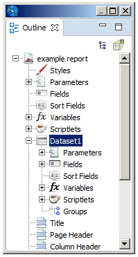
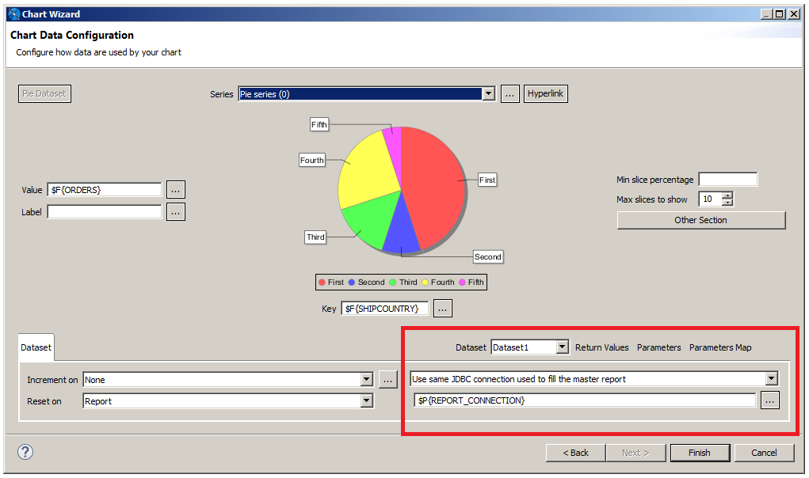
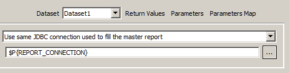
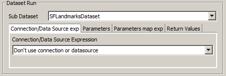

# Datasets and Subdatasets

You can run multiple queries in a single report using subdatasets and dataset runs. A dataset describes the shape of the data that is supplied to a report or element – for example, the list of fields and field types to use – but does not contain any information about where the data comes from. You can include an arbitrary number of subdatasets in your report, each with its own fields, variables, parameters, and groups. A subdataset can use the same connection as the main report (optionally with a different query), or it can use a different data source or connection.

To use a subdataset, you add an element that contains a dataset and define a dataset run for the element. A dataset run specifies all the information needed by JasperReports Library to fill the subdataset, including the information about where the data comes from. Because a dataset run for a subdataset is defined at element level, you can use the same dataset in more than one element. For example, if your report uses a connection, you can use the main dataset in two different elements, such as a chart and a crosstab, with different queries. Dataset runs can only be defined inside elements that contain datasets, including: charts, crosstabs, tables, lists, and maps.

This chapter has the following sections:

-   Understanding Datasets and Dataset Runs

-   Subdatasets

-   Dataset Runs

-   [Creating an Example Subdataset](dataset-creating-tutorial.md)

## Understanding Datasets and Dataset Runs

### Understanding Datasets

Datasets allow the engine to iterate through virtual records, just as data sources do, but they also enable calculations and data grouping using variables and groups. However, they have no visual or layout information and do not specify how to find the data that is used to fill the element at run time.

A report can include two types of datasets:

-   Main Dataset: The main dataset is responsible for iterating through the data source records, calculating variables, filtering out records, and estimating group breaks during the report-filling process. The report data source, along with the parameters, fields, variables, and groups declared at the report level, represent the building blocks of the main dataset for the report. All report templates implicitly declare and use this main dataset.
-   Subdataset: You can use a subdataset to provide a secondary record nested within a report. A subdataset iterates through its data source records similar to a dataset. However, a dataset can use the same connection that is used to fill the master report or it can use a different connection or data source. Subdatasets can be used to iterate through data that is not the main report data source itself, for example, to gather data for a chart or perform data bucketing for a crosstab.

!!! note

    Because dataset declarations can contain parameters, fields, variables, and groups, they closely resemble subreports, but they completely lack any visual content (that is, they have no sections or layout information at the dataset level).

Datasets, when instantiated, expect to receive parameter values and a data source to iterate through. As a convenience, you can associate an SQL query with a dataset that uses a JDBC connection.

A dataset gives an abstract description of your record metadata but does not say where the data is coming from. For example, you can create a dataset that stores the information that you have three fields – Last Name, First Name, City – and that those fields are text fields.

When you create a subdataset, you can optionally choose a connection or data source to use as a resource to specify your fields. For example, if you are retrieving the records above from a JDBC database, you can use the JDBC connection to retrieve the field information from your data, rather than entering it manually. However, when you save the dataset it does not specify the data source, so, for example, you could later retrieve the field values from the JDBC connection or you could retrieve them from a CSV file. The final binding of the subdataset to its data retrieval method does not occur until you add an element to your report and define a dataset run.

### Dataset Runs

To use a subdataset, you must define a dataset run. A dataset run is always defined at the element level and tells where to get the data for the element.

Datasets are filled similar to reports. This means that they require a data source or connection from which to get the data when they are filled. They can also rely on parameters for additional information to use when being filled. The dataset run binds the dataset used by the element with a data source and supplies the values for the dataset parameters. You can use the same dataset in different elements, and you can configure the dataset to run at the element level.

A dataset run can only be declared elements that contain datasets, including: charts, crosstabs, tables, lists, and maps.

!!! warning

    Unlike other elements, a table and list always require a subdataset; they cannot use the main dataset.

When you create a dataset run, you can set the value of the subdataset parameters using expressions containing main report objects (like fields, variables, and parameters), define a parameters map to set values for the subdataset parameters at run time, and define the connection or data source to be used by the subdataset.

## Subdatasets

### The Dataset Wizard

You create a subdataset using the Dataset wizard. To open the Dataset wizard, right-click your report's root node in the outline view and select **Create Dataset** from the context menu.

|                                                          |
|----------------------------------------------------------|
|  |
| *Figure 1: Dataset Wizard*                               |

The **Dataset** page of the Dataset wizard shows the following options:

-   **Dataset name**: A name for the subdataset. Must be unique in the report.

-   Dataset radio buttons:

    -   **Create new dataset from a connection or Data Source**: Select this to use a connection or data source to define the metadata for the dataset. The connection or data source introspects its associated data and suggest fields and field types for the dataset. Later, when you add an element and create a dataset run, you make the final choice on where to retrieve the data for the element. At that point, you can use the same data source/connection, or select a different one.

    -   **Create an empty dataset**: Select this to create a dataset without metadata. In this case, you need to define the metadata later, when you create a dataset run that uses this dataset.

        !!! note

            A dataset that is configured to use the empty data source is *not* an empty dataset, because it still defines fields and other metadata. The empty data source just creates a number of records where each field value is set to null.

-   **Next**: Displays the **Data Source** page (only available when **Create new dataset from a connection or Data Source** is selected).

    |  |
    |----|
    |  |
    | *Figure 2: Data Source page of the Dataset wizard* |

    The **Data Source** page shows the following options:

-   **Data Adapter**: Drop-down that displays available data adapters you can use.

-   **New**: Button that opens the Data Adapter wizard for creating a data adapter.

-   **Query Area**: Area to enter the query for the new dataset. Only displayed for adapters that use connections.

-   **Next**: Click to display the **Fields** page.

The Fields page shows the fields that are retrieved using the data adapter and lets you choose fields for your dataset metadata. Click **Next** to display the **Group B**y page.

The **Group By** page lets you group fields. In the context of a dataset, groups are only used to group records and there is no discrete portion of the report tied to them (for example, like the header and footer bands associated with groups). Primarily, dataset groups are used with variable calculations.

### Dataset Objects

When you create a subdataset, it appears as a node in the outline view for your report. Expand the node to see the dataset's fields, variables, parameters, and other objects.

|  |
|----|
|  |
| *Figure 3: Subdataset in report outline view* |

You cannot use objects coming from the master report dataset directly in an element that uses a subdataset. Only subdataset objects can be used in these cases. To use objects from your main report, you must declare them as parameters in your subdataset. You configure the binding between the main dataset object with the subdataset parameter inside the dataset definition, and then set the values for the parameters inside the dataset run.

For example, suppose you have a parameter named MyParam of type `String` in the main report and you want to use it with a subdataset. Add it as a parameter to the subdataset by right-clicking the Parameters node in the subdataset and selecting **Create Parameter**. Then in the **Properties** view for your new parameter, set the name as MyParam, and the class as `java.lang.String`. To set the value that this parameter has at runtime, define an expression in the dataset run of the element that uses the parameter. Setting the expression for a parameter inside the dataset run means that the parameter is evaluated when the element is evaluated. This means that when you use a parameter in two different elements, one inside the title band and one inside the summary band, the parameter's value can be different in the two different elements.

### Dataset Properties

The **Properties** view for a dataset shows a number of advanced options, most of which can only be understood and applied in a useful way after you become familiar with JasperReports. To see the properties for a dataset:

-   For a report, select the root node of the report in the outline view. The dataset properties are shown in the **Dataset** section on the **Report** tab in the **Properties** view.

-   For a subdataset, select the subdataset node in the outline view. The dataset properties are shown in the **Properties** view.

    |                                                                  |
    |------------------------------------------------------------------|
    |  |
    | *Figure 4: Dataset properties*                                   |

    A dataset has the following properties:

-   **Name** (required): A name for the subdataset. Must be unique in the report.

-   **When Resource Missing Type**: Specifies what to do when a specific resource (such as a label) is not available in the resource bundle defined below. The available options are listed in the following table.

    | Option | Description |
    |----|----|
    | `Null` | Prints the "Null" string (default). |
    | `Empty` | Prints nothing. |
    | `AllSectionsNoDetails` | Prints the missing key name. |
    | `Error` | Generates an exception and stops the filling process. |

-   **Filter Expression**: Boolean expression that determines whether records that are read from the data source should be used. Can use all the objects of the dataset (parameters, variables, and fields). Here are some examples of filter expressions:

    -   Filter only records where the field `FIRSTNAME` starts with the letter “L”:

        -   JavaScript: $F{FIRSTNAME}.substr(0,1) == "L"
        -   Groovy: $F{FIRSTNAME}.startsWith("L")

    -   Filter only records where the length of the field `FIRSTNAME` is less than 5:

        -   JavaScript: $F{FIRSTNAME}.length &lt; 5
        -   Groovy: $F{FIRSTNAME}.length() &lt; 5

    -   Filter only records where the field `FIRSTNAME` is the one provided by the parameter `NAME:`

        -   JavaScript: $F{FIRSTNAME} == $P{NAME}
        -   Groovy: $F{FIRSTNAME} == $P{NAME}

-   **Scriptlet Class**: A scriptlet is a Java class whose methods are run according to specific events during report creation, such as the beginning of a new page or the end of a group. For those who are familiar with visual tools such as Microsoft Access or Microsoft Excel, a scriptlet can be compared with a module in which procedures associated with other events or functions (for example, the expression of a textfield) are inserted. The scriptlet property identifies only the main scriptlet, but other scriptlets can be added to the report by using the outline view.

-   **Resource Bundle**: Used to internationalize a report. A resource bundle is the set of files that contain the text of the labels, sentences, and expressions used within a report in one defined language. What you set in the resource bundle property is the *resource bundle base name*, which is the prefix through which you can find the file with the correct translation. To reconstruct the file name required for a particular language, some language/country initials (for example, “\_it_IT” for Italian-Italy) are added to this prefix, as well as the `.properties` extension.

-   **Default Data Adapter**: Sets the name and location of the XML data adapter resource that JasperReports should use.

-   **Edit query, filter and sort options button**: Opens the Dataset and Query dialog, where you can edit the query, sorting, and filter options for the subdataset. See [Using the Dataset and Query Dialog](dataset_and_query_dialog.md) for more information.

## Dataset Runs

You create a dataset run when you insert an element that contains a dataset into your report. For example, the fields for defining a dataset run for a basic chart are in the lower right of the **Chart Data Configuration** dialog.

|                                                                      |
|----------------------------------------------------------------------|
|  |
| *Figure 5: Dataset run definition for a chart*                       |

-   **Dataset** drop-down: Displays all available datasets.

### Connection/Data Source Expression Menu

The **Connection/Data Source Expression** menu lets you specify where to get the data to fill the report.

|                                                                      |
|----------------------------------------------------------------------|
|  |
| *Figure 6: Specifying the Data for a Dataset Run*                    |

If the main report dataset uses a connection, such as a JDBC connection, you see the following options:

-   **Don't use any connection or Data Source**: Select this if you do not want to specify any data for the dataset run. You can set this if you have set a data adapter via the properties view, and want JasperReports Library to use that adapter. This setting can be used when you want to publish a report with multiple connections to JasperReports Server.

-   **Use another connection**: Select this and enter a connection expression to use a connection that is different from the connection in the main dataset. You can use this for any connection, such as a JDBC connection or big data connection.

-   **Use a JRDatasource expression**: Select this and enter a data source expression if you want to use a data source. Note that, even when the main report uses a data source, such as a CSV file or JSON data source, you cannot simply reuse the data source from the main report. Instead, you must define a subdataset and create a dataset run that accesses the data source. This is because, unlike a connection, a data source is consumed when JasperReports iterates through it to fill the element. This means that when you use the same data source in two different elements, you must access the data source twice.

-   **Use same JDBC connection used to fill the master report**: If the report uses a connection, such as a JDBC connection or a Hibernate connection, select this to have the dataset run use the same connection as the main report. You can optionally enter a different query from the query in the main report.

    When **Use same JDBC connection used to fill the master report** is selected, the connection expression uses the built-in parameter for the report's JDBC connection, `$P{REPORT_CONNECTION}`.

-   **Use an empty Data Source**: Select this to fill the dataset using an instance of `JREmptyDataSource`, that is, a data source that contains a specified number of records, where the field values are all `NULL`. See [Using the Empty Record Data Adapter](../data-adapters/data-adapters-empty.md) for more information.

    If the main report uses a data source, the menu and options are slightly different.

    |                                                                          |
    |--------------------------------------------------------------------------|
    |  |
    | *Figure 7: Dataset Run For a Dataset with Metadata*                      |

-   **Don't use connection or data source**: Select this if you do not want to specify any data for the dataset run.

-   **Use a Connection expression**: Select this to use any connection, such as a connection to a JDBC database or a big data store.

-   **Use a DataSource expression**: Select this to connect to a non-JDBC data source, for example, a JSON or jrdax data source.

### Parameters Tab

This tab allows you to set values for the subdataset parameters using calculated expressions. Expressions can reference main report objects such as fields, variables, and parameters. However, objects from your main report are not directly available in a subdataset. To use parameters from your main report, you must declare them in your subdataset and then assign their values in a dataset run.

### Parameters Map Tab

When you configure parameters using the **Parameters** tab, you create a parameters map. You can take this another level of abstraction, and specify an optional expression that produces an object of the type `java.util.Map` at runtime. The map object contains a set of coupled names/objects that is passed to the subdataset to set a value for its parameters. Parameters map values can be provided as expressions, making the map potentially dynamic. For example, you can use a parameters map to pass the username of the user running the report, or define the connection or data source used by the subdataset.

Your application can create a map designed for the subdataset, pass it to the master report using a parameter, then use that parameter as an expression (for example, `$P{myMap}`) to pass the map to the subdataset. If you want, you can pass the same parameters map to the main report and to the subdataset, using the built-in parameter `REPORT_PARAMETERS_MAP`. In this case, the parameters map expressions `$P{REPORT_PARAMETERS_MAP}`.

### Return Values Tab

In a report, it is often useful to get the result of some kind of calculation that has been performed in a subdataset or subreport (for instance, the number of records). The Return Values tab allows you to retrieve values calculated or processed by the subdataset (such as totals and record count) and store them in a variable in the main report.

Bindings between calculated values and local variables can be set in the **Subdataset Return Values** property in property view. When you define a variable that hosts or collects subdataset return values, you should set its calculation time to **System** to prevent the values from being recalculated at each iteration of the main dataset. A value from the subdataset run is available only after the whole band containing the subdataset has been printed.

If you need to print this value using a textfield placed in the same band as your subdataset run, set the evaluation time of the textfield to **Band**.
