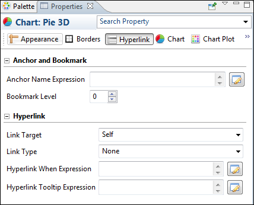
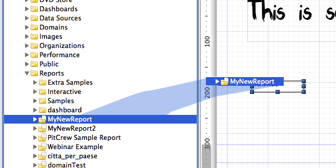
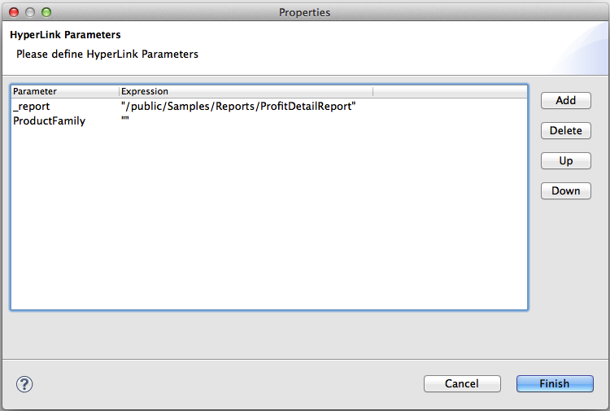
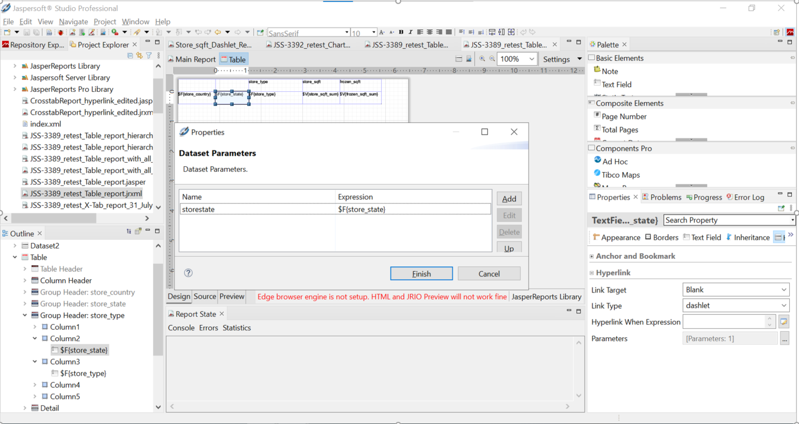
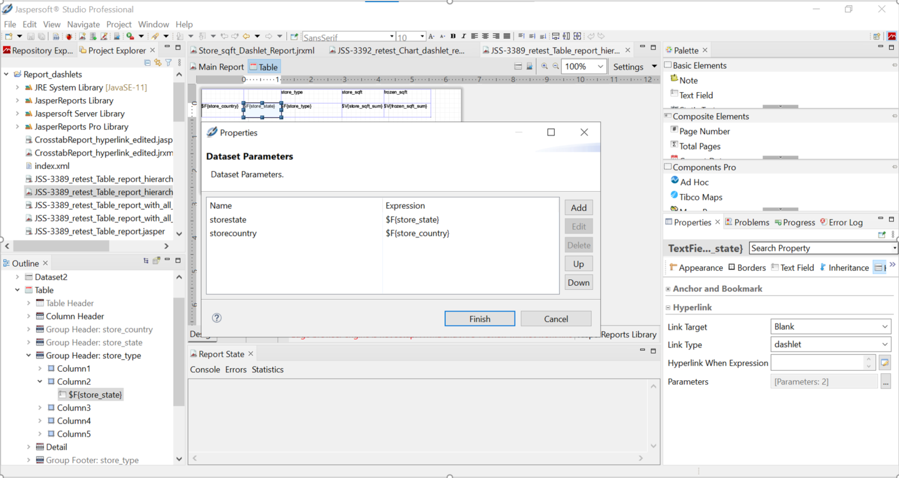
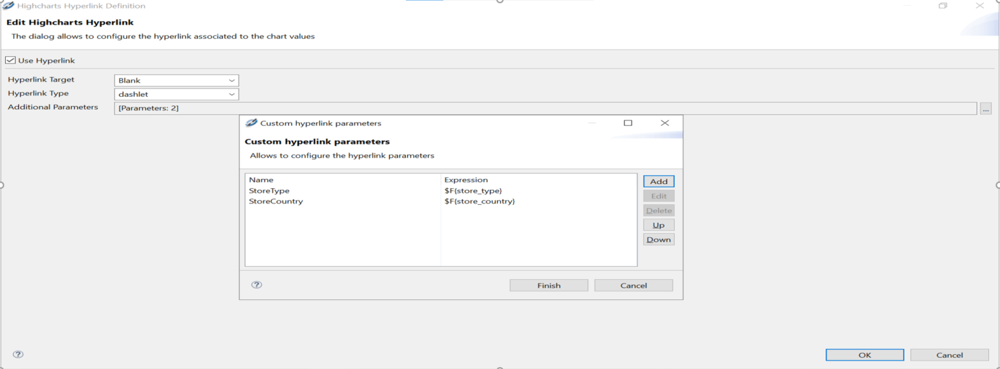

# Anchors, Bookmarks, and Hyperlinks

JasperReports Library provides a powerful combination of settings to define hyperlinks. While a hyperlink usually opens a specific URL, JasperReports broadens the concept, extending it to a more complex object that can be used for more complicated functionality, such as running a report in JasperReports to perform a drill-down or drill-up operation, pointing to a page within a PDF document.

Image, text field, and chart elements can be used both as anchors in a document and as hypertext links to external sources or to other local anchors.

!!! note

    This section describes hyperlinks for images, text fields, and charts. Hyperlinks for HTML5 charts are defined differently, as described in [Creating Hyperlinks in HTML5 Charts](../charts-html5/html5-charts-creating-hyperlinks.md).

To set anchor, bookmark, or hyperlink properties, select an image, text field, or chart element and go to the **Hyperlink** tab in the Properties view.

|                                                                    |
|--------------------------------------------------------------------|
|  |
| *Figure 1: Anchor, Bookmark, and Hyperlink Properties*             |

This window is divided in two sections:

-   Anchor and Bookmark
-   Hyperlink

## Anchors and Bookmarks

An anchor identifies a specific position in a document. If you plan to export your report to PDF, you can optionally set a bookmark level to have the anchor show up as a PDF bookmark. The Anchor and Bookmark area lets you set the following:

-   **Anchor Name Expression** – Expression for the name of the anchor. This name can be referenced by other hyperlinks. Click the  button to open the **Expression Editor**, where you can write or build the expression.
-   **Bookmark Level** – Bookmark level when the report is exported to PDF. If you plan to export your report as a PDF, set a bookmark level to populate the bookmark tree, making the final document navigation much easier. To make an anchor available as a bookmark, simply choose a bookmark level higher than one. Defining different levels creates nested bookmarks.

Bookmarks can also be displayed in JasperReports Server when the report is displayed in the interactive viewer. To display bookmarks in the server, set the following property:

`<property name="net.sf.jasperreports.print.create.bookmarks" value="true"/>`

This property can be set on the report level or globally in the JasperReports Server 
WEB-INF\\classes\\jasperreports.properties file.

!!! note

    The same table of contents is also available in the JasperPrint object, and can be explored by calling the method:

    `List<PrintBookmark> getBookmarks()`

## Hyperlinks

Hyperlinks let you link a location in a report to another destination. The most important property of a hyperlink is its type, which determines the format of the target. Jaspersoft Studio supports the following types of hyperlink: The exact properties of a hyperlink depend on the hyperlink type. The following properties may appear for a hyperlink:

-   **Link Target** – Specifies where to open the link target. The Link Target is similar to the target attribute of an HTML link. The dropdown box shows the following options: Self, Blank, Top, Parent. You can also specify a target name, which actually makes sense only when the hyperlink is used in a web environment.

-   **Link Type** – The following link types are supported in Jaspersoft Studio: Reference, LocalAnchor, LocalPage, RemoteAnchor, RemotePage, ReportExecution, and dashlet. You can also define your own custom hyperlink types.

-   **Target Expressions** – Expressions that determine the location of the link target. May include:

    -   **Hyperlink Anchor Expression** – Anchor in document to use as a hyperlink target.
    -   **Hyperlink Page Expression** – Page in document to use as hyperlink target.
    -   **Hyperlink Reference Expression** – Location of remote document. For link of type Reference, use a URL; for a link of type Remote Anchor or Remote Page, use a file reference.

-   **Hyperlink When Expression** – Expression that determines when the hyperlink is implemented. A hyperlink is only available if the Hyperlink When expression returns the Boolean value `True` (default).

-   **Tooltip Expression** – String to use as a tooltip when a user hovers the cursor over the hyperlink.

-   **Parameters** – Parameters that specify information about the target; only available for ReportExecution hyperlinks and custom hyperlink types.

ReportExecution is implemented as a custom hyperlink type in JasperReports Library.

### Linking to a URL

To link to a URL, http://www.jaspersoft.com/, select **Reference** from the Link Type dropdown in the Properties view. Hyperlinks of type Reference are rendered in all output formats that support web links, including Microsoft Excel and Word.

When working with a hyperlink of type Reference, you can add parameters via the Hyperlink Reference Expression. For example, the following expression uses the values of the `city` and `country` fields to dynamically build a URL:

`"http://www.someurl.com/search?city=" + $F{city} + "&country= " + $F{country}`

### Linking to a Report

Several hyperlink types link to an existing report. These types are primarily supported in PDF and HTML formats:

-   LocalAnchor – Links between two locations into the same document. It can be used, for example, to link the titles of a summary to the chapters to which they refer. To define the local anchor, it is necessary to specify a hyperlink anchor expression, which produces a valid anchor name, for example, `"title"`.
-   LocalPage – Point to a specific page in the current report. In this case, it is necessary to specify the page number you are pointing to by means of a hyperlink page expression, for example `Integer.valueOf(2)`. The expression must return an Integer object.
-   RemoteAnchor – Points to an anchor that resides in an external document. In this case, the location of the external file must be specified in the Hyperlink Reference Expression field, and the name of the anchor must be specified in the Hyperlink Anchor Expression field.
-   RemotePage – Points to a particular page of an external document. In this case, the location of the external file must be specified in the Hyperlink Reference Expression field, and the page number must specified in the Hyperlink Reference Expression.

Similar to links of type Reference, you can specify additional parameters for these hyperlink types by appending them to the expression string.

### Creating a Link Between Reports on a JasperReports Server Instance

Hyperlinks of type ReportExecution run one JasperReports Server report from another JasperReports Server report, for example, when drilling down to a report in the context of JasperReports Server. Instead of a hyperlink reference or similar expression, ReportExecution hyperlinks use JasperReports parameters to specify the target. The following report-execution parameters are available:

-   `_report` (required) – String that points to the JasperReports Server report to run. Usually a path on JasperReports Server, enclosed in quotes, such as "/public/Samples/Reports/myReport"
-   `_page` (optional) – Specifies a page to display in the target report. Only one of `_page` and `_anchor` should be used. If both are used, `_page` takes precedence and `_anchor` is ignored.
-   `_anchor` (optional) – Specifies a named anchor to display in the target report.
-   `_output` (optional) – Specifies an output format for the report, such as PDF, DOCX, etc. The default is HTML.
-   If the destination report contains one or more input controls, their value can be set by specifying the name of the input control as a parameter name and providing a value.

!!! note

    ReportExecution hyperlinks are an example of custom hyperlink extensions in JasperReports Library. More generally, these parameters can be used by URL Handlers, especially JasperReports Library extensions, to manipulate and generate hyperlinks.

Creating a ReportExecution hyperlink by dragging

The easiest way to configure a `ReportExecution` hyperlink in Jaspersoft Studio is to drag a report unit from the JasperReports Server repository explorer over an element that supports hyperlinks (such as a `textfield`).

|  |
|----|
|  |
| *Figure 2: Dragging a report from the server into the Report Design* |

The auto-configured hyperlink automatically sets the type to ReportExecution and configures the \_report parameter. Moreover, if the JasperReports Server Report has input controls, they are added to the list of parameters, ready to be populated with a proper value expression, as shown below.

|  |
|----|
|  |
| *Figure 3: Configuring Hyperlink Parameters* |

## Hyperlink Types

Jaspersoft Studio provides several types of built-in hypertext links: Reference, LocalAnchor, LocalPage, RemoteAnchor, RemotePage, and dashlets.

The following table describes the hyperlink types.

<table>
<colgroup>
<col style="width: 50%" />
<col style="width: 50%" />
</colgroup>
<tbody>
<tr>
<td>
Reference
</td>
<td>
The Reference link indicates an external source that is identified by a normal URL. This is ideal to point, for example, to a servlet to manage a record drill-down tool. The only expression required is the hyperlink reference expression.
</td>
</tr>
<tr>
<td>LocalAnchor</td>
<td>
To point to a local anchor means to create a link between two locations into the same document. It can be used, for example, to link the titles of a summary to the chapters to which they refer.

To define the local anchor, specify a hyperlink anchor expression that produces a valid anchor name.
</td>
</tr>
<tr>
<td>
LocalPage
</td>
<td>
If instead of pointing to an anchor you want to point to a specific current report page, you need to create a LocalPage link. In this case, it is necessary to specify the page number you are pointing to by means of a hyperlink page expression (the expression has to return an Integer object).
</td>
</tr>
<tr>
<td>
RemoteAnchor
</td>
<td>
If you want to point to a particular anchor that resides in an external document, you can use the RemoteAnchor link. In this case, the URL of the external file referenced must be specified in the Hyperlink Reference Expression field, and the name of the anchor must be specified in the Hyperlink Anchor Expression field.
</td>
</tr>
<tr>
<td>
RemotePage
</td>
<td>
This link allows you to point to a particular page of an external document. Similarly, in this case, the URL of the external file that is pointed must be specified in the <strong>Hyperlink Reference Expression</strong> field, and the page number must be specified by means of the hyperlink page expression. Some export formats have no support for hypertext links.
</td>
</tr>
<tr>
<td>
ReportExecution
</td>
<td>
This type of hyperlink is used to implement JasperReports Server’s drill-down feature.
</td>
</tr>
<tr>
<td>dashlet</td>
<td>
This type of hyperlink is used to make Jaspersoft Studio reports interactive with other dashlets in the dashboard.

<strong>Note</strong>: This hyperlink type is case-sensitive, so a report hyperlink can be enabled in the dashboard only if "dashlet" is lower case.
</td>
</tr>
</tbody>
</table>

!!! warning

    Some export formats have no support for hypertext links.

    To get hierarchical data in the crosstab report hyperlink, you must configure it in Jaspersoft Studio.

## Creating a Hyperlink

Some types of datasets let you assign a hyperlink to the value represented in the chart. In the report output, clicking the chart opens a web page or navigates to a different location in the report.

The click-enabled area depends on the chart type. For example, in pie charts, the hyperlink is linked to each slice of the pie; in bar charts, the click-enabled areas are the bars themselves.

Image, text field, and chart elements can be used both as anchors into a document and as hypertext links to external sources or local anchors.

To create a hyperlink

1.  Click the **Hyperlink** tab in the Properties view.
2.  In the **Link Target** dropdown, choose one of the following target types:

-   **Self**: This is the default setting. It opens the link in the current window.

    -   **Blank**: Opens the target in a new window. Used for output formats such as HTML and PDF.
    -   **Top**: Opens the target in the current window but outside the frames. Used for output formats such as HTML and PDF.
    -   **Parent**: Opens the target in the parent window (if available). Used for output formats such as HTML and PDF.

1.  In the **Link Type** dropdown, choose whether the link type is None, Reference, LocalAnchor, LocalPage, RemoteAnchor, RemotePage, or ReportExecution.

    See Hyperlink Types for an explanation of the different choices.

2.  Click the  button next to **Hyperlink Tool Expression** to create a tooltip for your hyperlink.

3.  Save your report.

### Creating a report of dashlet type

Reports created in Jaspersoft Studio can be used as a hyperlink to other resources present in JasperReports Server, such as Ad Hoc view, Ad Hoc-based reports, or JRXML reports (with or without having hyperlinks).

To create a hyperlink for a Crosstab or Table report:

1.  Click the **Hyperlink** tab in the **Properties** view.

2.  In the **Link Target** dropdown, select the following target type:

    **Blank**: Opens the target in a new window.

3.  In the **Link Type** dropdown, select the **dashlet** option present in the dropdown.

    (See Hyperlink Types for an explanation of the different choices.)

4.  Click the **…** next to the Parameters to create **Dataset Parameters**.

5.  Click **Add.**.

6.  Enter **Parameter Name** and **Parameter Expression**.

7.  Click **OK**, then click **Finish**.

This type of parameter mapping returns an individual cell value, when this report is used to create hyperlinks in JasperReports Server Dashboard.

!!! warning

    To create a crosstab/table dashlet report that contains hierarchy-based parameters, you need to configure/insert all parameters (as shown in the following screenshot), for the field where you want to have hierarchy-based data instead of individual cell data. (Details for creating hierarchy-specific parameters are also in the screenshot).

### Creating a chart report of dashlet type

To create a hyperlink for a chart report:

1.  Click **Edit Chart Properties**.
2.  Under the **Data Configuration** tab, click **Edit Hyperlinks**.
3.  Make sure that **Use Hyperlink** is checked. Select **Hyperlink Target** as *Blank* and **Hyperlink Type** as *dashlet*.
4.  Click the **…** next to **Additional Parameters** to create **Custom Hyperlink Parameters**.
5.  Click **Add**.
6.  Enter **Parameter Name** and **Parameter Expression**.
7.  Click **OK**, then click **Finish**.

