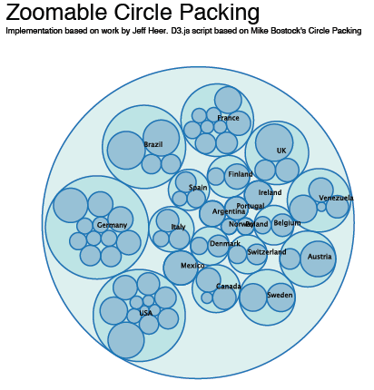

# Custom Visualization Component

!!! note

    Starting Jaspersoft Studio version 10.1.0, the custom visualization component is available only in Jaspersoft Studio Professional.

The custom visualization component lets you use JavaScript in Jaspersoft Studio and JasperReports Server. You can create JavaScript modules and use them in your reports to extend their functionality. The main purpose of the custom visualization component is to render SVG (Scalable Vector Graphics) images. Your modules can use third-party JavaScript libraries, such as JQuery. For example, perhaps you want to create reports with dynamic behaviors for interaction and animation; you could use D3 ([d3js.org](http://d3js.org/)) to bind data to the Document Object Model (DOM) and manipulate the SVG. Such a report is shown in D3-enabled report.

!!! note

    This component is only supported by the [Jaspersoft Community](http://community.jaspersoft.com/). Jaspersoft Technical Support and Engineering do not support it.

|                                                                        |
|------------------------------------------------------------------------|
|  |
| D3-enabled report                                                      |

The custom visualization component is a powerful and flexible feature, suitable for advanced users of JasperReports Library. Using the component requires advanced coding skills in the following technologies:

-   JavaScript

-   CSS

-   HTML/DHTML

-   Optionally, any third-party library you want to expose in Jaspersoft Studio and JasperReports Server.

!!! note

    Starting Jaspersoft Studio Professional 10.1.0, only NodeJS support is available to **Build** the custom visualization component. The Rhino and Google Closure compiler toolset support is discontinued.

    NodeJS must be installed at the standard location, else an error is shown.

    You can fix the error by providing the path to the NodeJS executable in the **Preferences** page, in the `com.jaspersoft.studio.components.customvisualization.nodejspath` property.

    If the property is not present, you can add it. Else, you can modify the property.

Before creating reports that use your third-party library, you must configure various applications to work together. You must:

1.  Install Chrome or Chromium, which renders your JavaScript module's visual component.

2.  Configure Jaspersoft Studio and JasperReports Server to use Chrome/Chromium.

3.  Create a JavaScript module that renders an SVG. This main module, as well as any JavaScript it relies on, are optimized and combined into a single JavaScript file (using a RequireJS build file (build.js). Jaspersoft Studio simplifies the optimization process to generate the JavaScript implementation of the component. Place your JavaScript files somewhere that you Jaspersoft Studio can find it, such as attaching it to the report unit or placing it on the classpath.

Next, create and deploy reports that rely on your custom visualization component to render SVG images. Drag the Custom Visualization component from the Elements palette into the Design tab, and create a report-level property of type `com.jaspersoft.jasperreports.components.customvisualization.require.js`. It must specify the main JavaScript file for your custom visualization. The custom visualization component appears as a rectangular area of your report. A single custom visualization component can be used by any number of reports that require the same JavaScript functionality. When exported to HTML format, these reports can be interactive (assuming that your module attaches events to the DOM).

You can also create a custom component descriptor in JSON, which lets you add the following to your component:

-   A component UI: You can specify the property names and types and the data items used by the component.

-   A thumbnail image: Used when the component is presented in the component choose, which appears when a component is dragged into the design view.

-   Location of implementation files: You can specify the location of the JavaScript file and CSS file that implement the component.

This component can help you use any number of JavaScript libraries, such as:

-   D3.js

-   Raphäel

-   Highcharts

-   JQuery

For details, see the articles on our Community wiki that describe the custom visualization component.
