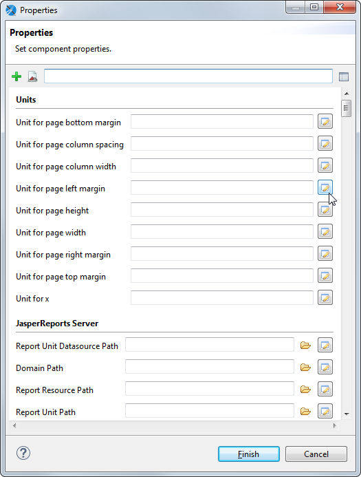
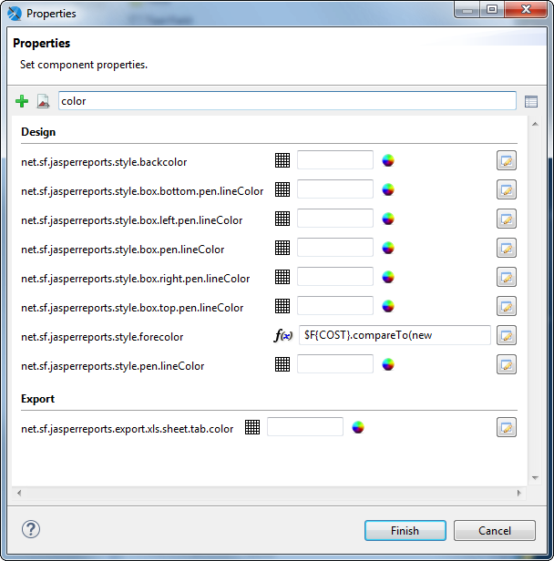

# Working with Advanced Properties

You can use the **Properties** dialog to view and set properties for elements, bands, or a report. The **Properties** dialog shows all the properties that can be set in the **Properties** view along with additional properties not shown elsewhere in the user interface.

Most element types support static values or expressions in properties. Some element types only allow static properties, including bands and parameters. The properties available for fields depend on the query language.

The steps to open the Properties dialog differ depending on the element you select. For example:

- To open the **Properties** dialog for a text field, go to the **Appearance** tab in the **Properties** view and click the **Edit Properties** button.
- To open the **Properties** dialog for a report, go to the **Advanced** tab in the **Properties** view and select **Edit Properties**, then click **...**.

|  |
|----|
|  |
| *Figure 1: Properties dialog for a report* |

By default, the **Properties**dialog displays a form with available properties grouped by category. The available categories depend on the element type. For example, reports allow you to set a number of JDBC and timezone properties. Each property has a widget that allows you to set the property. Deprecated properties are displayed with strike-through.

The **Properties** dialog supports the following actions:

- Hover to view the description of a property.

- Right-click on an entry box to set the property to Null or reset it to the default value (when available).

- Click  to switch to a summary table view. Using this view, you can manage multiple properties at the same time. For example, you can select and copy multiple properties, and then paste them into another element. To return to form view, click .

- Click  to show only properties that have already been set at element level.

- Enter a string in the Search property entry bar to search for a property by name.

- Some properties include variables in the property names, shown with curly brackets. To use these properties, replace the entire value, including the brackets, with the name you want to use.

!!! note

    You can also use styles to format some types of elements. Styles can be applied to multiple elements, but are more restrictive. Properties must be individually applied to each element.

## Example of Using the Properties Dialog

This example shows how to set a property expression that turns values in a text field red when they are greater than 10.

Create a report

To create the report for the chart

1.  Create a new, blank report using the Sample DB data adapter and the query: `select * from PRODUCT`.
2.  Click **Next**.
3.  Click  to select all fields, then click **Finish**.
4.  Delete all bands except for **Column Header** and **Details**.
5.  In the **Outline** view, expand the **Fields** node, select all fields, and drag them to the **Detail** band.

The fields are added to the detail band and headers are automatically added to the **Column Header** band.

1.  Drag to select the fields in the **Detail** band, right-click, and select **Align in Container \> Align to Top Margin**. Then double-click the detail band to resize it to fit the fields.

Set properties on a text field

1.  Select the `$F{COST}` field in the **Detail** band.
2.  Set the `Cost` field to display as currency. In the **Properties** view, select the **Text Field** tab and click **...**
3.  In the **Pattern Property** textbox, enter the following expression:

`$###,###.00`

1.  Select the **Appearance** tab in the **Properties** view and click **Edit Properties** at the bottom of the view.
2.  To see properties related to color, type `color `in the search bar.

|  |
|----|
|  |
| *Figure 2: Properties dialog for a report* |

1.  Click the expression editor icon next to **net.sf.jasperreports.style.forecolor** to open the expression editor.
2.  Select **Use Expression** and enter the following expression:

`$F{COST}.compareTo(new BigDecimal(10)) > 0 ? "#FF0000" :"#000000"`

1.  Click **Finish**.
2.  Click **Preview** to view the report.

## Variables in Property Names

Variables in property names are shown inside curly brackets (). To use these properties, replace the entire variable (including the brackets) with the name you want to use. You can create multiple properties and set them to different expressions.

### Sample Property with Variables in the Name

To see an example of a property with variables in the name:

1.  Select the root node of any report.
2.  Go to the **Advanced** tab in the **Properties** view and select **Edit Properties …** .
3.  In the **Properties** dialog, and scroll down to the **Export properties** or search on "export". You see the property `net.sf.jasperreports.export.csv.column.names.{arbitrary_name}`.

You can use an instance of this property to set a comma-separated list of names of columns you want to appear in CSV exports of the report. Each report element associated with one of these column names are exported. Elements that are not associated with these column names are be part of the export. For example, setting `<property name="net.sf.jasperreports.export.csv.column.names.1" value="id,name,department"/>` tells the CSV exporter to export those columns.

You can also set this property on a higher level, such as a dataset or crosstab. To associate an element with a column name, set the `net.sf.jasperreports.export.csv.column.name` property for that element.

### Using Multiple Properties With the Same Prefix

You can create multiple properties with this prefix and set column names for each instance. At runtime, all properties starting with the `net.sf.jasperreports.export.csv.column.names.` prefixes are collected and their values are parsed to get the list of all column names to be exported.

For instance, in a report you can have:

```
<property name="net.sf.jasperreports.export.csv.column.names.1" value="id,name,department"/>
<property name="net.sf.jasperreports.export.csv.column.names.2" value="address"/>
```

For this example, the result is the following columns, in this order: `id, name, department, address`.

The `{arbitrary_name}` suffix can be any name you choose. The following code gives the same result at runtime:

<table>
<colgroup>
<col style="width: 100%" />
</colgroup>
<tbody>
<tr>
<td><p><code>&lt;property name="net.sf.jasperreports.export.csv.column.names.first.column.set" value="id,name,department"/&gt;</code></p>
<p><code>&lt;property name="net.sf.jasperreports.export.csv.column.names.address" value="address"/&gt;</code></p></td>
</tr>
</tbody>
</table>

You can use multiple properties with the same prefix for dynamic properties. For example, you could generate column names from two different parameters:

```
<propertyExpression name="net.sf.jasperreports.export.csv.column.names.db.columns">
   <![CDATA[$P{columns1}]]>
</propertyExpression>
```

and

```
<propertyExpression name="net.sf.jasperreports.export.csv.column.names.additional.columns">
    <![CDATA[$P{other_columns}]]>
</propertyExpression>
```

When using multiple properties with the same prefix

- Properties are collected in the same order that they are declared in the report.

- If you have a single column name, you do not need a comma.

- Each instance should have a different name, to make them distinct. If you have two instances with the same name, the second instance overwrites the first.

- If a column name appears in both instances of the property, it is collected twice. This behavior should be avoided.

## Adding a Custom Property

When you create custom components using JasperReports Library, properties for these custom components may not be discovered by the Jaspersoft Studio UI. In this case, you can add the property to the Jaspersoft Studio interface by clicking + in the Properties dialog and manually entering the property name. All properties in the Properties dialog are loosely coupled to the JRXML, which means that adding or removing these properties does not change the JRXML document structure.

## Setting Properties for XLSX Metadata Export

To generate accessible Excel files, you are required to configure the report elements with metadata export properties. These metadata properties tell the report engine to use the metadata exporter. So, only elements that have these properties get exported. You can set the following metadata properties in the report to activate the XLSX metadata export:

- `net.sf.jasperreports.export.xls.column.names.{arbitrary_name}`(optional): Report-level property that contains a comma-separated list of column names that is exported for a report.

- `net.sf.jasperreports.export.xls.write.header`(optional): Report-level property that specifies if the column names also get exported for a report. The default value is false.

- `net.sf.jasperreports.export.xls.column.name`(mandatory): Each element that is exported must contain this property that specifies the name of the column associated with the element.

- `net.sf.jasperreports.export.xls.repeat.value`(optional): Element-level property that specifies if the value associated with the element must be repeated when it is missing.

- `net.sf.jasperreports.export.xls.data`(optional): Element-level property that contains the value associated with the element at export time. It is applied to text elements only.

- `net.sf.jasperreports.export.xls.column.width.metadata`(optional): Element-level property that contains the width (in pixels) of the column associated with an element.

## Setting Properties for CSV Metadata Export

To generate data-oriented CSV files, you are required to configure the report elements with metadata export properties. These metadata properties tell the report engine to use the metadata exporter. So, only elements that have these properties get exported. You can set the following metadata properties in the report to activate the CSV metadata export:

- `net.sf.jasperreports.export.csv.column.names.{arbitrary_name}` (optional): Report-level property that contains a comma-separated list of column names that is exported for a report.

- `net.sf.jasperreports.export.csv.write.header` (optional): Report-level property that specifies if the column names also get exported for a report. The default value is false.

- `net.sf.jasperreports.export.csv.column.name` (mandatory): Each element that is exported must contain this property that specifies the name of the column associated with the element.

- `net.sf.jasperreports.export.csv.repeat.value` (optional): Element-level property that specifies if the value associated with the element must be repeated when it is missing.

- `net.sf.jasperreports.export.csv.data` (optional): Element-level property that contains the value associated with the element at export time. It is applied to text elements only.
