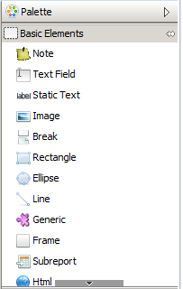
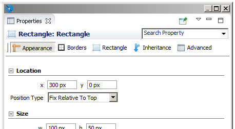

# Common Element Properties

All elements have a set of common properties. Other properties are specific to the element type. An element's properties determine its appearance and position on the page. You can access the properties of a selected element in the Properties view (by default in the upper right area of the UI). In Jaspersoft Studio, you place elements within bands (containers). Depending on the elements it contains, you can change the vertical size of a band.

## The Palette

Elements appear in the palette, located by default in the top right of the UI.

|                                                  |
|--------------------------------------------------|
|  |
| Elements in the palette                          |

The palette contains three subpalettes:

- Basic Elements contains the elements and components available in all editions of Jaspersoft Studio.
- Composite Elements contains elements created as combinations of other elements, such as Page Number and Time. You can add your own composite elements to any palette.
- Components Pro contains elements only available in commercial versions of Jaspersoft Studio. This subpalette is not visible in the Community edition.

## Element Properties

Element properties are divided into categories, visible via tabs in the Properties view. The attributes available depend on the element type.

|                                                                        |
|------------------------------------------------------------------------|
|  |
| Properties view for a rectangle                                        |

- The **Appearance** tab allows you to set the location, size, color, and text style of the element.
- The **Borders** tab allows you to set the padding and border style, color, and width of the element.
- An element tab allows you to set evaluation time along with properties specific to the element type. For example:
  - The **Static Text** tab allows you to define unchangeable text for a field, and control its appearance.
  - The **Text Field** tab allows you to format and position a text field element.
  - The **Image** tab allows you to set image alignment, fill, and scale properties.

Some elements have more than one element-specific tab. For example, the Chart component has the **Chart** and **Chart Plot** tabs, and the Map component has the **Map**, **Authentication**, **Markers**, and **Paths** tabs.

- The **Inheritance** tab allows you to view any attributes inherited from another level, and override those attributes when possible.
- The **Hyperlink** tab, available for image, text field, and chart elements, allows you to define a hyperlink in an element.
- The **Advanced** tab displays detailed information about the element.

Frequently, the value of an attribute is undefined, and it has a common default value. This means that the element does not have a specific behavior defined, but gets a behavior from somewhere else. For example, the default value of the attribute "background color" is undefined in most of the cases, but when a non-transparent element is added to a report in the design tab, you can see that it has a white background. The value of the background color attribute is inherited from a lower level.
