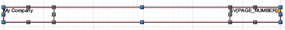
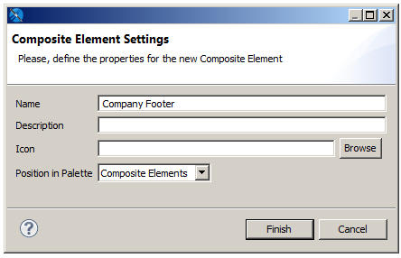
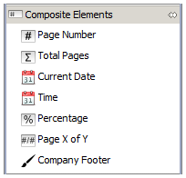
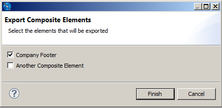
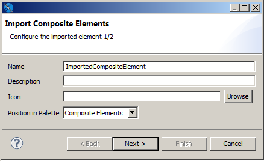

# Working with Composite Elements

Composite elements are one or more pre-configured elements that you can use in your reports. You can configure properties such as the size, color, or font of an element, or create a text field with a complex expression you frequently use, and then save it as a composite element. Jaspersoft Studio also includes several pre-existing composite elements, such as page number and total pages.

Some element types are hard to reuse in other reports, in particular, those elements that depend on the availability of a specific subdataset having certain fields. You cannot include elements based on a dataset in a composite element. In particular, composite elements cannot include charts, tables, lists, and crosstabs. Composite elements can include notes, text fields, static text, images, breaks, rectangles, ellipses, lines, frames (must contain only permitted elements), barcodes, HTML elements, and other composite elements.

If your composite element contains elements that use expressions (text-field expressions or print-when expressions), the objects you are referencing in those expressions (such as variables, fields, or parameters) should be available in the report in which you use the composite elements. If the objects are not present, you may receive an error when compiling or previewing the report.

!!! warning

    Composite elements cannot include elements based on a dataset, such as charts or crosstabs.

## Creating and Editing Composite Elements

To create a composite element

1.  Open or create a report.

    For example:

    1.  Go to **File &gt; New &gt; Jasper Report** or click  on the main toolbar.
    2.  In the New Report Wizard, select Blank A4 in the Report Templates window and click **Next**.
    3.  Select a name and location for your file (for example, Composite Element Sample Report in MyReports) and click **Next**.
    4.  Choose **One Empty Record** in the Data Source window and click **Finish**.

2.  Place the elements that you want in the Title band and format and position them.

    !!! note

        Composite elements must be created from the Title band.

    For example, to create a footer that includes your company name and the page number:

    1.  Drag the Static Text element to the Title band in your report and type My Company. Then align the company name to the left by right-clicking the Static Text element and selecting **Align in Container &gt; Align to Left Margin**.
    2.  Drag the Page Number element to the Title band in your report. Align the Page Number to the right by right-clicking the Page Number element and selecting **Align in Container &gt; Align to Right Margin**. Then, with the Page Number element selected, go to the **Text Field** tab in the Properties view and click  to align the text right.
    3.  Select both elements, right-click, and choose Align Components &gt; Align Top.

3.  Select all the elements that you want in your composite.

4.  (Optional) To have your elements move together, right-click, and select **Enclose into Frame** from the context menu.

5.  Make sure that all elements are still selected.

    |  |
    |----|
    |  |
    | *Figure 1 Selected Elements For Composite Element Creation* |

6.  Right-click and select **Save as Composite Element**.

    The Composite Element Settings dialog opens.

    |  |
    |----|
    |  |
    | *Figure 2 Composite Element Settings Dialog Box* |

7.  Enter the following information:

-   **Name**: Enter a unique name that you want to appear in the palette.

    -   **Description** (optional): Enter a description. If the element uses text fields or expressions, it may be useful to mention these, or the expected data adapter, in the description.
    -   **Icon** (optional): Choose the icon that shows in the palette for this composite element. You can choose an icon in JPG, PNG, or GIF format. If you click Browse to locate an icon, and you want to use a PNG or a GIF, you must choose the correct format at the bottom right of the file open dialog. If you do not choose an icon, Jaspersoft Studio uses the default icon .
    -   **Position in Palette**: Select one of Basic Elements, Composite Elements, or Components Pro.

1.  Click **Finish**.
2.  Click **OK** on the confirmation message.

The new composite element is saved as a .jrtool file in the same location as your report. An icon is added to the bottom of the subpalette that you selected.

|  |
|----|
|  |
| *Figure 3 Composite Element in the Palette* |

To edit the contents of a composite element

1.  Right-click on the composite element in the palette and select **Open in Designer**.

    The composite element opens in the Designer as a .jrtool file.

2.  You can add and remove elements and change element formatting. If you add elements, remember to select all elements and create a frame.

3.  Save the file.

To edit the name or location of a composite element

1.  Right-click on the composite element in the palette and select **Edit**.

    The Composite Element Settings dialog opens.

2.  Change the name, description, icon, or position in the palette.

3.  Click **Finish**.

4.  Click **OK** on the confirmation message.

To delete a composite element, you have created

1.  Right-click on the composite element in the palette and select **Delete**.

The element is removed from the palette.

!!! note

    You cannot delete the composite elements that are included Jaspersoft Studio.

## Exporting and Importing Composite Elements

You can share composite elements between Jaspersoft Studio installations using import/export.

To export one or more composite elements

1.  Right-click on a custom composite element in the palette.

2.  Select  **Export Composite Elements** from the context menu.

    |  |
    |----|
    |  |
    | *Figure 4 Exporting Composite Elements* |

3.  Select the elements that you want to export in the Export Composite Elements dialog.

4.  Click **Finish**.

5.  When prompted, navigate to the location where you want to save the export file, and click OK.

The selected composite elements are saved as a .zip file in the location that you chose.

To import a composite element set

1.  Right-click on any element in the palette.

2.  Select  **Import Composite Elements** from the context menu.

3.  Navigate to the location where your zip file is stored, select the file you want to upload, and click **Open**.

4.  Choose a name, optional description, and optional icon in the Import Composite Element dialog and select the palette where you want the composite element to appear. The name in the palette must be unique.

    |  |
    |----|
    |  |
    | *Figure 5 Importing Composite Elements* |

5.  If there are additional elements in the file, click **Next** and configure the next element as in the previous step.

6.  When you have configured all your imported elements, click **Finish**.

The composite elements are placed in the palette with the settings you configured.
