# Formatting Elements

Formatting tools help organize the elements in the report. Right-click the element that you want to work on and select a tool from the context menu.

|                                                              |
|--------------------------------------------------------------|
| 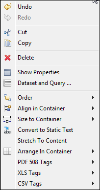 |
| *Figure 1 Formatting Tools Menu*                             |

The tools in the context menu are specific to the selected items. The following tables explain the tools.

!!! note

    A container is the band, frame, or cell that contains the element.

**Formatting Tools**

<table>
<thead>
<tr>
<th>
Icon
</th>
<th>
Tool Name
</th>
<th>
Description
</th>
<th>
Multiple Select?
</th>
</tr>
</thead>
<tbody>
<tr>
<td colspan="4">
Order Tools
</td>
</tr>
<tr>
<td>

</td>
<td>
Send Backward
</td>
<td>
Moves the element behind its current layer.
</td>
<td>
Yes
</td>
</tr>
<tr>
<td>
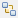
</td>
<td>
Send to Back
</td>
<td>
Moves the element to the bottom layer.
</td>
<td>
Yes
</td>
</tr>
</tbody>
<tbody>
<tr>
<td colspan="4">
Align in Container Tools
</td>
</tr>
<tr>
<td>
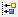
</td>
<td>
Align to Left
</td>
<td>
Aligns the left side to that of the primary element.
</td>
<td>
Yes
</td>
</tr>
<tr>
<td>
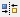
</td>
<td>
Align to Center
</td>
<td>
Aligns the center to that of the primary element.
</td>
<td>
Yes
</td>
</tr>
<tr>
<td>
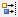
</td>
<td>
Align to Right
</td>
<td>
Aligns the right side to that of the primary element.
</td>
<td>
Yes
</td>
</tr>
<tr>
<td>
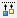
</td>
<td>
Align to Top
</td>
<td>
Aligns the top side (or the upper part) to that of the primary element.
</td>
<td>
Yes
</td>
</tr>
<tr>
<td>
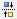
</td>
<td>
Align to Middle
</td>
<td>
Aligns the middle to that of the primary element.
</td>
<td>
Yes
</td>
</tr>
<tr>
<td>
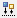
</td>
<td>
Align to Bottom
</td>
<td>
Aligns the bottom side (or the lower part) to that of the primary element.
</td>
<td>
Yes
</td>
</tr>
</tbody>
<tbody>
<tr>
<td colspan="4">
Size Components Tools
</td>
</tr>
<tr>
<td>

</td>
<td>
Match Width
</td>
<td>
Adjusts the width to that of the primary element.
</td>
<td>
Yes
</td>
</tr>
<tr>
<td>
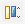
</td>
<td>
Match Height
</td>
<td>
Adjusts height to that of the primary element.
</td>
<td>
Yes
</td>
</tr>
<tr>
<td>
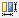
</td>
<td>
Match Size
</td>
<td>
Resizes to that of the primary element.
</td>
<td>
Yes
</td>
</tr>
</tbody>
<tbody>
<tr>
<td colspan="4">
Size to Container Tools
</td>
</tr>
<tr>
<td>

</td>
<td>
Fit to Width
</td>
<td>
Adjusts elements to fill width of container.
</td>
<td>
Yes
</td>
</tr>
<tr>
<td>
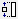
</td>
<td>
Fit to Height
</td>
<td>
Adjusts elements to fill height of container.
</td>
<td>
Yes
</td>
</tr>
<tr>
<td>

</td>
<td>
Fit to Both
</td>
<td>
Adjusts elements to fill width and height of container.
</td>
<td>
Yes
</td>
</tr>
</tbody>
<tbody>
<tr>
<td colspan="4">
Arrange in Container Tools
</td>
</tr>
<tr>
<td>

</td>
<td>
Horizontal Layout
</td>
<td>
Centers selected elements vertically.
</td>
<td>
Yes
</td>
</tr>
<tr>
<td>

</td>
<td>
Vertical Layout
</td>
<td>
Centers selected elements horizontally.
</td>
<td>
Yes
</td>
</tr>
<tr>
<td></td>
<td>Grid Layout</td>
<td>Positions elements in a grid based on properties set on each element.</td>
<td>Yes</td>
</tr>
</tbody>
<tbody>
<tr>
<td colspan="4">
Miscellaneous Tools
</td>
</tr>
<tr>
<td></td>
<td>
Stretch to Content
</td>
<td>
Resizes element to fit the content
</td>
<td>
N/A
</td>
</tr>
<tr>
<td></td>
<td>
PDF 508 Tags
</td>
<td>
Adds tags required for PDF 508C compliance
</td>
<td></td>
</tr>
<tr>
<td></td>
<td>
XLS Tags
</td>
<td>
Adds tags that define how data is exported to the Microsoft Excel format
</td>
<td></td>
</tr>
</tbody>
</table>
