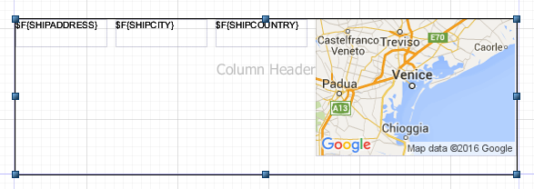
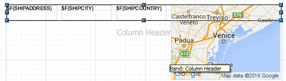

# Frames

A frame is an element that can contain other elements and optionally draw a border around them. Since a frame is a container of other elements, in Outline view the frame is represented as a node containing other elements.

A frame can contain other frames, and so on, recursively. To add an element to a frame, drag the new element from the palette inside the frame. Alternatively you can use Outline view and drag elements from a band into the frame. The position of an element is always relative to the container position. If the container is a band, the element position is relative to the top of the band and to the left margin. If the container (or element parent) is a frame, the element coordinates are relative to the top-left corner of the frame. Since an element dragged from a container to another does not change its top/left properties, when moving an element from a container to another its position is recalculated based on the new container location.

The advantages of using a frame to draw a border around a set of elements, with respect to using a simple rectangle element, are:

-   When you move a frame, all the elements contained in the frame move.
-   While using a rectangle to overlap some elements, the elements inside the rectangle are not treated as if they overlap (with respect to the frame), so you do not have problems when exporting in HTML (which does not support overlapped elements).
-   Finally, the frame automatically stretches according to its content, and the element ` position type` property of its elements refer to the frame itself, not to the band, making the design a bit easier to manage.

## Sizing the Frame

Frames can be sized to appear smaller than their contents. This is useful because by default, each time a frame is used in a report, the report uses the height of the frame for each record. A frame that is too large can cause unwanted white space.

For example, suppose you have a frame that contains some fields and a map:

|                                                      |
|------------------------------------------------------|
|  |
| *Figure 1 Frame size larger than contents*           |

Now suppose that your map is configured with an expression that only displays the map some of the time. If you size the frame to be bigger than the map, the report inserts white space when the map is not displayed. Instead, you can size the frame to be smaller than the map:

|                                                          |
|----------------------------------------------------------|
|  |
| *Figure 2 Frame size smaller than contents*              |

Now, the frame expands as necessary to include any non-null content, but no additional white space is added if the map is not present.

!!! warning

    Be careful when creating and modifying reports that use frames that are smaller than their contents. The user interface does not always make it clear which elements are contained in a frame. For example, it is possible to add a field to a frame and then resize the frame so that the frame no longer overlaps the element. To see which elements are in a frame, select the frame and expand its node in outline view. If you have trouble moving an element inside or outside a frame, move it in outline view.

# Inserting Page and Column Breaks

Page and column breaks are used to force the report engine to make a jump to the next page or column. A column break in a single column report has the same effect as a page break.

In the Design tab, they are represented as a small line. If you try to resize them, the size is reset to the default because they are used just to set a particular vertical position in the page (or better, in the band) at which Jaspersoft Studio forces a page or column break.

The type of break can be changed in the Properties view.
