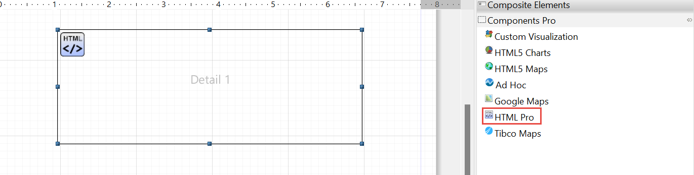
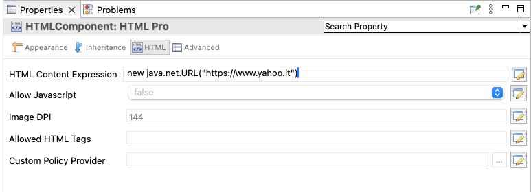
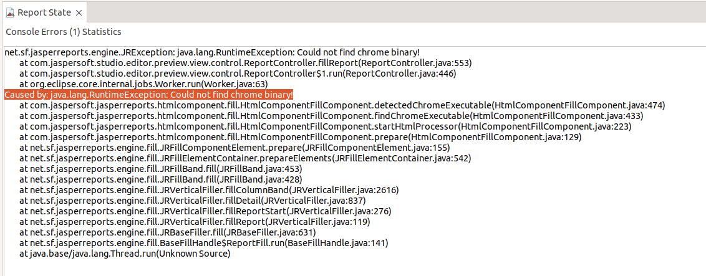

# HTML Pro Component

!!! note

    The **HTML Pro** component is exclusively available for Professional users and is unrelated to the outdated HTML component in the Community version.

The **HTML Pro** component allows the embedding of HTML content (including layout, tables, and images) into JasperReports. While the support for basic HTML formatting using HTML as the markup language for text fields is already available, it is limited and does not support images, tables, and custom CSS-based formatting.

The component fetches HTML content provided by an expression (`contentExpression`), which can either be a string containing HTML code or a URL. Currently, the support for fetching extra options (such as authentication, request headers, URL parameters and HTTP verb) is not available.

The component's output can span several pages. It modifies the HTML content to prevent text from splitting between pages, similar to how browsers handle document printing. However, any CSS directives with `media="print"` are ignored.

**HTML Output**

The component uses an iframe and CSS to present only the relevant portion of the HTML content on each page.

!!! note

    Currently, each iframe contains the entire HTML document and shows only the relevant portion by setting the document's top margin, hiding the overflow, and preventing scrolling.

The user perceives only the chunk of the HTML document reserved for that page. Since the HTML is provided by the user and not generated by JasperReports, links are undetected by JasperReports and unavailable in the report metadata, even if the user wants to use them in advanced modes like Visualize.js.

**PDF Output**

Each fragment of HTML is exported as PDF and superimposed onto the JasperReports PDF output.

**Other Output**

HTML portions are rendered as JPEG images and embedded into the final document.

!!! warning "Restriction"

    TimeoutError exceptions were observed in specific cases on Windows and Linux, such as when handling remote images.

## Playwright Library Usage

The JasperReports HTML PRO component leverages the Microsoft Playwright library to provide enhanced HTML report generation capabilities. To facilitate a seamless user experience, the Jaspersoft Studio Pro product includes the appropriate Playwright version pre-bundled and tailored to the user's specific operating system. This integration, with a Google Chrome installation on the user's machine, ensures the HTML PRO component operates flawlessly and accurately renders reports in the desired HTML format.

The mandatory `playwright.cli.dir` property is already configured internally within the Jaspersoft Studio Pro application plug-in(s).

!!! note

    The Jaspersoft Studio configuration `.ini` file can be used to override the default playwright location property by specifying a custom location. This is generally done in the testing/debug scenarios.

## Jaspersoft Studio component

The **HTML Pro** component is a new component and is available in the **Components Pro** subpalette. The **HTML Pro** component allows you to use HTML in Jaspersoft Studio and JasperReports Server.

The **Properties** pane, in the lower-right corner, currently allows you to view the following **HTML Pro** properties:

-   **HTML Content Expression**: This is where you provide the specifics of the content (either the URL or the HTML content itself) that will be rendered.

-   **Allow Javascript**: The `com.jaspersoft.jasperreports.html.component.allow.javascript` is used to allow or disallow javascript in HTML. By default, javascript is not allowed, so it is set to `false`.

-   **Image DPI**: The `com.jaspersoft.jasperreports.html.component.image.dpi` property is used to set the resolution of the images in DPI. This is used when exporting the HTML content to formats other than PDF and HTML.

-   **Allowed HTML Tags**: The `com.jaspersoft.jasperreports.html.component.allowed.elements` property is used to set the list of allowed tags in HTML. This property only works if the HTML is provided as a string. It has no effect if the HTML is loaded from a URL.

-   **Custom Policy Provider**: The `com.jaspersoft.jasperreports.html.component.policy.factory.provider` property specifies a class implementation of the `com.jaspersoft.jasperreports.html.component.policy.factory.provider.PolicyFactoryProvider` interface. It enables a more granular and detailed approach to input sanitization. It is based on customizing an `org.owasp.html.PolicyFactory`.

The preview requires Chrome to run. Otherwise, a runtime exception is thrown.

!!! info "Important"

    Execution errors may occur when running JRXML files with Chromium. It is strongly recommended to use the official Google Chrome solution.

    Note that the executable installation can be customized through JRL property preferences in Jaspersoft Studio.

    `net.sf.jasperreports.chrome.executable.path = /usr/bin/google-chrome`
