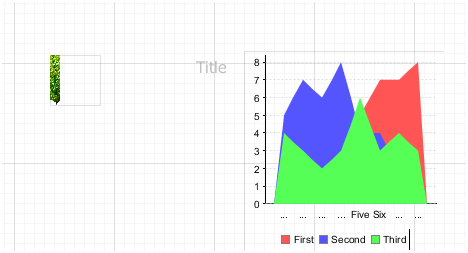
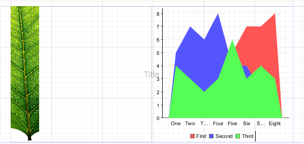
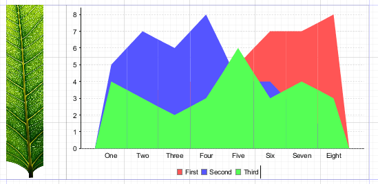
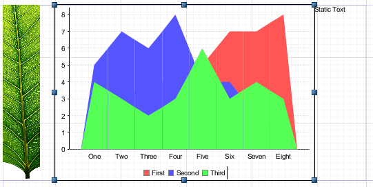
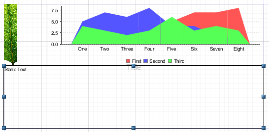
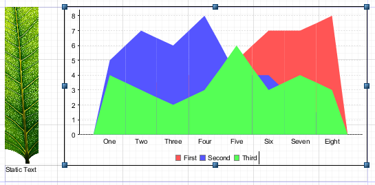

# Inserting, Selecting, and Positioning Elements

## Inserting Elements

When you insert an element, you can let Jaspersoft Studio autosize it, or you can size it as you insert it. Setting the size of an element when you insert it is useful for tabular elements such as tables and crosstabs.

To let Jaspersoft Studio autosize an element

-   Drag an element from the palette to place it in the report editing area.

    To size an element at insertion time

-   Click the element in the palette. The cursor changes  to show that an element is selected. Click and drag in the report editing area to size and place the element. If you insert a crosstab or table using click and drag, the columns fill the whole crosstab or table.

## Selecting Elements

-   Click to select an element in the report editing area.
-   Drag to adjust the element's position or change its size by selecting it and dragging a corner of the selection frame.
-   To select several elements at the same time, drag the cursor in a rectangle around them. When two or more elements are selected, only their common properties are displayed in the Properties view. If the values of the properties are different, the value fields are blank (usually the field is shown empty). To edit properties unique to one element, select only that element.
-   Shift-click to select the parent of the current object. For example, shift-click an element contained directly in a band to select the band.

## Positioning Elements

Jaspersoft Studio offers a number of ways to place the elements in your report with precision.

### Using the Grid

To show a grid for aligning elements in the page, go to **View &gt;** **Show Grid** from the main menu. To force the elements to snap to the grid, also select **Snap to Grid**.

### Using Bands

The top and left values that define the element’s position are always relative to the parent container (a band or frame).

If you want to move an element from one band to another or to a frame, drag the element node from the Outline view to the new band (or frame) node.

In the report editing area, you can drag an element from one band to another band, but the element’s parent band does not change. In general, an element must stay in its band, but there are exceptions to this rule. For example, you can move an element anywhere in the report without changing or updating the parent band.

### Guides

When dragging or resizing an element, Jaspersoft Studio suggests places to align it based on the elements currently in the Design tab, the band bounds, and any guides. When the element you are moving or resizing is in line with another element in the report, a guideline appears, allowing you to align the elements. To force elements to align with guidelines, select **View &gt; Snap to Guides** from the main menu.

You can drag and change the position of a guideline at any time with no effect on the element’s position.

To remove a guideline, drag it to the upper-left corner of the report editing area.

### The Properties View

You can use the Properties view to edit an element’s properties. By default the Properties view is at the right side of the UI. The Properties view is for more than just elements. You use it to edit all the components of a report. When you select something in the designer or the Outline view, the Properties view shows the options specific to that object.

## Positioning Elements in Containers

Some elements that can contain many other elements are called containers. Containers include bands, frames, table cells, and crosstab cells. The following tools help you position items inside containers:

-   Sizing tools – Let you size an element to fit the height, width, or entire container.

-   Container layouts – Let you set how elements are automatically arranged in a container.

    Elements inside containers must obey the following rules.

-   Elements in table cell and crosstab cells must be fully contained by the parent in the design time. Otherwise, an error occurs at compilation time.

-   Elements in bands can extend horizontally past the document margins and/or overflow the top of the band. Otherwise, an error occurs at compilation time.

-   Frames are able to adapt their size to content.

### Container Layouts

A container layout is a design-time tool that adjusts the size and the position of elements when they are added to or removed from a container. The concept of layout is specific to Jaspersoft Studio and works only at design time. Layouts do not make a report stretchable or resizable. At run-time, depending on the design, JasperReports Library may still let elements overlap or change their position relative to other elements.

There are four container layouts:

-   Free layout

-   Horizontal layout

-   Vertical layout (default)

-   Grid layout

    An additional layout, spreadsheet layout, is displayed on the same context menu, but is actually applied across bands. See [1.1, “Working with Spreadsheet Layout,” on page 1](../spreadsheet-layout.md) for more information.

    To choose a layout:

-   Right-click in the container, select Arrange in Container from the menu, then select the layout you want.

    or

-   Click the container and then select the option you want from the Layouts menu on the Appearance tab of the Properties view. This is the only way to select Free Layout.

### Working with Grid Layout

Grid layout positions elements in a container in a grid of rows and columns. By setting properties on individual elements, you can control the element's placement in the grid, as well as influence the overall height of the rows and width of the columns. Elements can span multiple rows and/or columns. If you resize the container during design, the elements are resized based on their properties.

When grid layout is selected for a container, such as a band, elements inside the container have a Layout section on the Appearance tab of the Properties dialog. The following table shows the properties that you can set on an element in a container with the grid layout. The property name to use in the source view is included in the description.

<table>
<colgroup>
<col style="width: 33%" />
<col style="width: 33%" />
<col style="width: 33%" />
</colgroup>
<thead>
<tr>
<th>Property</th>
<th>Value</th>
<th>Description</th>
</tr>
</thead>
<tbody>
<tr>
<td>
Row Number
</td>
<td>Relative (default) or an integer between 0 and 1000</td>
<td>
The number of the row from which this element starts. 0 is the first row. When set to Relative, increments the last evaluated row by 1.

com.jaspersoft.layout.grid.y
</td>
</tr>
<tr>
<td>
Column Number
</td>
<td>Relative (default) or an integer between 0 and 250</td>
<td>
The number of the column from which this element starts. 0 is the first column. When set to Relative, increments the last evaluated column by 1.

com.jaspersoft.layout.grid.x
</td>
</tr>
<tr>
<td>
Row Span
</td>
<td>Integer between 0 and 1000; default = 1</td>
<td>
Number of rows that the element spans.

com.jaspersoft.layout.grid.rowspan
</td>
</tr>
<tr>
<td>
Column Span
</td>
<td>Integer between 0 and 250; default = 1</td>
<td>
Number of columns that the element spans

com.jaspersoft.layout.grid.colspan
</td>
</tr>
<tr>
<td>
Fixed Size
</td>
<td>Boolean; default = false.</td>
<td>
Set to true to size the element manually. Set to false to have the element size automatically using the element's settings

com.jaspersoft.layout.grid.fixed
</td>
</tr>
<tr>
<td>
Row Weight
</td>
<td>Number; default = 1</td>
<td>
Number that specifies how much space the element's row takes relative to other rows. Not available when <strong>Fixed Size</strong> is True.

com.jaspersoft.layout.grid.weight.x
</td>
</tr>
<tr>
<td>
Column Weight
</td>
<td>Number; default = 1</td>
<td>
Number that specifies how much space the element's column takes relative to other rows. Not available when <strong>Fixed Size</strong> is True.

com.jaspersoft.layout.grid.weight.y
</td>
</tr>
</tbody>
</table>

To use grid layout

1.  This example uses a vertical image, that is, an image much taller than it is wide. You can use any vertical image, for example, a company logo rotated vertically. To create the exact image used in this example, create a report with the Green Leaf template. This creates a leaf_banner_green.png file in your workspace. In your file system, use a graphics editor to rotate the image 90°. Note that this rotates the image in any report where it is used.

2.  Create a report using the BlankA4 template and the Empty data source. Do not reuse the report created in the previous step.

3.  Add your vertical image to the title band of your report.

4.  Add a chart to the title band of your report, to the right of your image.

5.  Resize the title band to fit a chart.

    |  |
    |----|
    |  |
    | Title band before applying grid layout |

6.  Right-click in a blank space in the Title band and select **Arrange in Container &gt; Grid Layout**, or select the Title band and select **Grid Layout** in the Properties view.

    The two elements are arranged to fill the band equally.

    |  |
    |----|
    |  |
    | Title band with grid layout |

7.  Resize the elements so that the chart takes up most of the space. To do this, select the chart. In the Properties view, in the Layout section of the Appearance tab, set **Column Weight** to 5.

    The elements adjust so that the chart width is five times the image width.

    |  |
    |----|
    |  |
    | Grid layout with column weight |

8.  Now add a static text element to the far right of the title band.

    The static text is added at the end of the first row.

    |  |
    |----|
    |  |
    | Adding an element to a grid layout |

9.  Position the static text. To do this, select the static text. In the Properties view, in the Layout section of the Appearance tab, set the following:

-   Set **Row Number** to 1 to move the element to the second row. You could also have added the static text directly below the first row, but setting the row explicitly gives you more control.

    -   Set **Column Span** to 2 to have the element span both columns. You could instead set the Column Number to 2 to move the static text under the chart.

|  |
|----|
|  |
| Using two rows in grid layout |

1.  Set the relative heights of the rows. To do this, select the chart and set **Row Weight** to 10 in the Layout section of the Appearance tab of the Properties view. You could actually do this by changing the settings on any of the three elements, but in this case, the chart is the main element and you want other elements to adjust to it.

|  |
|----|
|  |
| Using row weight in grid layout |
