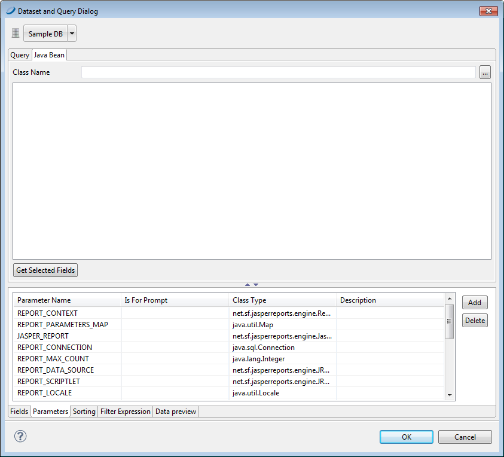

# Registration of JavaBean Fields

One of the most advanced features of JasperReports is its ability to manage data sources that are not based on simple SQL queries. One example of this is JavaBean collections. In a JavaBean collection, each item in the collection represents a record. JasperReports assumes that all objects in the collection are instances of the same Java class. In this case, the “fields” are the object attributes (or even attributes of attributes).

By selecting the **Java Bean** tab in the query designer, you can register the fields that correspond to the specified Java classes. We assume you know the Java classes that correspond to the objects that you use in your report.

|                                              |
|----------------------------------------------|
|  |
| *Figure 1: JavaBeans Tab*                    |

Suppose you are using objects of this Java class:

**com.jaspersoft.ireport.examples.beans.PersonBean**

To register fields for the class:

1.  Put the class name in the name field and click **Read attributes**. JJaspersoft Studio scans the class.

<!-- -->

1.  Check the scan results to make sure Jaspersoft Studio has captured the correct object attributes for the class type.
2.  Select the fields that you want to use in your report and click **Add**.

Jaspersoft Studio creates fields corresponding to the selected attributes and adhesion to the list. The description, in this case, stores the method that the data source must invoke to retrieve the value for the specified field.

Jaspersoft Studio parses a description such as `address.state` (with a period between the two attributes) as an attribute path. This attribute path is passed to the function `getAddress()` to locate the target attribute, and then to `getState()` to query the status of the attribute. Paths may be arbitrary and long, and Jaspersoft Studio can recursively parse attribute trees within complex JavaBeans and to register very specific fields.

We have just discussed the two tools used most frequently to register fields, but we are not done yet. There are many other tools that you can use to discover and register fields, for instance, the HQL and XML node-mapping tools.
