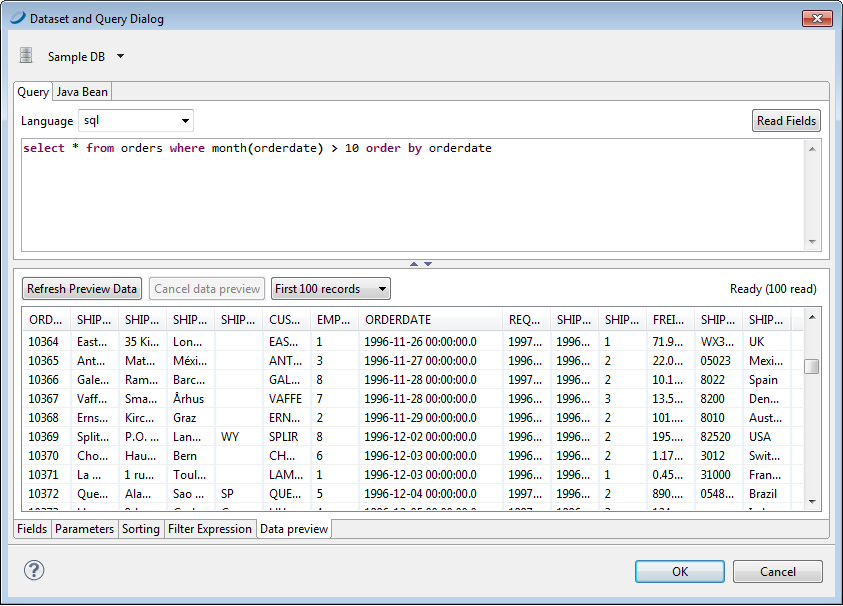

# Registration of Fields from an SQL Query

An SQL query is the most common way to fill a report. Jaspersoft Studio provides several tools for working with SQL, including a query designer and a way to retrieve and register the fields derived from a query in the report automatically.

Before opening the query dialog, be sure you select the correct connection/data source. All operations performed by the tools in the query dialog use this data source.

To open the query dialog (Query Dialog with Data Preview) right-click the name of your report in the **Outline** view and choose **Dataset and Query...**.

|                                                    |
|----------------------------------------------------|
|  |
| *Figure 1: Query Dialog with Data Preview*         |

Jaspersoft Studio does not require a query to generate a report. It can obtain data from a data source that is not defined by a query execution. JasperReports supports multiple query languages including:

-   JSON

-   MongoDBQuery

-   PLSQL

-   SQL

-   XLS

-   XPath

If the selected data source is a JDBC connection, Jaspersoft Studio tests the access connection to the data source as you define the query. This allows Jaspersoft Studio to identify the fields using the query metadata in the result set. The design tool lists the discovered fields in the bottom portion of the window. For each field, Jaspersoft Studio determines the name and Java type specified by the JDBC driver.

If your query accesses tables containing large amounts of data, scanning the data source for field names could take a while. In this case, you might consider disabling the **Automatically Retrieve Fields** option to finish your query definition quickly. When you have completed the query, click the **Read Fields** button to start the fields discovery scan.

!!! note

    All fields used in a query must have a unique name. Use alias field names in the query for fields having the same name.

The field name scan may return a large number of field names if you are working with complex tables. To reduce unnecessary complexity, we suggest that you review the list of discovered names and remove fields you are not using in your report. When you click **OK** all the fields in the list are included in the report design. Although you can remove them later in the outline view, it is a good idea at this point in the design process to remove any field names that you are not going to use.
