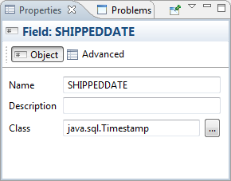
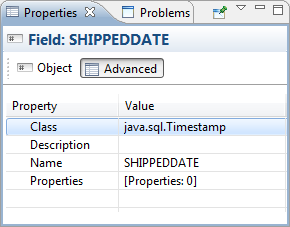

# Understanding Fields

A print is commonly created starting from a data source that provides a set of records composed of a series of fields. This behavior is exactly like obtaining the results of an SQL query.

Jaspersoft Studio displays the available fields as children of the **Fields** node in the document outline view. To create a field, right-click the **Fields** node and select **Create Field**. The new field is included as an undefined entry on the **Properties** tab. You can configure the field properties by selecting it.

Select the **Object** tab to name your field, enter a description, and choose a class.

|                                                                    |
|--------------------------------------------------------------------|
|  |
| *Figure 1: Object Tab in Properties View of a Field*               |

Select the **Advanced** tab to enter advanced properties for the field.

|                                                                    |
|--------------------------------------------------------------------|
|  |
| *Figure 2: Advanced Tab in Properties View of a Field*             |

A field is identified by a unique name, a type, and an optional description.

You can also define a set of name/value pair properties for each field. Field properties are used by QueryExecutors to configure fields, for example, to set up the timezone or date, or to configure the number format to be used. In many QueryExecutors where the data source is not a flat table (such as MDX, JSON, or XPath), properties can contain instructions or addresses to data. For JDBC, properties can be used to indicate the index of the column in the dataset. You can also set a property for the column name, which functions as an alias. Applications like this Jaspersoft Studio can use properties to store useful information: for example, column size could be used to size the TextFields or Table cells during report design. Field properties can be static or dynamic; that is, you can set the value using an expression, which is evaluated at the beginning of dataset iteration.

Jaspersoft Studio determines the value for a field based on your data source. For example, when using an SQL query to fill a report, Jaspersoft Studio assumes that the name of the field matches the name of a field in the query result set. You must ensure that the field name and type match the field name and type in the data source. You can systematically declare and configure large numbers of fields using the tools provided by Jaspersoft Studio. Because the number of fields in a report can be quite large (possibly reaching the hundreds), Jaspersoft Studio provides different tools for handling declaration fields retrieved from particular types of data sources.

Inside each report expression (like the one used to set the content of a text field) Jaspersoft Studio specifies a field object, using the following syntax:

`$F{<``field name``>}`

where `<field name>` must be replaced with the name of the field. When using a field expression (for example, calling a method on it), keep in mind that it can have a value of `null`, so you should check for that condition. An example of a Java expression that checks for a `null` value is:

`($F{myField} != null) ? $F{myField}.doSomething() : null`

This method is generally valid for all the objects, not just fields. Using Groovy or JavaScript this is rarely a problem, since those languages handle a null value exception in a more transparent way, usually returning an empty string.

In some cases a field can be a complex object, like a JavaBean, not just a simple value like a String or an Integer. A trick to convert a generic object to a String is to concatenate it to an empty string this way:

`$F{myfield}+ “”`

All Java objects can be converted to a string. The result of this expression depends on the individual object implementation (specifically, by the implementation of the `toString()` method). If the object is null, the result returns the literal text string “`null`” as a value.
