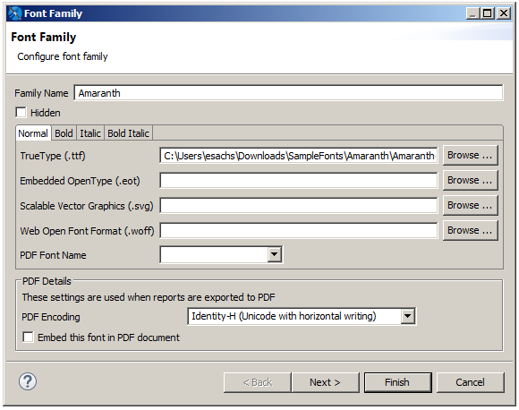
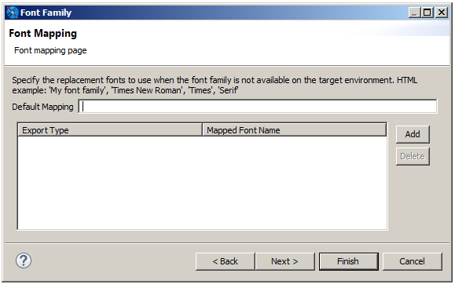
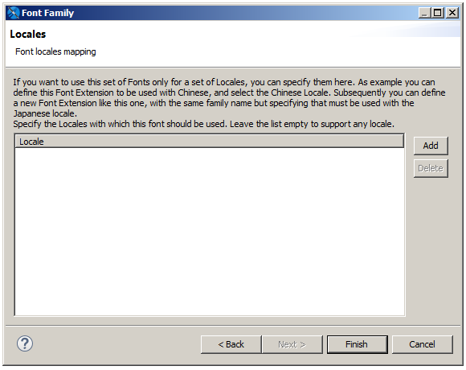

# Fonts

The best way to define and use a font in JasperReports Library is to create and use a font extension. Font extensions force JasperReports to work with external TTF, SVG, WOFF, or EOT fonts instead of using built-in or system fonts. This ensures that a specific font behaves in the same way wherever the report is run.

Using system fonts usually results in unacceptable changes in report format when the report is deployed on another system. Subtle differences in font size and spacing can affect not only the appearance of the text but the layout of the report itself. You may lose part of the text in a text element or the font might not be available at all. Font extensions help avoid these problems:

-   A font can be available in one operating system but not in another. In this case, the default font is used for the element, but it may not support the expected character set.

-   The Java virtual machine can map logical font family names to different physical fonts.

-   A font that is available in different operating systems can be slightly different from one operating system to another.

You can incorporate additional information in a font extension, such as: bold and italic fonts, the text encoding for the font, and a list of locales where the font should be used. You can also use font extensions to embed your fonts in PDF files.

In addition, you can combine several font extensions into a font set. For example, if you have data in English and Japanese, you can create a single font set that combines fonts for those languages.

This chapter contains the following sections:

-   Font Extensions Reference

-   [Example of Using Font Extensions](fonts-using.md)

-   [Deploying Font Extensions to JasperReports Server](fonts-using.md)

## Font Extensions Reference

You can work with font extensions using the Fonts page in the Preferences dialog.

### The Fonts Page

The Fonts page displays all your font extensions and font sets, and lets you create, copy, edit, delete, and reorder fonts and font sets.

To access the Fonts page

1.  Select **Window &gt; Preferences** (**Eclipse &gt; Preferences** on Mac). The **Preferences** dialog is displayed.
2.  In the **Preferences** dialog, select **Jaspersoft Studio &gt; Fonts**.

The **Fonts** page is displayed.

|                                                                   |
|-------------------------------------------------------------------|
|  |
| *Figure 1: Fonts page*                                            |

The **Fonts** page shows the following:

-   **Font List**: The list of font extensions and font sets. Font sets are prepended with **&gt;**; click to expand and show the font extensions contained in the font set. When you create a font set, the default font for the set is the font that appears highest in the list when the font set is created. Inside a font set, non-default fonts are applied in the order they appear in the font list.
-   **Add from URL**: Specify a URL location for a zip file of the fonts you want to add as extensions. To add all the Noto fonts from Google, click  and select the Noto URL.
-   **Add from Path**: Specify a folder containing the fonts you want to add as extensions.
-   **Duplicate**: Create a copy of the selected font extensions and/or font sets. Each copy has a unique name, which can be edited.
-   **Delete**: Delete the selected font extensions and/or font sets. This does not remove the original font files from your system.
-   **Up**: Move the selected font extension and/or font set up in the list of fonts.
-   **Down**: Move the selected font extension and/or font set down in the list of fonts.
-   **Create Set**: Combine the selected font extensions into a font set.
-   **Add to Set**: Add the selected font extensions to an existing font set. Clicking this displays a dialog where you can select the font set you want to add the extensions to.
-   **Edit**: Edit the selected font extension or set. For a font extension, displays The Font Family Dialog. For a font set, displays the Font Set dialog.
-   **Export**: Export the selected font extension or set.

### The Font Family Dialog

The **Font Family** dialog lets you configure an existing font extension and create and configure font sets. This dialog has three pages.

To access the Font Family dialog

Select a font extension in the Fonts list and click **Edit**.

#### Font Family Page

The **Font Family** page lets you define the basic configuration of the font or font set.

|                                                       |
|-------------------------------------------------------|
|  |
| *Figure 2: Font Family dialog – Font Family*          |

The **Font Family** page shows the following:

-   **Family Name**: Name JasperReports Library uses to identify the font extension or font set. When you create a font extension from an external font file, by default, the font name is used for the family name. This can be edited.

-   **Hidden**: Flag that determines whether the font is shown as an available font extension "above the line" in the **Font** property of a report element. Use the Hidden flag to hide internal fonts from the user. See [Viewing the Available Font Extensions](fonts-using.md) for more information.

-   **Normal/Bold/Italic/Bold Italic**: Tabs that let you configure the individual files that define the specified attributes. For each attribute, you can configure the following:

    -   **\[Font Format\]**: File location for the specific font and attribute. To change or add a file, use the **Browse** button to navigate to the file location for the specific font and attribute. You can only select one file for each tab.
    -   **PDF Font Name** (deprecated): The name of the font when exported to PDF. This can be a pre-defined PDF font or the name of the font file. Not necessary when using font extensions.

-   **PDF Details**: Settings used for the font when exported to PDF. Deprecated for static text and text fields.

    -   **PDF Encoding** (deprecated): The font encoding to use for the font. Defaults to Identity-H. To avoid Identity-H printing issues, set this to the correct encoding for your font.
    -   **Embed this font in PDF document** (deprecated): Flag that specifies whether to embed the font in a generated PDF or not. Embedding fonts is recommended to ensure consistency across platforms.

#### Font Mapping Page

The Font Mapping page lets you specify a font mapping to use when one or more font files are not installed in the target environment. The order of the font names indicates the order in which the web browser should search for the replacement font. Once a replacement font is found, the browser stops searching and renders the text. If no font mapping is available for HTML, then web fonts are used.

To access the Font Mapping Page

Click **Next** on the **Font Family** page.

|                                                                       |
|-----------------------------------------------------------------------|
|  |
| *Figure 3: Font Family dialog – Font Mapping*                         |

!!! note

    If a mapping is present, then web fonts are not used. Do not define a font mapping unless you want to override the web font functionality.

The **Font Mapping** page shows the following:

-   **Default Mapping**: A string that defines a mapping for the font. For example, a serif font might be set to: 'My font family', 'Times New Roman', 'Times', 'Serif'.
-   **Add** button: Adds the string in the Default Mapping field to the list of mappings.
-   **Delete** button: Deletes the currently highlighted mapping.
-   **Export Type**: Sets the file type (html, xhtml, or rtf). Click a value to display a down arrow, then click the arrow to select a type from the cascading menu. Defaults to html. You can define different mappings for different file types.
-   **Mapped Font Name**: Click a value to edit the name of the mapped font.

#### Locale Mapping Page

The **Locale Mapping** page lets you set the locales where this font family is used. If you have different font extensions that support different languages (for example, a font for Western European and a font for Japanese), you can set the locales for these fonts. It is preferable to use font sets.

To access the Font Locale Page

Click **Next** on the **Font Mapping** page.

|                                                                     |
|---------------------------------------------------------------------|
|  |
| *Figure 4: Font Family dialog – Locale*                             |

The **Locales** page shows the following:

-   **Locale**: List of locales supported by the font.

-   **Add** button: Add a locale where the font is supported.

-   **Delete** button: Delete the selected locale.

Clicking **Add** opens the **Locales** dialog, where you can set the locales supported by the font. This dialog has two tabs:

-   **Predefined Locales**: Choose from a list of available locales.

-   **Custom Locales**: Enter the ISO language code for a language not on the list of predefined locales. You can enter the language (required), an optional country, and an optional variant, as supported by ISO 639-1.

### Font Sets

Font sets let you group font extensions in supersets that can include several languages and/or scripts. When you use a font set, the font family resolution occurs during text processing on a per-character basis, allowing you to include characters from different languages or character sets in the same text element. For example, if you have data that includes Japanese and English entries, you can create a single font set that contains Western European and Japanese fonts and use that font set for your data.

#### The Font Set Dialog

When you create or edit a font set, the **Font Set** dialog lets you edit the name for the font set.

Accessing the font set dialog

-   To create a font set, select the font extensions you want to combine, and click **Create Font Set**. Enter a name for the set and click **OK**.

-   To edit the name of an existing font set, select the set and click **Edit**.

|                                               |
|-----------------------------------------------|
|  |
| *Figure 5: Font Set dialog*                   |

#### The Font Set Family Dialog

The **Font Set Family** dialog lets you control the mapping between fonts and characters sets for a font set. In many cases, multiple fonts inside a font family may support the same character set or "script". In this case, JasperReports Library uses a greedy algorithm to display as much contiguous text as possible in a single font. If you want to ensure that a specific font extension is used for a specific script, you can set the *included/excluded* scripts for the fonts in your font set.

To access the Font Set Family dialog.

Expand a font set in the **Fonts** list, then double-click a font inside the set.

|  |
|----|
|  |
| *Figure 6: Font Set Family dialog* |

The **Font Set Family** dialog shows the following:

-   **Primary**: Toggle that sets the primary font for the font set.

-   **Include Scripts**: Language/character sets that should use this font extension when the font set is applied.

-   **Exclude Scripts**: Language/character sets that should never use this font extension when the font set is applied.
