# Example of Using Font Extensions

This example shows how to create font extensions for two fonts and then combine them in a font set.

## Creating Font Extensions and Font Sets

To access the Fonts page

1.  Select **Window \> Preferences** (**Eclipse \> Preferences** on Mac). The **Preferences** dialog is displayed.
2.  In the **Preferences** dialog, select **Jaspersoft Studio \> Fonts**.

The **Fonts** page is displayed:

|                                                         |
|---------------------------------------------------------|
| 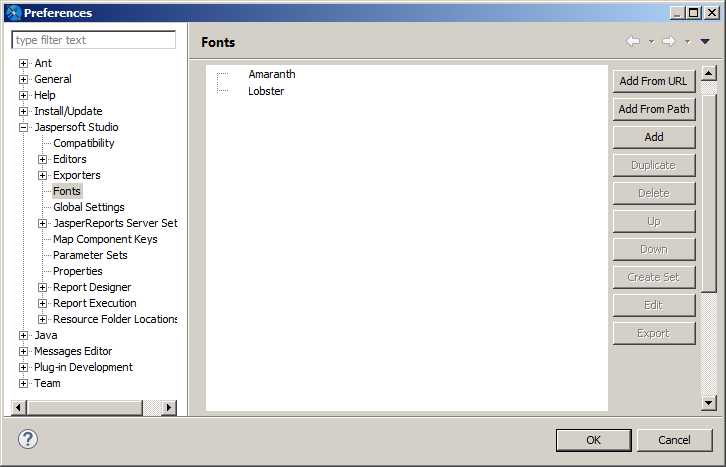 |
| *Figure 1: Fonts preferences*                           |

To create a font extension

This example uses two external Google fonts, Amaranth (a Latin-only font) and Lobster (supports Latin and Cyrillic characters). If you do not have these fonts available, you can work with other fonts. However, you must have the correct license to embed your fonts in a PDF.

1.  Make sure that the font files for the fonts have been downloaded and decompressed. You can also use fonts from a URL.

2.  Click **Add from Path** to open the **Fonts Path** dialog.

    |                                                               |
    |---------------------------------------------------------------|
    | 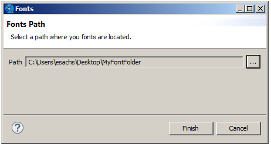 |
    | *Figure 2: Adding fonts from a path*                          |

3.  Click **...** and browse to the folder that contains the fonts you want, then click **Finish**.

Jaspersoft Studio loads all the fonts at that location, extracts the font family name embedded in the font files, and displays all the extracted fonts in the **Preferences** dialog.

!!! note

    Once you have create a font extension, you can edit it by double-clicking its name in the font list or by selecting it and clicking **Edit**. See [1.2.2, “The Font Family Dialog,” on page 1](fonts-intro-reference.md) for more information.

Next, combine these two font extensions in a single font set.

To create a font set

1.  In the **Font** section of the **Preferences** dialog, select the fonts you want in your set.

    |                                                                         |
    |-------------------------------------------------------------------------|
    | 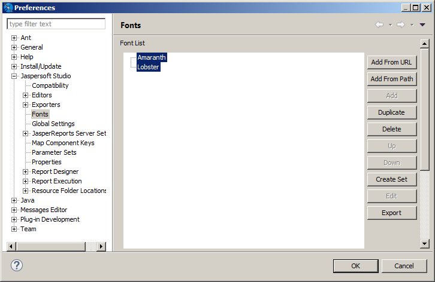 |
    | *Figure 3: Selecting font extensions*                                   |

2.  Click **Create Font Set**. The **Font Set** dialog is displayed.

    |                                               |
    |-----------------------------------------------|
    | 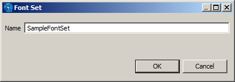 |
    | *Figure 4: Font Set dialog*                   |

3.  Enter a name for your font set and click **OK**. This example uses **SampleFontSet**.

The new font set is displayed in the font list.

Next, configure the fonts in the font set so that Lobster is only used for Cyrillic characters, even though it supports Latin characters.

Configure fonts in a font set

1.  Expand the font set to display the names of the individual font extensions.

    |                                                                   |
    |-------------------------------------------------------------------|
    | 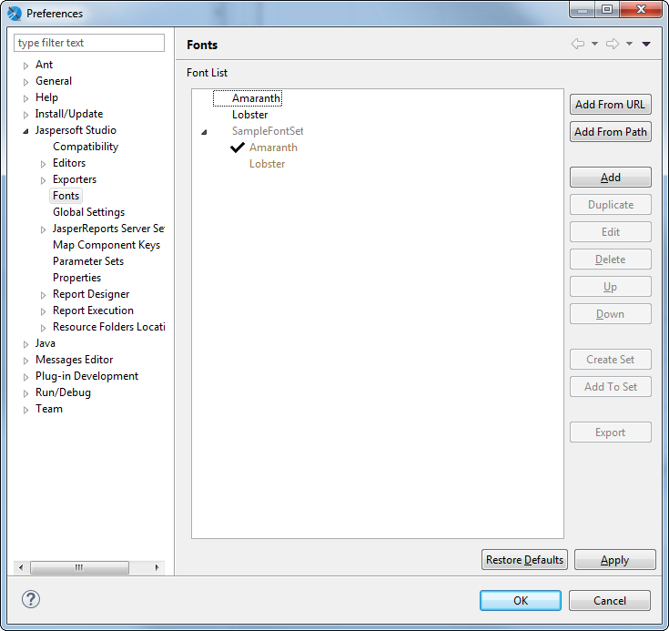 |
    | *Figure 5: Fonts window with expanded font set*                   |

2.  Select **Lobster** and click **Edit** or double-click **Lobster**.

    The **Font Set Family** dialog is displayed.

    |  |
    |----|
    | 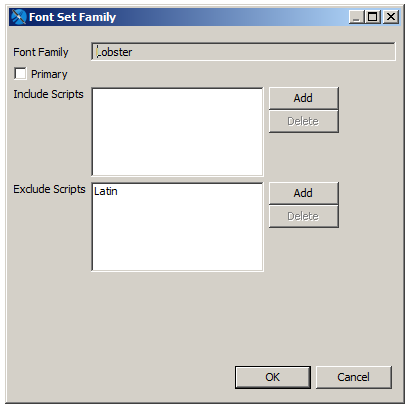 |
    | *Figure 6: Font Set Family dialog* |

3.  To prevent Lobster from being used by Latin characters, click **Add** next to the **Exclude Scripts** list.

    The **Scripts name** dialog is displayed.

4.  Select **Latin** in the **Scripts Name** dialog and click **OK**.

    Latin is added to the list of excluded scripts.

5.  Click **OK** to close the **Scripts Name** dialog; click **OK** again to close the **Font Set Family** dialog and click **OK** a third time to close the **Preference** dialog.

## Using Font Extensions in a Report

Once you have set up your font set, you can use it in a report.

Create a report with a local data adapter

1.  Export the **One Empty Record** adapter to your project. To do this:

    1.  In the **Repository Explorer**, right-click the **One Empty Record** adapter and select **Export to File**.

    |                                                                       |
    |-----------------------------------------------------------------------|
    | 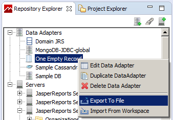 |
    | *Figure 7: Exporting a global data adapter*                           |

2.  Select the project that you want and click **OK**.

    A data adapter file is created in your project.

3.  Go to **File \> New \> Jasper Report** or click  on the main toolbar.

4.  In the **New Report Wizard** window, select a blank template, such as the **Blank A4** template, then click **Next**.

5.  Select the project folder with the data adapter file you just created, give the report a name, and click **Next**.

6.  On the **Data Source** page, select the **One Empty Record - \[OneEmptyRecord.jrdax\]** adapter. Make sure to select this adapter, which is local, and not the **One Empty Record** adapter that is selected by default.

    |                                                                     |
    |---------------------------------------------------------------------|
    | 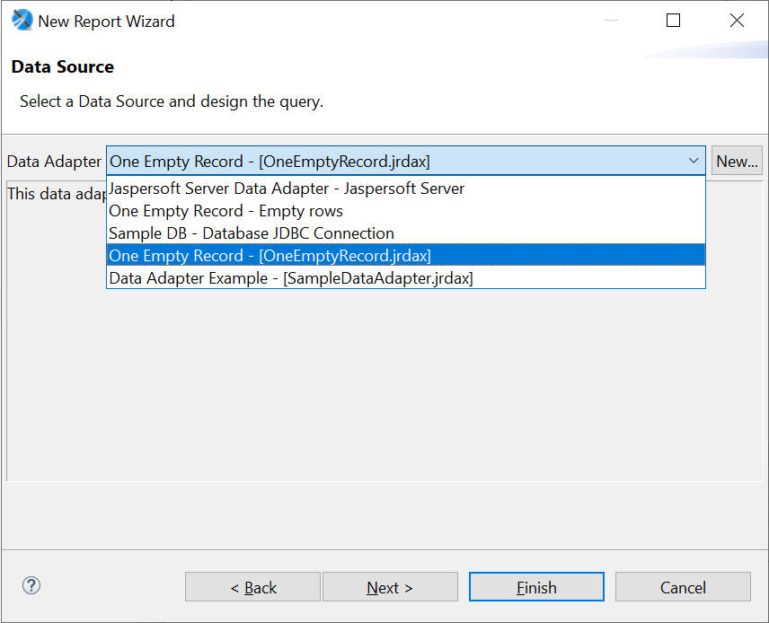 |
    | *Figure 8: Selecting the local data adapter*                        |

7.  Click **Finish**.

8.  Set the default data adapter for the report:

    1.  Select the report node in the **Outline** view.
    2.  In the **Properties** view for the report, on the **Report** tab, scroll down to **Dataset \> Default Data Adapter** and click **...**
    3.  In the **Open Data Adapter** dialog, select **Custom Value**.
    4.  Enter **OneEmptyRecord.jrdax** in the **Path** entry box.

    |                                                                         |
    |-------------------------------------------------------------------------|
    | 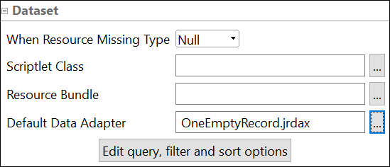 |
    | *Figure 9: Default Data Adapter*                                        |

9.  Click **Finish**.

Create a report with multi-lingual text

1.  Create a report with a blank template.

2.  Drag the Static Text element  into the Title band of the report.

3.  Enter English and Cyrillic text in the element you just created:

    Report **Отчёт**

4.  Select the element.

5.  Expand the **Font** menu on the **Static Text** tab of the **Properties** View for the static text element.

    The menu is divided into two sections. Installed font extensions or font sets appear above the line. Fonts below the line are not installed as font extensions. In this example, Amaranth, Lobster, and SampleFontSet are all above the line.

    |                                                           |
    |-----------------------------------------------------------|
    | 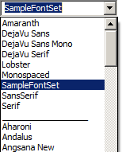 |
    | *Figure 10: Font menu with font extensions*               |

    The default font used for a new static text element is SansSerif. This font does support for extended characters, but because it is a Java logical font that is translated to a physical font by the JVM, you will not know what font is selected when the report is run.

6.  Select **SampleFontSet** from the **Font** menu and **24** from the size menu next to it. Then resize the static text element so it is large enough to display the text.

    |                                                                         |
    |-------------------------------------------------------------------------|
    |  |
    | *Figure 11: Font set in design view*                                    |

7.  Save and preview the report. The license for these fonts lets you preview the report as a PDF.

|                                                                 |
|-----------------------------------------------------------------|
|  |
| *Figure 12: Font set in preview*                                |

# Deploying Font Extensions to JasperReports Server

When you use font extensions in a report, the font extensions are not automatically available on the server. You need to export your font extensions as a jar and upload them to the server. For reports in HTML, add the jar to the server classpath and enable font support in `jasperreports.properties`. For reports in PDF, add the jar to the report as a resource.

Deploy the report to JasperReports Server

1.  Click  on the main menu bar.
2.  In the **Publish To JasperReports Server** dialog, select the JasperReports Server instance you want and choose a location for the report. This example uses **Public \> Samples \> Reports**.
3.  Enter a name for the report on JasperReports Server. This example uses **SampleFontSetReport**.
4.  Click **Next**.
5.  Verify that OneEmptyRecord appears as a resource to publish on the next page, then click **Next**.
6.  Verify that **Do not use any Data Source** is selected on the **Configure the Data Source** page. Making this selection ensures that the uploaded adapter is used for the report.
7.  Click **Finish**. If the publishing process succeeds, a success dialog is displayed.
8.  Click **OK** to exit the success dialog.

View the report on JasperReports Server

1.  Log in to the server, navigate to the report you just created, and run the report.

You see that the report does not use the correct fonts. You need to export the fonts in Jaspersoft Studio and upload them to the server.

!!! warning

    When working with fonts, look carefully at your uploaded reports. For some fonts or character sets, you do not see misformatted text; instead, the text is not displayed at all.

Export the font set in Jaspersoft Studio

1.  In **Window \> Preferences \> Jaspersoft Studio \> Fonts**, select the font set and the fonts within it and click **Export**. For this example, select Amaranth, Lobster, and SampleFontSet.
2.  In the **Export Font to Jar** dialog, select a name and location for the exported file and click **Save**. For this example, use SampleFontSet.jar.

The font set is exported as a jar in the location that you chose. This is not a regular font jar. It is a jar file that includes additional information used by Jaspersoft.

Add the font set as a jar on your JasperReports Server instance

1.  On the machine hosting your JasperReports Server instance, enable font support by adding the following to your `<js-install>\WEB-INF\classes\jasperreports.properties` file:

    `net.sf.jasperreports.web.resource.pattern.fonts=fonts/.*`

    !!! note

        You only have to enable font support once.

2.  Add the exported font set jar to your `<js-install>WEB-INF\lib` directory.

3.  Stop and restart your JasperReports Server instance. See the JasperReports Server Installation Guide for more information.

Upload the font set as a resource

You can attach the resource directly to the report, or you can upload it to another location, for example the report directory and link the report to it. Uploading a resource to another location makes it easier to reuse the resource.

1.  In the Repository Explorer in Jaspersoft Studio, navigate to the folder on your JasperReports Server instance where you want to add this resource. For this example, it is the **Public \> Samples \> Resources** folder.

2.  Right-click the folder and select **New** from the cascading menu.

    |                                                                         |
    |-------------------------------------------------------------------------|
    | 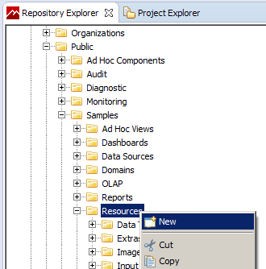 |
    | *Figure 13: Adding a resource in the Repository Explorer*               |

3.  Select a **Jar** in the **Add Resource** wizard and click **Next**.

4.  Enter a name and ID for your jar and click **Next**.

5.  Select **Upload from File System**, select the jar you want, and click **Open**.

6.  Click **Finish** to upload the selected jar.

Add the resource to your report

1.  Right-click your report in the Repository Explorer and select **New** from the cascading menu.
2.  Select a **Link** in the **Add Resource** wizard and click **Next**.
3.  Enter a name and ID for the link and click **Next**.
4.  Click  to open the **Find Resource** dialog.
5.  Navigate to the jar you uploaded and click **Open**.
6.  Click **Finish** to attach the jar to the report as a resource.

View the report on JasperReports Server

1.  Open a web browser, log in to the server, navigate to the report you just created, and run the report. You should see the correct fonts. If you do not see your fonts, there has been a problem with uploading the jar to the file system.

2.  Export the report as PDF. You should see the updated fonts. If not, there has been some problem uploading and linking the resource.

!!! note

    When verifying font extensions and sets, it is best to run the report in JasperReports Server from a web browser. Running the report from Repository Explorer in Jaspersoft Studio may not show the fonts correctly.
