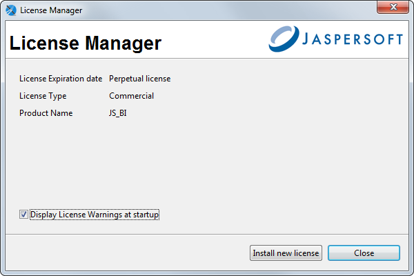

# Installing

Jaspersoft Studio is available as an Eclipse Rich Client Package (RCP), downloadable from [here](https://community.jaspersoft.com/download-jaspersoft/).

!!! note

    Starting Jaspersoft Studio 10.0.0, a new integrated license manager and validator is introduced. The standard license file is renamed to `jaspersoft.jss.license`. However, the application's core features and functionality remain unchanged regardless of the license type.

## Requirements

### Software Requirements

Jaspersoft Studio requires the Java Runtime Environment (JRE). To compile the report scriptlets, a full distribution of Java is required. The JSS installer includes the required version of Java.

During the JSS download, you must accept the Java license agreement and select the correct operating system. Jaspersoft Studio is based on Eclipse and supports several common operating systems. For the versions supported, see the JasperReports Server Supported Platform Datasheet:

-   Windows, 64 bit

-   Linux, 64 bit

-   MacOS X, 64 bit

To find the version of Eclipse used in Jaspersoft Studio:

1.  Select **Help &gt; About Jaspersoft® Studio** from the main menu.

2.  Click the Eclipse icon to view information about Eclipse .

### Hardware Requirements

Jaspersoft Studio needs a 64-bit processor and at least 500 MB of hard disk space. The amount of RAM needed is dependent on report complexity. A value of 1 GB dedicated to Jaspersoft Studio is recommended, 2 GB is suggested.

## Available Packages

The Eclipse RCP package is available in the following formats for community and commercial versions.

Commercial versions:

-   js-jss_x.x.x_linux_x86_64.tgz

-   js-jss_x.x.x_macosx_x86_64.dmg

-   js-jss_x.x.x_sources.zip

-   js-jss_x.x.x_windows_x86_64.exe

-   js-jss_x.x.x_windows_x86_64.zip

x.x.x represents the version number of Jaspersoft Studio.

For community only, unsupported versions for the Eclipse RCP are available as a convenience for users who are in a restricted environment and cannot download or install an .exe file:

-   js-studiocomm_x.x.x_linux_amd64.deb

-   js-studiocomm_x.x.x_linux_x86_64.tgz

-   js-studiocomm_x.x.x_macosx_x86_64.dmg

-   js-studiocomm_x.x.x_windows_x86_64.exe

-   js-studiocomm_x.x.x_windows_x86_64.zip

## Command-Line Installation on Windows

The Jaspersoft Studio installer can be run via the command line on Windows. The command-line installation supports an unattended (silent) mode.

### Options for the Command-Line Installer

<table>
<colgroup>
<col style="width: 33%" />
<col style="width: 33%" />
<col style="width: 33%" />
</colgroup>
<thead>
<tr>
<th>Option</th>
<th>Description</th>
<th>Notes</th>
</tr>
</thead>
<tbody>
<tr>
<td><code>/S</code></td>
<td><p>Silent mode (optional)</p></td>
<td>Flag to run the installer in silent mode. When <code>/S</code> is present, no prompt is required from the user.</td>
</tr>
<tr>
<td><code>/LICENSE</code></td>
<td><p>License Path (optional - commercial versions only)</p></td>
<td><p>Path to the license file to use for this installation. The license file is copied into the Jaspersoft Studio installation folder and given the following filename: <code>jaspersoft.jss.license</code>. If no license is specified, Jaspersoft Studio looks for the file <code>jaspersoft.jss.license</code> in the installation directory.</p>
<p>If this option is specified, it must appear before the <code>/D</code> option.</p>
<p>You can place the license file there directly instead of using the <code>/LICENSE</code> option.</p></td>
</tr>
<tr>
<td><code>/D</code></td>
<td>Destination Directory (Mandatory)</td>
<td>The path of the installation directory for this Jaspersoft Studio instance.</td>
</tr>
</tbody>
</table>

### Sample Install Command

Suppose you want to use a silent install for Jaspersoft Studio and have the following setup:

-   Installer Path:` \JASPERSOFT\Installer\JaspersoftStudioPro-x.x.x.final-windows-installer-x86_64.exe`

-   License File (downloaded from support portal): `C:\Jaspersoft\My Licenses\jasperserver.license`

-   Desired destination folder: `C:\SW\JASPERSOFT\JSS\xxx`

The install command is:

``` text
\JASPERSOFT\Installer\TIBCOJaspersoftStudioPro-x.x.x.final-windows-installer-x86_64.exe /S /LICENSE=C:\Jaspersoft\My Licenses\jasperserver.license /D=C:\SW\JASPERSOFT\JSS\xxx
```

!!! note

    The command-line installer looks for the license in the following order:

    1.  (Optional) If the command is run including the `/LICENSE` option, the license at the specified path is copied into the installation folder with the filename `jaspersoft.jss.license`.
    2.  Jaspersoft Studio looks in the installation folder for a license with the name `jaspersoft.jss.license`.
    3.  If no license is present, the evaluation license is used.

## Installing a New License File

By default Jaspersoft Studio is installed with a temporary license that expires at the end of the evaluation period. After the license expires, you can only access the community features of Jaspersoft Studio.

To obtain a commercial license, contact [Jaspersoft Technical Support](https://www.jaspersoft.com/support) (https://www.jaspersoft.com/support) or your sales representative.

To install a license file:

1.  Select **Help &gt; License Manager** from the main menu.

    

2.  Click **Install new license**

3.  Browse to the location where you have placed your license file.

4.  Select the license and click **Open**. A confirmation message appears.

5.  Click **OK** and then **Close** to return to the user interface.
