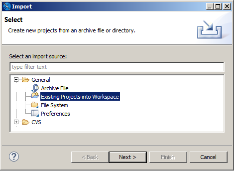
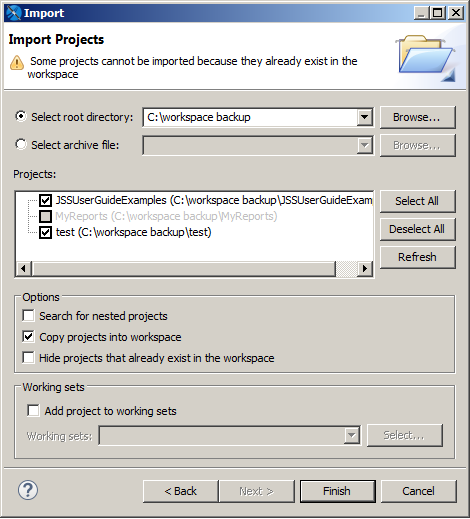
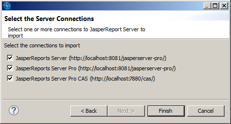
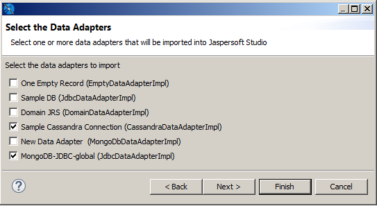
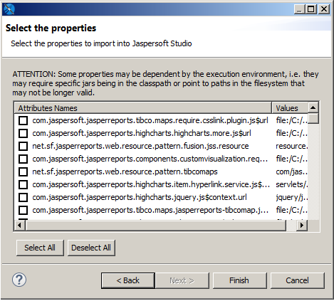

# Updating Your Workspace

Due to incompatibilities between Eclipse and earlier versions of the Jaspersoft Studio workspace, the workspace format was updated. The current workspace format cannot be used with older versions of Jaspersoft Studio.

!!! note

    If you are not prompted to update your workspace, you do not need to.

If you are updating from an old version of Jaspersoft Studio, you are prompted to choose a new workspace when you open Jaspersoft Studio. When you choose a new workspace, a new, empty workspace is created and set as the workspace for your Jaspersoft Studio instance. This workspace is used for newer versions. Your previous workspace remains unchanged and can still be used with older versions.

To update the reports and data from your earlier version of Jaspersoft Studio, you can import some or all of your projects, server connections, data adapters, and project settings into your new workspace.

Importing projects

1.  (Optional) To import a version of the MyReports project, you must first delete the existing MyReports folder from your current workspace. You can do this, for example, if you have just upgraded and have created a new empty workspace. To delete MyReports in your current workspace, navigate to the workspace location in your file system and delete or move the MyReports directory.

2.  Select **File \> Import ...**

3.  Select **Existing Projects into Workspace** from the **General** category.

    

4.  Browse to the workspace that you want, click **OK**, and then click **Next**.

    The **Import** dialog opens.

    

5.  To work on a copy without modifying the original, select **Copy projects into workspace**.

6.  Click **Finish**.

The projects you selected are imported into your current workspace.

Your workspace contains server connections, global data adapters, and your Jaspersoft Studio preferences in addition to your projects. You must import each type separately.

Importing server connections

1.  Select **File \> Import ...**.
2.  Select **External JasperReports Server Connections** from the **Jaspersoft Studio** category.
3.  Browse to the workspace that you want, click **OK**, and then click **Next**.

The **Select the Server Connections** dialog opens.

|                                                             |
|-------------------------------------------------------------|
|  |
| *Figure 1: Select the Server Connections dialog*            |

1.  Choose the connections that you want.
2.  Click **Finish** to import the connections.

The selected server connections are imported into your Jaspersoft Studio instance.

Importing data adapters and settings

1.  Select **File \> Import ...**.

2.  Select **External Properties and Data Adapters** from the **Jaspersoft Studio** category.

3.  Browse to the workspace that you want, click **OK**, and then click **Next**.

4.  The **Select the Data Adapters** dialog opens.

    

5.  Choose the data adapters that you want. You do not need to import the built-in adapters (One Empty Record and Sample DB).

6.  Click **Next**.

    

7.  Choose the properties that you want and click **Finish**

The selected data adapters and properties are imported into your Jaspersoft Studio instance.

# Network Workspace

The best practice to work with Studio is to rely on the classic local machine workspace.

For backup and co-working, the user can choose the default versioning solution shipped, based on GIT. The eGIT plug-in allows the user to share JasperReports projects, reports and other additional resources. Other versioning solutions based on SVN, Mercurial or others can be picked up once their dedicated plug-in is installed and tested.

There is no proven benefit of using a network shared folder (such as, `\\MY_REMOTE_MACHINE\SHARED_FOLDER\JSS_WORKSPACE` in Windows) to take a backup or share work with others.

Although not prohibited, this practice is highly discouraged and not officially supported by the team due to the following reasons:

- Network issues (such as, delay, latency, and so on) can affect the proper saving and storing of the workspace.

- Security software like the antivirus, firewall, Endpoint Detection and Response (EDR) and so on can also impact the saving of the workspace.

- People might mistakenly believe they can use the same workspace simultaneously. This will eventually lead to the corruption of the working area.

The user can choose to configure a different location for the workspace using:

- Use **File \> Switch Workspace** in Jaspersoft Studio.

- Modify the `.ini` configuration file and change the `-data` parameter to a custom location.

- Modify the desktop shortcut (for example, Windows) to include the `-data` parameter.

However, as mentioned earlier, it is highly recommended to use the local machine solution.
