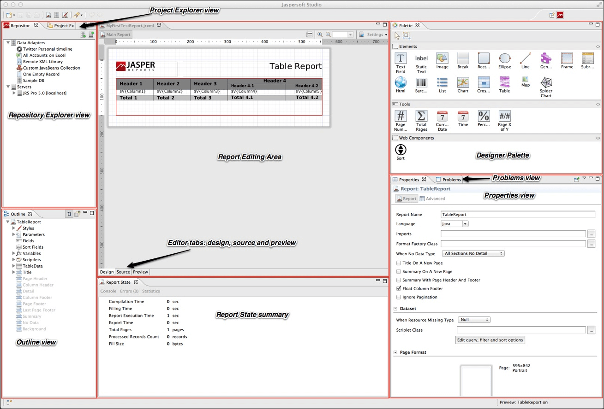

# User Interface and Design View

Jaspersoft Studio is based on the Eclipse platform. If you have worked with Eclipse, you are likely familiar with the user interface. Figure 1-1 shows a preview of the Jaspersoft Studio interface, with the main areas highlighted. Some views have additional menus and actions, accessed through icons in the upper right of the view.

|                                             |
|---------------------------------------------|
|            |
| *Figure 1 Jaspersoft Studio User Interface* |

This chapter has the following sections:

-   [Eclipse Interface](#eclipse-interface)

-   [User Interface Components](#user-interface-components)

-   [The Design Tab](design-tab.md)

-   [Understanding Bands](design-tab.md)

-   [Specifying Report Properties](design-tab.md)

-   [The Preview Tab](preview-tab.md)

-   [Exporting Reports with Jaspersoft Studio](simple-report/reports-exporting.md)

## Eclipse Interface

In Eclipse terminology, the initial layout of the Jaspersoft Studio interface is called a perspective. The default Jaspersoft Studio perspective contains an editor area and views. Some views appear by themselves, while others are stacked together in tabbed notebooks. You can open and close views and drag them to different positions in the Eclipse workbench.

-   To open a window you have closed, select **Window &gt; Open View** from the menu. Select the window that you want to open from the dropdown list.

-   To reset the interface to the default perspective, select **Window &gt; Reset Perspective**.

-   To save a perspective, select **Window &gt; Save Perspective As** and enter a name for your perspective.

### Learning More About Eclipse

-   If you are not familiar with Eclipse, there are many excellent resources available:

    The Eclipse help is a good place to start. You can access Eclipse help by selecting **Help &gt; Help Contents &gt; Subclipse - Subversion Eclipse Plugin**.

-   If you are setting up Eclipse for a team, search the internet for a phrase such as "configuration management for Eclipse".

-   To work with version control such as CSV, Git, or SVN, use the corresponding Eclipse perspective included with Jaspersoft Studio. To add a different perspective, click  at the upper right of the Eclipse interface and select the perspective you want from the Open Perspective dialog. Once a perspective has been added, you see an icon for it at the top right. Use this perspective for all interactions with your version control repository, such as checking out projects, synchronizing files, and resolving conflicts. For information about working with a particular package, use an internet search such as "Eclipse Subversion". To return to the Jaspersoft Studio perspective, click .

## User Interface Components

Jaspersoft Studio has a multi-tab editor, which includes three tabs that allow you to interact with your reports in different ways: **Design, Source**, and **Preview**:

-   The **Design** tab is the main one selected when you open a report file and it allows you to create your report graphically.

-   The **Source** tab contains the JRXML source code for your report.

-   The **Preview** tab lets you run the report preview after having selected a data source and output format.

You can explore the data using the following views:

-   The Repository Explorer view maintains the list of JasperReports Server connections and available data adapters.

-   The Project Explorer view maintains the list of the projects in the current workspace, usually a Jaspersoft Studio project.

-   The **Outline** view shows the complete structure of the report in a tree. When the **Design** or **Source** tab is active, clicking an element in the **Outline** view highlights that element in the editor. The **Outline** tab is empty when the Preview tab is active.

-   The **Properties** view lets you view and edit the properties of the element that is selected in the report editor or in the **Outline** view. The properties shown depend on the type of element. For example, the **Properties** view for a table shows four tabs: **Appearance, Dataset, Table**, and **Advanced**, while the **Properties** view for a line shows **Appearance, Borders, Line, Inheritance**, and **Advanced**. Some properties are read-only, but most are editable. When the root node of a report is selected in the **Outline** view, the **Properties** view shows the properties for the report.

Unlike many other views, you can open multiple instances of the **Properties** view at one time and you can pin a selection to a specific Properties view instance. This allows you to view or edit the properties for a specific element while working with other elements in your report, or with another report entirely.

-   The **Problems** view shows a list of problems and errors that can, for example, block the correct compilation of a report.

-   The Report state summary provides statistics on report compilation/filling/execution. Errors are shown here as well.

This comparison table shows the differences in terminology between iReport and JasperReports Server.

**Comparison of Features in iReport and Jaspersoft Studio**

| iReport | Jaspersoft Studio |
|----|----|
| JasperReports Server Repository | Repository Explorer |
| Report Inspector | Outline view |
| Report Designer | Report editing area |
| Problems List | Problems view |
| Elements palette | Designer Palette |
| Formatting tools | Available via the context menu on the element |
| Property sheet | Properties view |
| Styles library | --- |
| --- | Project Explorer |
| iReport Output window | Report State summary |
