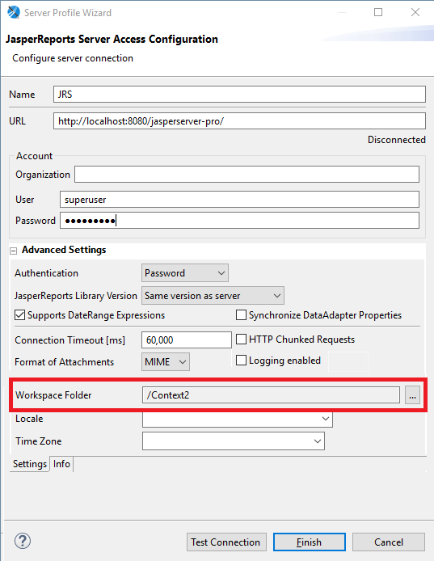
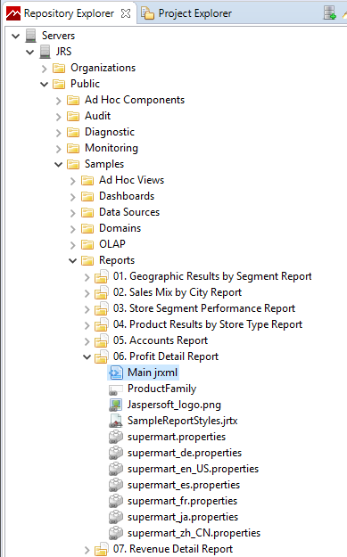
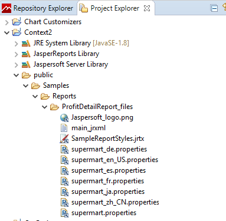

# Configuring a Project

When you are developing reports that you plan to publish to JasperReports Server, correctly setting up the project helps you create reports that can be easily published. To do this, you want to associate a project with the server and set the report execution context to JasperReports Server. See [Project Folder Types and Report Execution Contexts](../intro-contexts.md) for more information.

!!! note

    The JasperReports Server context is only a simulation. It does not include all the classes and structure of JasperReports Server.

To associate a project with a JasperReports Server instance

1.  Go to the Repository Explorer.

2.  Create a server connection by right-clicking **Servers  &gt; Create JasperReports Server Connection**. Set up your server connection. 
    OR 
    Edit an existing connection by right-clicking the connection and selecting **Edit JasperReports Server Connection**.

3.  Click to expand the **Advanced Settings** section in the **JasperReports Server Access Configuration**.

    |  |
    |----|
    |  |
    | *Figure 1 Setting a Workspace Folder* |

4.  In the Workspace Folder section, browse to the project you want to associate with this server instance.

5.  Click **Finish**.

To set the folder context to JasperReports Server

1.  Right-click on the folder whose context you want to change.
2.  Select **Report Repository Type &gt; JasperReports Server**.

If you know the folder structure that you are using on your JasperReports Server, you can set up the same structure in your project, so you can place images, data sources, and other resources in the locations they map to on the server.

To work with reports from the server

Once you have associated your server with a project, opening a report from the server copies the folder structure automatically from the server to the project.

1.  Go to your server in the Repository Explorer.

2.  Navigate to the folder that contains your reports. This example uses the **Public &gt; Samples &gt; Reports  &gt; 06. Profit Detail Report**.

3.  Expand the folder for your report. You see the local resources for the report.

    |  |
    |----|
    |  |
    | *Figure 2 A Report and its Main.jrxml on the Server* |

4.  Open the `Main.jrxml` file in the editor. You can do this by double-clicking the file, or by right-clicking the file and selecting **Open in Editor**.

5.  When you open the Main.jrxml file in the editor, the report and all its resources are copied to the associated project in Jaspersoft Studio. The path for the report in the repository is duplicated in the Jaspersoft Studio project. To see this, open the Project Explorer and navigate to the associated folder.

|  |
|----|
|  |
| *Figure 3 A Report in the Associated Jaspersoft Studio Project* |
