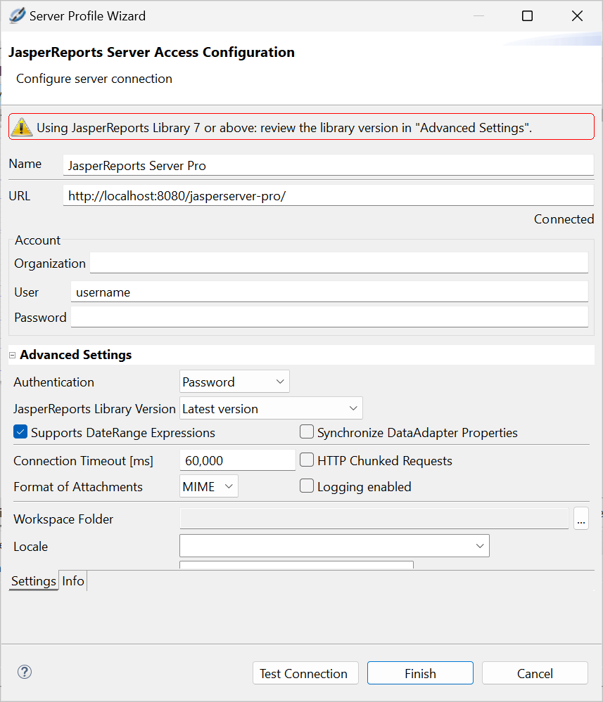
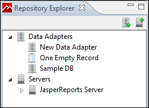

# Connecting

To connect Jaspersoft Studio to the server

1.  Start Jaspersoft Studio.

2.  Open the **Repository Explorer**, then click the **Create a JasperReports Server Connection** icon .

    The **Server Profile Wizard** appears.

    |  |
    |----|
    |  |
    | *Figure 1 Server Profile Wizard* |

3.  Enter the URL, usernames, and password for your server. If the server hosts multiple organizations, enter the name of your organization as well.

The defaults are:

-   **URL**:

    -   Commercial editions: ` http://localhost:8080/jasperserver-pro/`

        -   Community edition: ` http://localhost:8080/jasperserver/`

            !!! note

                The Server profile wizard automatically detects a server connection beginning with https and displays a  icon. See [1.0.1, “Connecting to JasperReports Server Over SSL,” on page 1](jss2jrs-trust.md) for more information.

    -   **Organization**: There is no default value for this field. If the server hosts multiple organizations, enter the ID of the organization to which you belong.

    -   **User name**: `jasperadmin`

    -   **Password**: `jasperadmin`

!!! note

    Note that if you are upgrading from a previous version of Jaspersoft Studio, the [old URL](http://localhost:8080/jasperserver-pro/services/repository) still works.

1.  Click **Test Connection**.

2.  (SSL connections only.) If you are connecting over SSL, the SSL certificate is displayed. To add the certificate to your trust store, click **Trust**. If you do not click **Trust**, the certificate is displayed each time you connect to this JasperReports Server instance. See [Connecting to JasperReports Server Over SSL](jss2jrs-trust.md) for more information.

3.  If the test fails, check your URL, organization, username, and password.

    Connection problems can sometimes be caused by Eclipse's secure storage feature, which improves your security by storing passwords in an encrypted format. For more information, refer to our [Eclipse Secure Storage in Jaspersoft Studio](http://community.jaspersoft.com/wiki/eclipse-secure-storage-jaspersoft-studio) Community Wiki page.

4.  If the test is successful, click **Finish**.

The server appears in the **Repository Explorer**.

|                                                                  |
|------------------------------------------------------------------|
|  |
| *Figure 2 Repository Explorer*                                   |
