# Working with Domains

!!! info "Important"

    The features in this section may be restricted by your JasperReports Server software license. If you don't see some of the options described, your current license likely prohibits their use. Contact us to learn about your licensed features or to discuss upgrading.

Domains are structures for managing data in JasperReports Server. They connect to a normal data source and select tables and columns, join them to others, arrange the results into business-related sets, give them meaningful labels, and provide access security based on users and roles. Through the server UI, users can then create reports interactively with the Ad Hoc editor, and the Domain acts as the data source, providing a curated view of your database.

Jaspersoft Studio can also create reports based on the domains defined in JasperReports Server. Such reports use a data adapter to load data accessed through a domain. Then there are two different query languages that you can use with a domain: the "jasperQL" query language and the earlier "domain" query language.

The jasperQL language was introduced in version 7.8 and has better support for input controls and lets you order records by a field and limit the number of records shown. You can also group by one or more fields in the Dataset and Query dialog. Jaspersoft recommends using the more advanced jasperQL language.

Before your report can access a domain with either query language, consider the following requirements:

- Make sure that your domain is fully defined and saved on the server. For information about creating domains, see JasperReports Server Data Management Using Domains. The examples in this section use the supermart sample domain.
- Make sure that JasperReports Server is online.
- Optional: Define the server profile or connection object, as described [Connecting to JasperReports Server](jss2jrs-connecting.md). You do not need the server profile to create and run a domain report, but you need it to publish the report back to the server.
- Create a data adapter for the server connection, as described in the next section. The data adapter may also identify the domain on the server, or the report may specify the domain.

## Creating a Domain Data Adapter

A data adapter for a domain identifies your instance of JasperReports Server and the domain in its repository.

1.  In the Repository Explorer, click  or select **File \> New  \> Data Adapter** from the menu. In the **Data Adapter Wizard** that appears, double-click **Jaspersoft Server**.

|  |
|----|
| 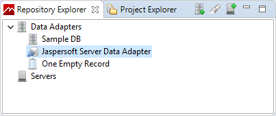      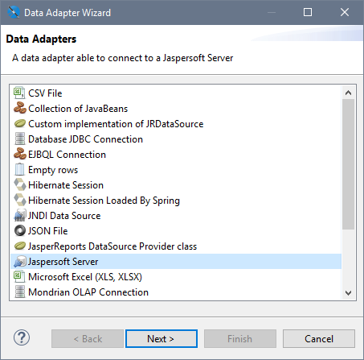 |
| *Figure 1: Creating a New Data Adapter* |

Alternatively, you can edit the empty Jaspersoft Server Data Adapter that is created by default as a template. Double-click it in the Repository Explorer panel to open it for editing in the **Data Adapter Wizard**.

|  |
|----|
| 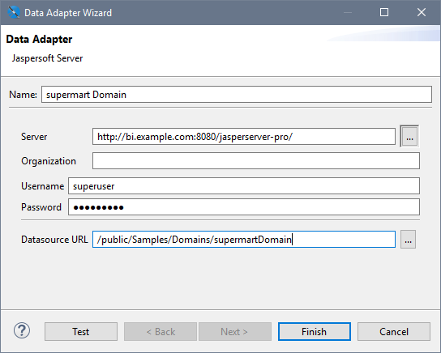 |
| *Figure 2: Entering Server and Domain Information* |

1.  Enter a name for the data adapter, usually the name of the domain.
2.  Enter the URL to access your server, ending in **jasperserver-pro/**, or click  to select from the list of saved servers.
3.  Enter the username and password to access your server. If you access a domain in an organization, specify the credentials of a user or administrator in the organization, including the organization name or alias. It is good practice to use the credentials of the least permitted user who still has access to the domain or domains you want to access. If you have reports with different Domains using the same data adapter for this server, make sure that the user has access to all Domains and all the data that you need in the Domains.

!!! warning

    A domain may restrict access to its data based on the user who accesses the data. Restrictions can be based on usernames, roles, attributes, or any combination of these. Depending on how your domain is defined, the credentials you choose here may affect the data that appears in reports that use this adapter. If you access multiple domains, the data from each of them may be affected by the user given here.

1.  Click **Test** to make sure your server is accessible and the credentials are valid.
2.  Optional: enter the repository URL of your domain or click  to browse for it. If you only access one domain on the server, specify it here. If you have several domains, each report can specify the domain that it uses.

When browsing, you can enter a name and select it from the results, or navigate the repository tree that is accessible to the user you specified. Mouse over a resource to see its description and details.

|  |
|----|
| 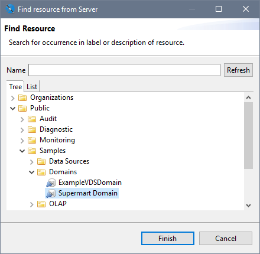      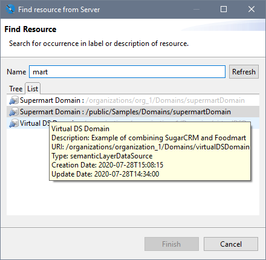 |
| *Figure 3: Creating a New Data Adapter* |

1.  Click **Finish** to create the data adapter for your domain.

## Creating a Domain Report

As of Jaspersoft Studio 7.8, the jasperQL query language is the default query language for a domain report. You can create a query when you first create the report or you can add it later using the Dataset and Query dialog.

To create a report based on a domain.

1.  Make sure you have defined a data adapter for accessing the domain on your instance of JasperReports Server. For more information, see “Creating a Domain Data Adapter” on page 1.
2.  Click  or select **File \> New  \> JasperReport** from the menu. The **New Report Wizard** is displayed.
3.  Select a template and click **Next**.
4.  Select a location to save your report, enter its name, and click **Next**.
5.  Select the data adapter for your domain or server, in this example we use "Supermart Domain."

The wizard refreshes to show the query language, the pathname of the Domain and the fields of the Domain that are available.

|  |
|----|
| 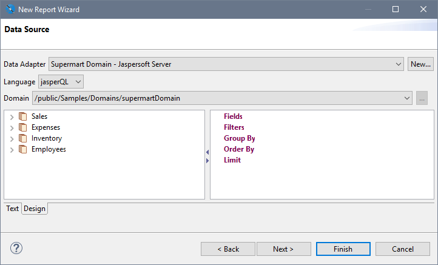 |
| *Figure 4: Fields of a Domain Available Through the Data Adapter* |

The default query language is jasperQL. You can select a different domain on the server if needed, and the dialog updates the available fields. The domain being used is stored in the report itself, therefore it may be different from the one in the data adapter.

1.  Select fields or folders in the Domain on the left of the dialog, and drag them to the Fields item on the right to create fields. For example, drag **Sales \> Stores**.

The items are added as a flat list, using the labels from the Domain. At this point, you can refine the query by adding fields to filters, group by, and order by headings. These actions are covered in detail in the next section Using the jasperQL Query Designer.

1.  When done, click **Next** to select the dataset fields. These are the fields that appear in the report outline for use in creating the report. In this simple example, click  to add all fields.

|  |
|----|
| 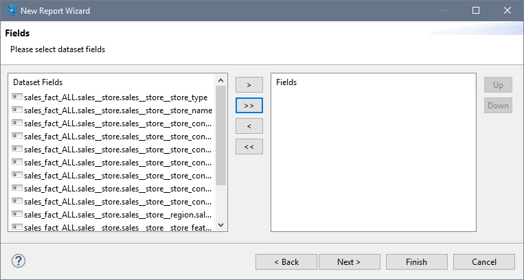 |
| *Figure 5: Fields of the Query Result Selected for the Report* |

1.  Click **Finish** and the report appears in a new tab with a blank canvas. The elements and fields of the report appear in the report outline. When you mouse over the fields, you see the field's label from the domain.

|  |
|----|
| 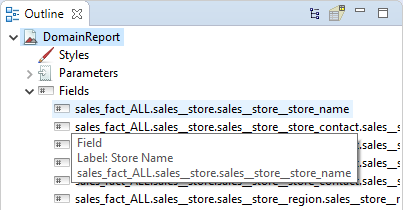 |
| *Figure 6: Fields of a Domain in the Report Outline* |

1.  Define your report as usual, using the **Palette** and **Outline** to add and organize components.
2.  Click **Preview** to test your report. Jaspersoft Studio compiles your report. If it is successful, your report is filled and displayed.
3.  You are prompted to publish your report on save, or click  to publish your report. For more information, see [Publishing a Report to JasperReports Server](jss2jrs-publishing.md).

## Using the jasperQL Query Designer

The jasperQL query language is a JSON-based syntax for defining a query used to access data through a domain on JasperReports Server. In practice, you define your query interactively through the UI of the New Report dialog or later in the similar Dataset and Query dialog. In the previous sections, we created the data adapter to access the domain and a report that uses the data adapter. In this section, we explain how to create a query interactively in the designer.

After a domain-based report has been created, you can always go back and change or refine the query by right-clicking the root of the report in the Outline panel, and selecting **Dataset and Query...** If you want to use input controls in your report, define the corresponding parameters in your report before adding them as a filter in this dialog. When the report uses a Domain data adapter and the jasperQL query language, the center of the dialog contains the jasperQL query designer:

|  |
|----|
| 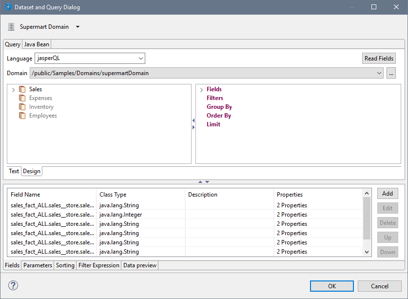 |
| *Figure 7: Editing a jasperQL Query in the Dataset and Query Dialog* |

The panel at the bottom of the Dataset and Query dialog displays the fields that are selected from the query results (the dataset) for use in the report. If you configure the jasperQL query fully, you reduce the results so they contain exactly the fields you need. In that case, click the **Read Fields** button to "read" all the query result fields into the report, and they replace any in the **Fields** tab at the bottom.

The panel at the bottom also has a **Data Preview** tab for testing the query. Use its controls to run the query and see the values returned for the fields you have chosen or created. For example, this lets you check your aggregation, grouping, and expected calculated field values. This is particularly useful to test any DomEL expressions in your query elements.

The query designer has a **Text** tab that displays the text of the current query for information purposes. The jasperQL query is a JSON text that is sent to the server through a private API. The syntax of the JSON is also private, and editing the query on the text tab is not recommended.

|  |
|----|
| 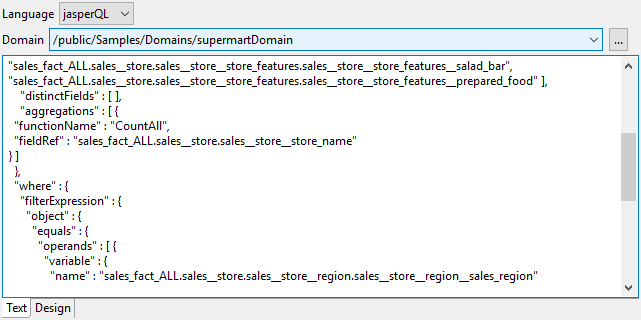 |
| *Figure 8: JSON Text View of a jasperQL Domain Query* |

On the **Designer** tab, you can create a query of your domain by dragging and dropping fields, entering expressions, and clicking for certain actions. The elements of the query are structured like an SQL query. The result is a query that is easy to create and easy to interpret:

|  |
|----|
| 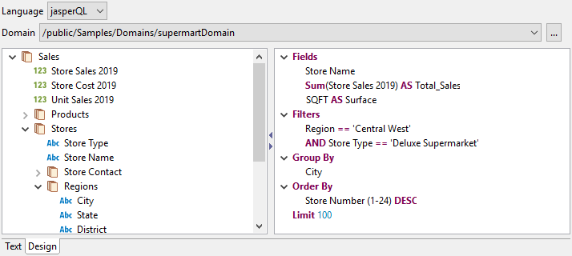 |
| *Figure 9: Visual representation of a jasperQL domain Query* |

Use the following interactive features of the jasperQL query designer to create your query:

### Selecting Fields

Select fields or folders in the Domain on the left of the dialog, and drag them to the **Fields** heading on the right to create fields. These are the fields that are returned by the query. You can have many fields, and later use only the ones you need in the report, or you can select exactly the fields that you need for the report. The items are added as a flat list, using the labels from the Domain.

You can mouse over a field name to see its name, ID, and type:

|  |
|----|
| 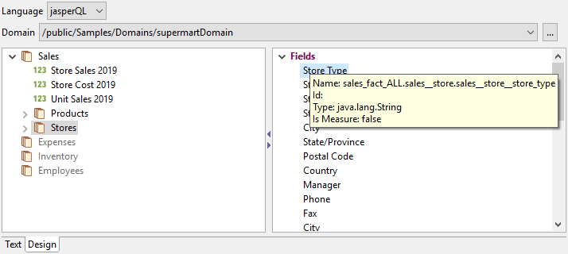 |
| *Figure 10: Information About a Field from the Domain* |

To remove a field from the list under the **Fields** heading, or any other heading on the right side, right-click the field and select **Delete** from the context menu. You can also select the field and use the **Delete** key.

To specify distinct values for all fields returned by the query, right-click the **Fields** heading and select **Set/Reset DISTINCT**. You can also double-click the **Fields** heading to toggle the setting.

### Using Field Aliases

To create an alias for a field, double-click the field in the right-hand panel, enter the alias in the **AS** text box, and click **OK**:

|  |
|----|
| 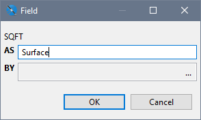 |
| *Figure 11: Creating an Alias for a Field* |

The alias is also useful for giving fields a simple name wherever they appear in Jaspersoft Studio. Otherwise, the fields are known by their ID, for example: `sales_fact_ALL.sales.store_features.store_sqft`.

### Defining Aggregate Functions

To create an aggregate function on a field, right-click it on the left or right panel, and select **Add Aggregate Function** from the context menu. Choose the function from the dropdown menu, and optionally give the field an alias in the **AS** text box. The available functions depend on the field type. To modify the function on an existing aggregate field, double-click the field.

|  |
|----|
| 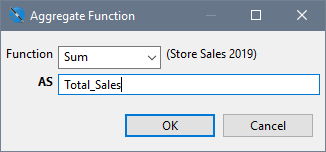 |
| *Figure 12: Aggregate Function dialog* |

### Defining Calculated Fields

If you need a calculated field that is not in your domain, you can create it in the query so that it is available in your report. Calculated fields are defined using the Domain Expression Language (DomEL) language, described in the JasperReports Server Data Management Using Domains.

To create a calculated field, right-click on an item in the left-hand panel and select **Add Calculated Field** from the context menu. Enter a valid DomEL expression and enter a name for the field in the **AS** text box. For example, the following expression concatenates two string fields to make the location easier to display in the report:

|  |
|----|
| 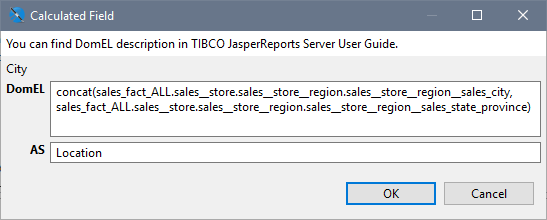 |
| *Figure 13: Defining a Calculated Field* |

### Filtering Results

Defining a filter in the query reduces the size of the results and means that your report processes only the rows of data you are interested in. To define a filter, drag a single item from either side to the **Filters** heading on the right, or right-click on the item and select **Add to Filters**. Choose the comparison operator from the dropdown menu; the available operators depend on the field type.

|  |
|----|
| 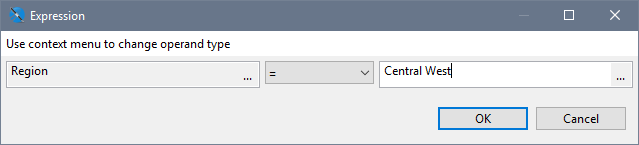 |
| *Figure 14: Defining a Filter* |

Type the comparison value for the filter or click **...** to select from a list of available values. Jaspersoft Studio queries the data through the Domain to display the list. The results include rows of data for other fields chosen so far. Double-click any row to insert the bolded value as the comparison value in the filter.

|  |
|----|
| 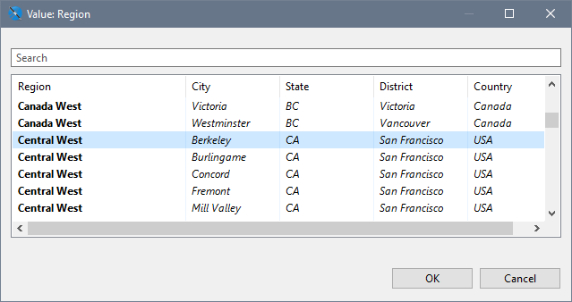 |
| *Figure 15: Choosing Filter Values* |

Alternatively, you can right-click the comparison value field and select **Parameter** or **Function** to use JasperReports parameters or functions that you have already defined. Each of those options brings up a dialog where you can specify the parameter or function. For example, parameters can be used to compare values against input controls that you have defined in the report. When using parameters in filters, be sure to define default values for the parameters to avoid unexpected errors.

For more information on parameters, see [Parameters](../parameters/parameters-intro.md).

Repeat these steps for each filter that you want. For the second filter and each one thereafter, a menu in the filter expression dialog lets you choose to **AND or OR** your filter with the previous one.

|  |
|----|
| 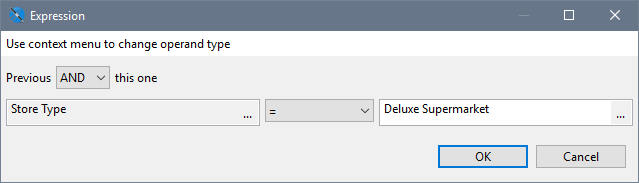 |
| *Figure 16: Adding a Second Filter* |

To change the operator or value of a filter, double-click it on the right-hand panel. You can also drag filters to change the order of composition. Finally, you can double-click the Filters heading and select **Replace DomEL Filter**. This special filter allows you to write DomEL expressions on both sides of the operator and compare them.

### Grouping Rows

To group by a field, drag the field from the left to the **Group By** heading on the right, or right-click on the item and select **Add to Group By**. Unlike SQL queries, the field being grouped by must not be selected in the list of fields on the right. In the Group By dialog you can enter an alias for the field in the **AS** text box, but it is not required:

|  |
|----|
| 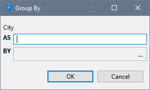 |
| *Figure 17: Defining a Group* |

### Ordering Rows

To order the results by the value of a field, drag the field to the **Order By** heading on the right, or right-click on the item and select **Add to Order By**. The default ordering is ascending, but you can double-click the item and change the direction of ordering.

|  |
|----|
| 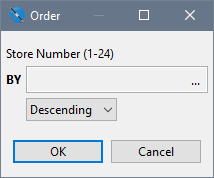 |
| *Figure 18: Defining a Descending Order* |

### Limiting Rows

To limit the number of items shown in your report, double-click the **Limit** heading in the right-hand panel and enter the maximum number of rows to return from the query. For example, if you are working with a large dataset, you might want to limit the time it takes to run while you are designing your report.

|  |
|----|
| 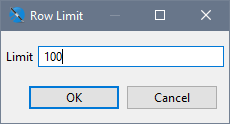 |
| *Figure 19: Defining a Row Limit* |

## Using the domain Query Language

The `domain` query language is the older query language for a domain report. The interface is similar to the jasperQL query language, but it does not support as many features in the query. You can still use and edit reports that use a domain-language query, but Jaspersoft recommends using the jasperQL query designer for all new reports.

Because the two query languages are not compatible, you cannot switch between them once you have started creating your query. If you want to upgrade a report with the domain-language query to use the features of a jasperQL query, you will need to rewrite the query after switching the language setting. In some cases such as aggregation where the report had to be configured a certain way because the domain-language did not support aggregation, you need to rewrite parts of the report. However, the report is simplified because the aggregation can be done by the query.
