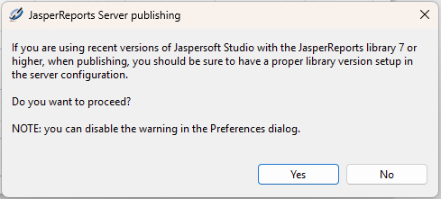
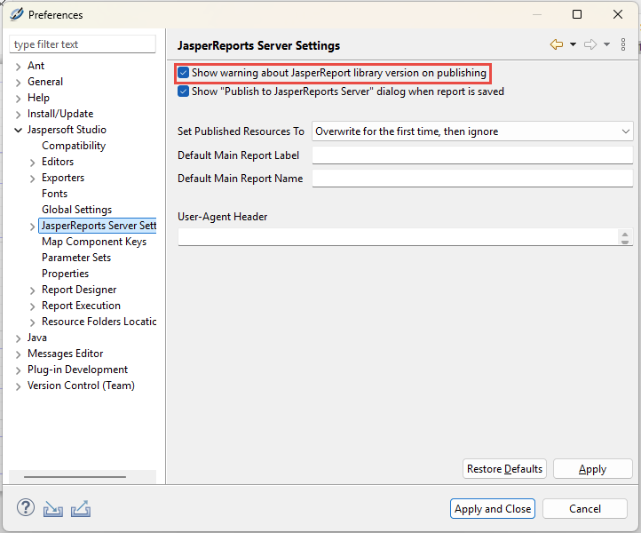
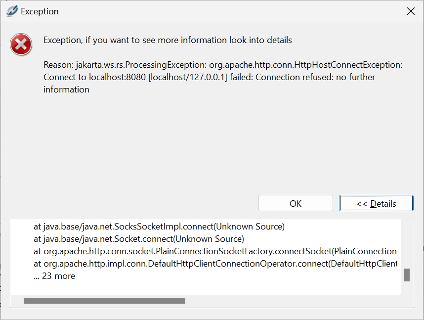
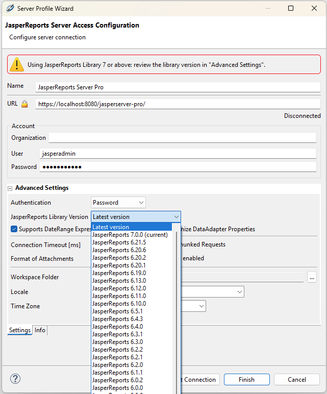
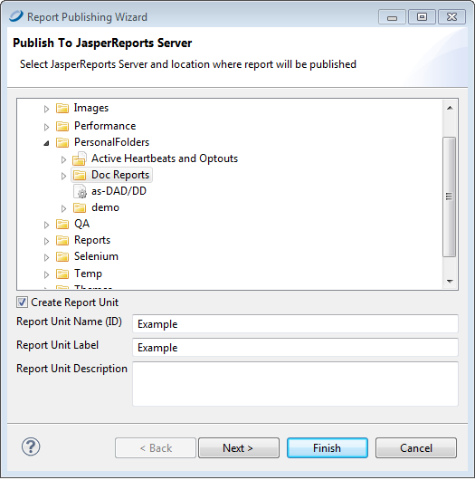
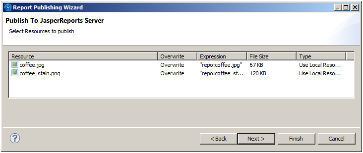
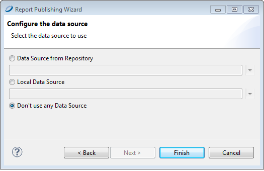

# Publishing a Report

You can easily publish your reports from Jaspersoft Studio to any JasperReports Server connection. Publishing to the server uploads the JRXML for the report, along with any resources that the report needs such as images and query resources. You must also configure the data source for the report on the server.

!!! note

    At runtime, during the Publish process, if you encounter exceptions like `net.sf.jasperreports.engine.JRRuntimeException: Class my.customapp.package. MyClass is not visible to deserialization`, you can resolve the issue by implementing the following workaround.

    Add an appropriate property under **Window &gt; Preferences &gt; Jaspersoft Studio &gt; Properties**. The new property for deserialization whitelisting should be in the following format: `net.sf.jasperreports.deserialization.class.whitelist.jss.<NEW_CUSTOM_CATEGORY> = my.customapp.package.MyClass`.

    To streamline the configuration for complex reports involving multiple dependencies, you may whitelist full packages using the `**` wildcard notation (for example, `my.customapp.package.**`) rather than listing single classes.

When you are using the latest or recent version of Jaspersoft Studio with JasperReports Library version 7 or higher, the appropriate version of JasperReports Library must be set up in the JasperReports Server configuration. A dialog with this message is shown when you are trying to publish a report to JasperReports Server.

This dialog can be disabled from the main tool bar, from **Window &gt; Preferences &gt; JasperReports Server Settings**.

If the appropriate version of JasperReports Library is not available in JasperReports Server, an error is displayed.

You can fix this by changing the JasperReports Library version in the **Server Profile Wizard &gt; Advanced Settings**.

## Publishing Report Resources

The reports you create in Jaspersoft Studio can have embedded resources, such as images, query resources, and data adapters using `net.sf.jasperreports.data.adapter`. You can use the following columns in **Select Resources** to publish the page of the **Report Publishing Wizard** to control the resources you upload:

-   **Overwrite**: Controls whether you overwrite a resource if it exists. This setting is important when you republish a report that has been published before. Click the value in this column to display a dropdown menu with the following choices:

    -   **Overwrite**: Creates a resource or overwrites an existing resource with the current version.
    -   **Ignore**: Ignores the resource.
    -   **Overwrite Only Expression**: Updates the expression for the resource. Enter the new value in the **Expression** column. It does not create or overwrite the resource.

-   **Expression**: When **Overwrite** or **Overwrite Only Expression** is selected, it lets you choose the expression you want to use. Click the value in this column and then click **...** to open the Expression Editor and edit the expression that specifies the location where the file is saved. By default, resources such as images are published to a repository location, and the uploaded report uses the `repo:` syntax to refer to the report location.

-   **Type**: When **Overwrite** is selected, specifies the existing resource to overwrite. Click the value in this column to display a dropdown menu with the following choices:

    -   **Save to Folder**: Save to a location anywhere on your JasperReports Server instance. When you choose this option, you are prompted to navigate to the location you want.
    -   **Link to Resource**: Links to an existing resource on your JasperReports Server instance. When you choose this option, you are prompted to navigate to the resource you want. If you modify a report and the report is set to **Overwrite**, the changes overwrite only the path, not the resource.
    -   **Use Local Resource**: Save as a resource inside the report unit on JasperReports Server.

## Choosing a Data Source for a Published Report

In JasperReports Server, data is usually specified using a JasperReports Server data source. Like a data adapter, a JasperReports Server data source does not contain data. Instead it contains the information JasperReports Library needs to construct a `JRDataSource` when the report is run. Choosing a JasperReports Server data source instead of a data adapter when you publish a report to JasperReports Server lets you take advantage of features specific to JasperReports Server or to use a JNDI connection configured on your application server.

When you upload a report from Jaspersoft Studio to JasperReports Server, you can choose one of the following options:

-   **Data Source from Repository**: Use an existing JasperReports Server data source for your report.
-   **Local Data Source**: Create a JasperReports Server data source or upload a Jaspersoft Studio data adapter file to use in your report.
-   **No Data Source**: Change the data adapter information in your report.

### Data Source from Repository

The **Data Source from Repository** option lets you choose an existing data source from the JasperReports Server repository.

To use the **Data Source from Repository** option:

-   Make sure that the data source is available in JasperReports Server. If you want to create a data source, select **Local Data Source** instead.

    !!! warning

        If you are using a JDBC or JNDI data source, make sure that your connection uses the same driver as your Jaspersoft Studio data adapter. For example, if you connect to an Oracle database from a commercial edition, you can download and use the native Oracle driver or you can use the Oracle JDBC driver that is included with Jaspersoft Studio. If your driver in JasperReports Server does not match the driver used in Jaspersoft Studio, you could see different data in your uploaded report.

-   Click  to publish your report and select a JasperReports Server instance and repository location where you want to save the report. Then click **OK**. If you are prompted to upload resources, select your **Settings**.

-   Select **Data Source from Repository** when prompted.

-   Click **...** and select the correct JasperReports Server data source from the repository.

### Local Data Source

The **Local Data Source** option lets you create a data source in JasperReports Server to use with your report, or to upload a data adapter from Jaspersoft Studio to JasperReports Server. To use this option to create a data source:

-   If you want to use a JNDI data source, first set up the JNDI connection for your database in your application server. Make sure to use the same JDBC driver for your Jaspersoft Studio adapter and the JNDI connection in JasperReports Server.

-   Click  to publish your report and select a JasperReports Server instance and repository location where you want to save the report. Then click **OK**. If you are prompted to upload resources, select your **Settings**.

-   Select **Local Data Source** when prompted.

-   Click **...** to open the **Add Resource** wizard.

-   Select the type of data source that you want to create, for example, Datasource JDBC, and click **Next**.

-   On the **Resource Editor** page, enter a name and unique ID for the data source. You can also enter an optional description. Then click **Next**.

-   On the next page, manually fill in the required information for the data source you want to create.

-   Click **Finish** to create the data source and use it in your uploaded report.

For some types of data sources, such as JDBC, JNDI, and bean data sources, you can publish a data adapter from Jaspersoft Studio and set it as the data source for the report:

-   Make sure that the data adapter you want to upload is saved locally as an jrdax file in the same project as your report. See [Importing and Exporting Data Adapters](../data-adapters/data-adapters-creating.md) for information about exporting a global data adapter to your project; see [Copying a Data Adapter](../data-adapters/data-adapters-creating.md) for information about copying a data adapter from one project to another.

-   Click  to publish your report. Select a JasperReports Server instance and repository location where you want to save the report. Then click **OK**.

-   If you are prompted to upload resources, select your resource settings and click **OK**.

-   Select **Local Data Source** when prompted.

-   Click **...** to open the **Add Resource** wizard.

-   Select the type of data source that you want to create and click **Next**. Only some data source types can be imported from data adapters in Jaspersoft Studio, such as Datasource Bean, Datasource JDBC, and Datasource JNDI.

-   On the **Resource Editor** page, click **Import from Jaspersoft Studio**. If this button is not available, you cannot import the data source type you selected.

-   The **Import** dialog shows a list of local and global adapters. Make sure to select a local adapter, which includes the name of a file. Click **OK** then **Finish** to select the adapter.

-   Click **Finish** to publish the report and the selected data adapter to the repository.

!!! note

    If you are using a custom data adapter or any other adapter that uses one or more jars that are not included in JasperReports Server, add the jars to a location on your server classpath.

### No Data Source

Use **No Data Source** when you have configured `net.sf.jasperreports.data.adapter` in your JRXML, as described in [Default Data Adapter](../data-adapters/data-adapters-using-in-reports.md). Setting `net.sf.jasperreports.data.adapter` lets you use multiple data adapters in the same report, for example, using a different data adapter for a subreport.

To use this option:

-   Set the default data adapters for the datasets and subdatasets used in your report, as described in [Default Data Adapter](../data-adapters/data-adapters-using-in-reports.md).

-   Follow these guidelines when setting default data adapters in a report that you want to publish:

    -   Do not use global data adapters. The default data adapter must reference a local file in the same project as your report, or a data adapter already in your repository.

    -   Where possible, use inheritance to reduce the number of times you actually set the default data adapter. If your report uses a specific adapter multiple times, try to structure the report so that the data adapter is set for a single dataset and other datasets inherit it. For example, if you have a crosstab and a table that use the same data adapter, you could create a subreport that contains the table and crosstab. Then if you set your data adapter as the default for the subreport, the table and crosstab inherit this adapter. Reusing the data adapter improves performance when you run the report.

-   Publish your report and select **No Data Source** when prompted.

-   When you publish the report, the default data adapters are uploaded to the repository.

## Example of Publishing a Report

To publish a report to the server

1.  Open a report.

2.  Click the **Publish Report** button  in the upper-right corner of the Designer. The **Report Publishing Wizard** opens.

    |  |
    |----|
    |  |
    | *Figure 1 Report Publishing Wizard* |

3.  Locate the directory for storing your report.

4.  Name the report unit. The report unit contains all report files.

5.  Click **Next**. The **Select Resources** window opens. This window displays any resources required by your report, such as images, query resources, and embedded data adapters.

    |                                                              |
    |--------------------------------------------------------------|
    |  |
    | *Figure 2 Select Resources*                                  |

6.  Select any resources that you want to upload with your report and check the box if you want to overwrite previous versions of those resources. Click **Next**. The **Configure the data source** window opens.

    |                                                                      |
    |----------------------------------------------------------------------|
    |  |
    | *Figure 3 Configure Data Source*                                     |

7.  Select a data source configuration. See [Publishing Data Adapters](#choosing-a-data-source-for-a-published-report) for more information.

8.  Click **Finish**. The report is uploaded to the server. If there are no errors, an appropriate message is shown.
