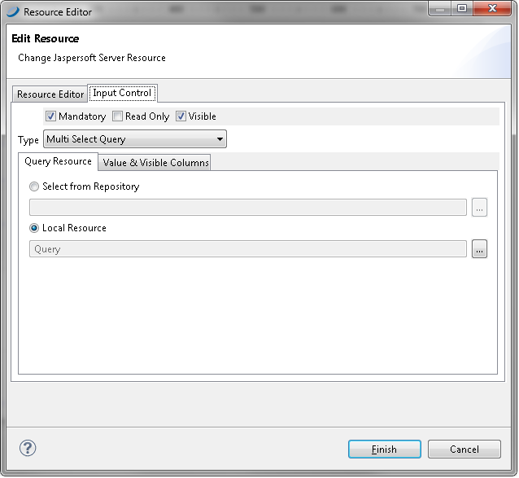

# Adding, Modifying, and Deleting Resources

You need to create and manage the resources associated with your reports, such as images, JARs, JRXML files, property files for localized reports, input controls, datatypes, lists of values, style templates (JRTX), and data sources. We have included Secure File and Azure Certificate options in the resources.

If you are maintaining existing reports, you may need to modify existing resources. You can also change the location, name, or description of the repository folders.

You can add, modify, or delete repository resources from Jaspersoft Studio. In the Repository panel, expand your JasperReports Server repository and take one of the following actions:

-   To add a resource, right-click a folder, select **New**, then select the type of object you want to add.

    !!! note

        If you choose to add an item other than a JasperReport, a dialog allows you to enter information about the object. If you choose to add a JasperReport, a wizard guides you through the process. For the best results when adding a JasperReport, open the JRXML in Jaspersoft Studio and click . Follow the steps in the wizard to publish your report. See [Publishing a Report to JasperReports Server.](jss2jrs-publishing.md)

-   To add an Azure certificate, right-click a folder, select **New**, then select **Azure Certificate**. Similarly, you can add a secure file.

    |                                                                        |
    |------------------------------------------------------------------------|
    |  |
    | *Figure 1: Selecting Azure Certificate*                                |

-   To change the location of a repository resource, drag it to a new location.

-   To delete a resource from the repository, right-click it and select **Delete**.

-   To modify a repository resource, right-click it, select **Properties**, and make your changes in the Properties dialog. On the **General** tab, you can view the object’s repository ID, name, and description. (Available tabs depend on the selected resource.)

    !!! note

        If you are logged in as a user with sufficient access rights (such as jasperadmin or superuser), you can modify property values and save them back to the repository.

-   To change an input control, use the **Input Control Resource** tab.

|                                                                        |
|------------------------------------------------------------------------|
|  |
| *Figure 2: Properties of an Input Control Resource*                    |
