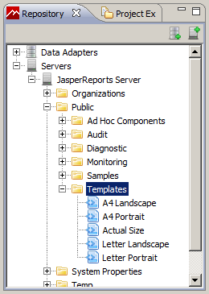
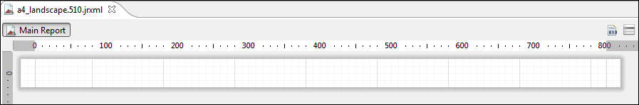
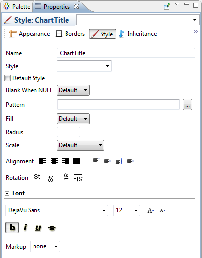
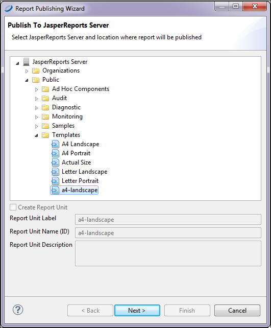
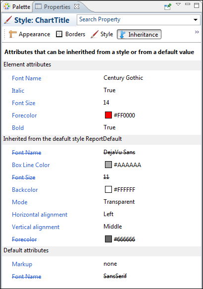

# Working with JasperReports Server Templates

!!! info "Important"

    This section describes functionality that can be restricted by the software license for Jaspersoft Studio. If you don’t see some of the options described in this section, your license may prohibit you from using them. To find out what you're licensed to use, or to upgrade your license, contact Jaspersoft.

JasperReports Server includes several templates that affect the layout of your reports. You can add custom templates to your JasperReports Server instance by uploading a JRXML file to a Templates directory. In addition to font and color choice, templates can contain images such as logos. In a JasperReports Server template, the absolute path of an image is in the repository and cannot be overwritten. Other users can apply your template by selecting Custom Report Template when they create a report from an Ad Hoc View.

!!! note

    JasperReports Server templates are different from report templates in Jaspersoft Studio. See [, “Report Templates,” on page 1](../templates-intro.md) for more information.

## Creating a Custom JasperReports Server Template

It's easiest to start with a template in JasperReports Server and change its properties (such as colors, fonts, and logos) in Jaspersoft Studio. Then, publish the new template to the server. This example shows how to change the font for a chart title.

To create a template

1.  Connect to JasperReports Server as `superuser`.

2.  In the **Repository Explorer**, navigate to the **Public/Templates** directory.

    |  |
    |----|
    |  |
    | *Figure 1 Accessing the Templates directory from Jaspersoft Studio* |

3.  Right-click **A4 Landscape** and choose **Open in Editor**.

    |  |
    |----|
    |  |
    | *Figure 2 Default A4 landscape template* |

    The document will look empty, but if you click the **Source** tab, you see that attributes are set at the JRXML level. Note the attributes for ChartTitle:

    `<style name="ChartTitle" forecolor="#000000" fontName="DejaVu Sans" fontSize="12" isBold="true"/>`

    You can edit styles directly on the **Source** tab if you choose.

4.  Click the **Design** tab and in the **Outline** view, click the arrow next to **Styles**.

5.  Click **ChartTitle**. The styles open in the **Properties** view.

    |  |
    |----|
    |  |
    | *Figure 3 Style tab in Properties view* |

6.  Make these changes:

    1.  Font: Century Gothic, 14 pt, bold, italic.
    2.  Change the forecolor to red (click **Appearance** for that change.)
    3.  Alignment: Center

!!! note

    You can link to an image in your template by uploading the image to the repository and then dragging it into the appropriate band in the template. The template uses the absolute path to the image in the repository and the image cannot be changed or overwritten.

To save and publish a template

1.  Save the template with a new name.

2.  Click **Yes** in the pop-up to publish the report to JasperReports Server.

    The **Report Publishing Wizard** appears.

    |  |
    |----|
    |  |
    | *Figure 4 Report Publishing wizard* |

3.  Select a folder to store your template, and click **Next**.

## Report Template Styles in Jaspersoft Studio

In Jaspersoft Studio a report template includes styles that inherit attributes from other styles or from default values. Open one of the default templates in Jaspersoft Studio to see the available styles listed in the Outline view. When a report template is applied to a report that includes a basic chart, only the ChartTitle style is applied to the chart. In general, report styles control the general look of the report, while chart themes control the look of basic charts (implemented through JFreeCharts). For more information on chart themes, see [Chart Themes](../charts-jfree/charts-themes-using.md).

The **Inheritance** tab in the **Properties** view shows you which styles are inherited and from where. That makes it easy if you want to change a style at a higher level, or have an attribute inherited by more styles.

|  |
|----|
|  |
| *Figure 5 Inheritance tab* |
