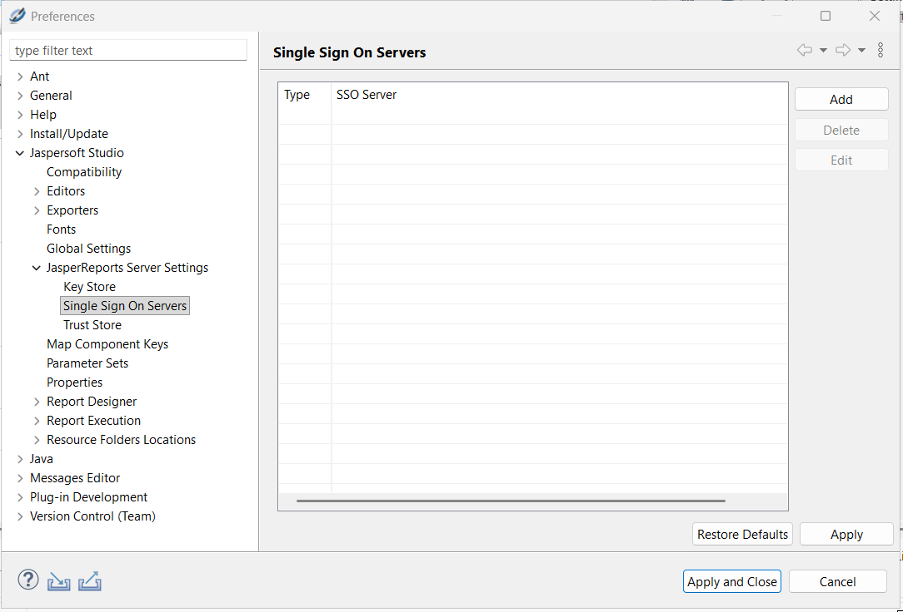
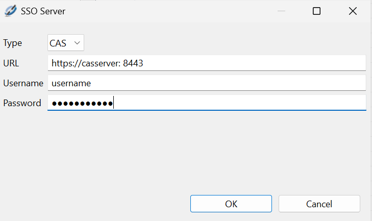
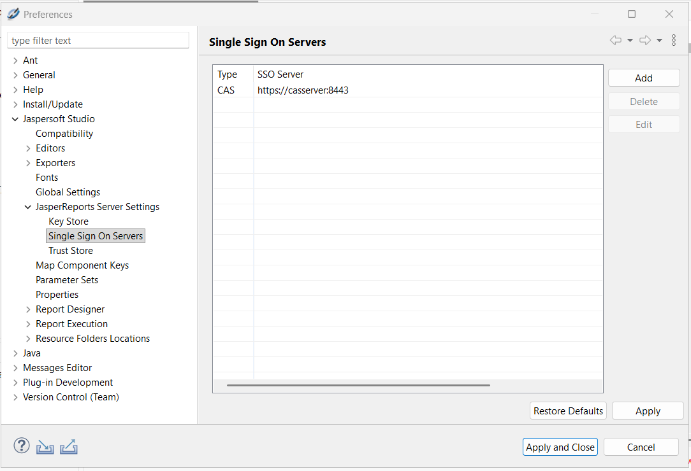
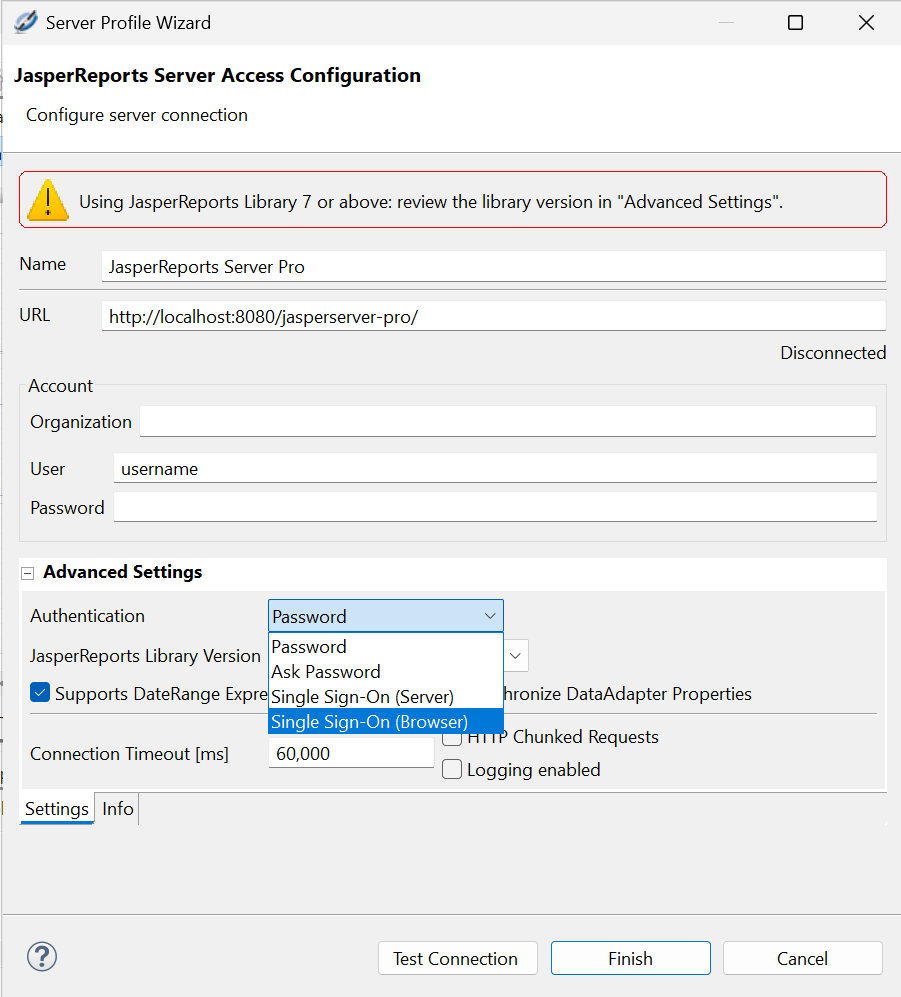
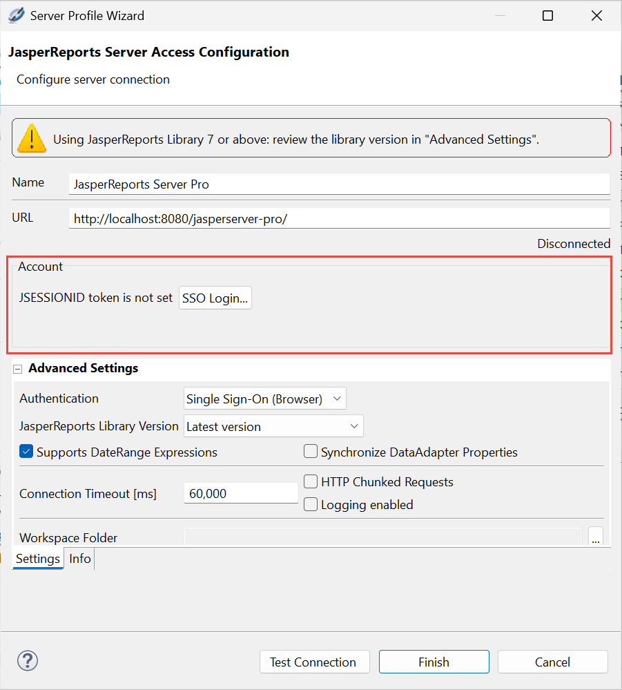
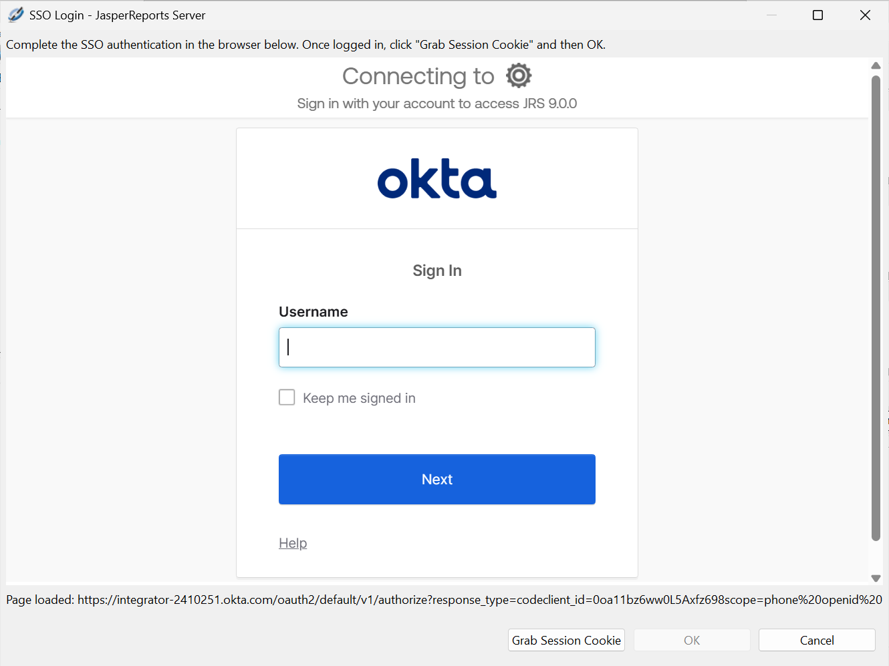
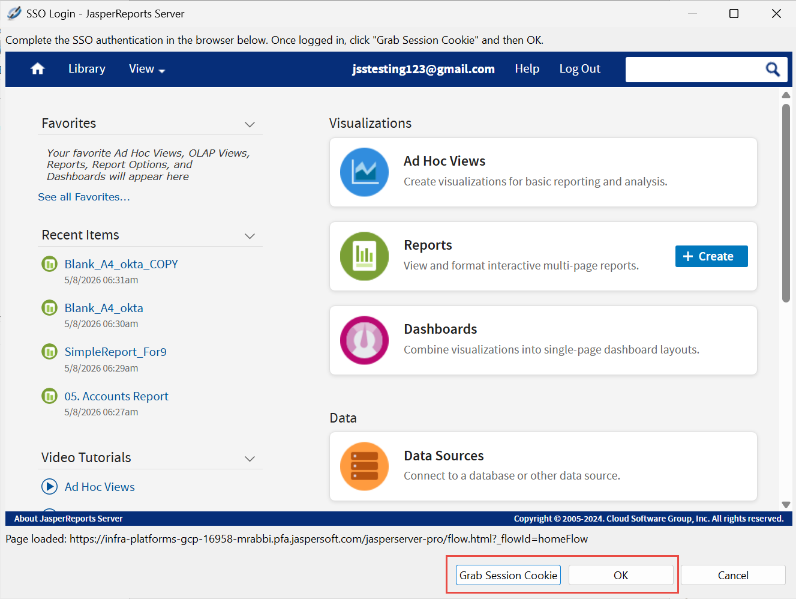
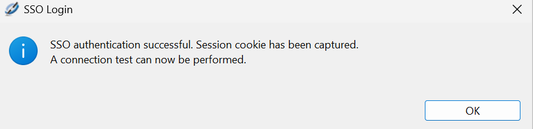
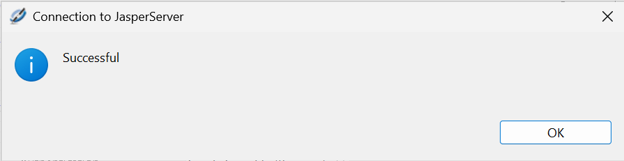
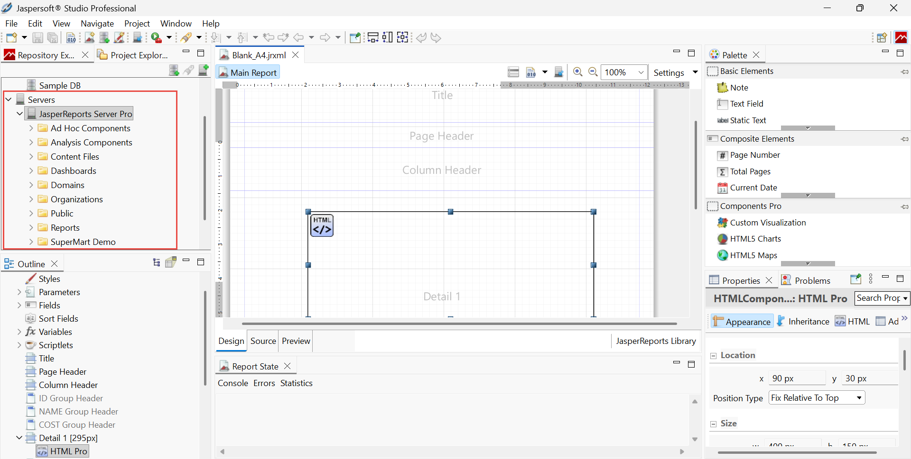

# Using Single Sign-on with JasperReports Server

You can use Single Sign-On (SSO) to connect to a JasperReports Server instance that has been configured to work with the Central Authentication Service (CAS) protocol. For information about configuring CAS for JasperReports Server, see the JasperReports Server External Authentication Cookbook.

Jaspersoft Studio version 10.1.0 introduces an enhanced SSO support, allowing you to seamlessly connect to JasperReports Server instances secured by external identity providers (such as Okta).

With this enhancement, a new **Single Sign-On (Browser)** authentication method is available in your server profile. Jaspersoft Studio launches an embedded, secure browser window directly within the application where you can complete your organization's standard login process. Once authenticated, Jaspersoft Studio allows you to capture the required session cookie (`JSESSIONID`) to securely connect your workspace, instantly enabling full access to repository browsing, report publishing, and resource management without storing your credentials locally.

Configure JasperReports Server

Before you begin, configure your JasperReports Server instance for CAS, as described in JasperReports Server External Authentication Cookbook.

Add the CAS server to your Jaspersoft Studio workspace

1.  In Jaspersoft Studio, select **Window \> Preferences** (**Eclipse \> Preferences** on Mac).
2.  In the Preferences window, navigate to **Jaspersoft Studio \> JasperReports Server Settings \> Single Sign On Servers**.

|                                                                      |
|----------------------------------------------------------------------|
|  |
| *Figure 1: Single Sign On Servers in Preferences Dialog*             |

1.  In the **Single Sign On Servers** pane, click **Add**.
2.  Enter the **URL** of your **CAS** server along with the **Username** and **Password** that you want to use for access.

|                                                        |
|--------------------------------------------------------|
|  |
| *Figure 2: SSO Server Settings Dialog*                 |

1.  Click **OK**.

The CAS server is added to the list of available single sign-on servers.

1.  Click **Apply and Close**.

Configure your JasperReports Server connection to use SSO in browser

1.  In Jaspersoft Studio, open the **Repository Explorer**, right-click **Servers** and then click the ** Create JasperReports Server Connection**.

2.  The **Server Profile Wizard** opens.

3.  Click **Advanced Settings**.

4.  From the **Authentication** drop-down, select **Single Sign-On (Browser)**.

    

    !!! note

        The legacy SSO option using CAS is renamed to **Single Sign-On (Server)**.

5.  The **Account** section of the **Server Profile Wizard** changes.

    A message **JSESSIONID token is not set** is shown. Click **SSO Login...**.

    

6.  An in-app browser dialog opens. Follow the standard login procedure for your SSO-configured JasperReports Server instance (Okta in this case).

    

7.  Once you successfully complete the login process, you are redirected to the JasperReports Server login page.

    Click **Grab Session Cookie**. Click **OK**.

    

    A message stating that the SSO authentication is successful is shown.

    

8.  Click **Test Connection** to test the connection. This may take some time, especially the first time you connect.

    Once done, a message stating that the connection is successful is shown.

    

9.  Click **OK** in the confirmation dialog.

10. Click **Finish** to create the connection.

11. Once the connection is verified, your session is active. You can now perform standard operations, such as, repository browsing, report publishing, resource uploading, and modifications as usual.

    

    !!! note

        Your security token (`JSESSIONID`) is stored temporarily, so your authenticated session is only active while Jaspersoft Studio remains open.

        You will need to run through the SSO re-authentication to get a new token if:

        - You close and restart Jaspersoft Studio.

        - Your session times out due to inactivity.

        - The JasperReports Server is restarted or the token becomes invalid for any other reason.

        If your session expires while you are working, Jaspersoft Studio identifies the communication error (HTTP 401) in the background and automatically prompts you to log back in.

|     |
|-----|
|     |
|     |
