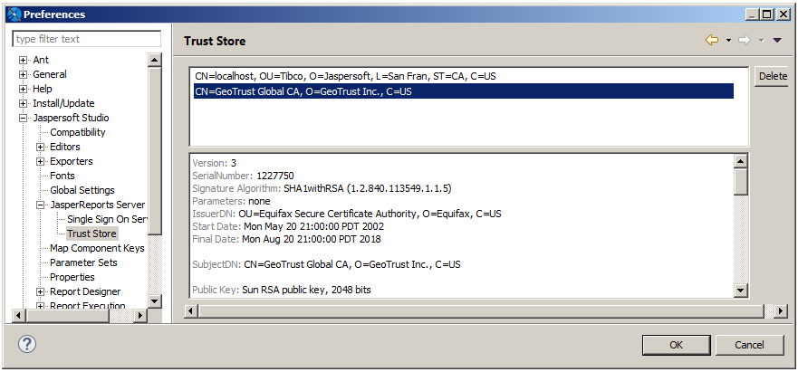

# Connecting to JasperReports Server Over SSL

Jaspersoft Studio lets you trust and manage certificates for connections to JasperReports Server instances over SSL.

## Viewing the Certificate

When you create a JasperReports Server connection over SSL, the Server profile wizard automatically detects the `https` scheme in the URL and displays a  icon. To open the Security Certificate dialog and view the security certificate, click . If you do not click **Trust**, the certificate is displayed each time you connect to this JasperReports Server instance.

To view the trust store from the Security Certificate dialog, click **Show Trust Store**.

## Adding the Certificate to the Trust Store in Jaspersoft Studio

To add a connection's certificate to the trust store, click **Test Connection** in the server profile wizard, and then click **Trust**. This is the topmost certificate in the certificate chain.

## Setting the SSL Properties

SSL properties, including the location of the trust store, are set at the JVM-level via system properties. This means you can set SSL properties in one of two ways:

- In code using `System.setProperty`
- Using `java -D…` syntax when running the program from the command line or in Jaspersoft Studio's `.ini` file. See [1.1.2, “Setting the -clean Flag in the .ini File,” on page 1](../config-clean.md) for more information about the .ini file.

You can set the following keys for Jaspersoft Studio:

- `javax.net.ssl.trustStore` – Location of the Jaspersoft Studio trust store. On Windows, the specified pathname must use forward slashes, `/`, in place of backslashes, `\`. Jaspersoft Studio defaults to the internal configuration directory.
- `javax.net.ssl.trustStorePassword` – Password to unlock the trust store.
- `javax.net.ssl.trustStoreType` (Optional) – Format of the trust store. Defaults to Java keystore file format (JKS).
- `javax.net.debug` – Debug flag. To enable logging for the SSL/TLS layer, set this property to `ssl`.

For more information, see Oracle's documentation for your Java version.

## Working with the Trust Store

To view the trust store in the Jaspersoft Studio user interface:

1.  Select **Window \> Preferences** to open the **Preferences** dialog (**Eclipse \> Preferences** on Mac).
2.  Navigate to **Jaspersoft Studio \> JasperReports Server Settings \> Trust Store**.
3.  The **Trust Store** dialog appears.

|                                                        |
|--------------------------------------------------------|
|  |
| *Figure 1: Trust Store dialog*                         |

You can also open the Trust Store dialog when you are creating a secure connection by clicking **Show Trust Store** in the Security Certificate dialog.

The **Trust Store** dialog lets you do the following:

- To view a certificate and its certificate chain, select the certificate.

- To remove a certificate from the store, select the certificate and delete it.
