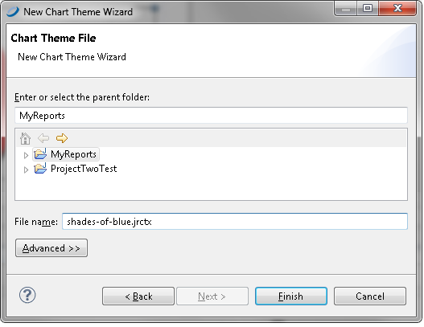
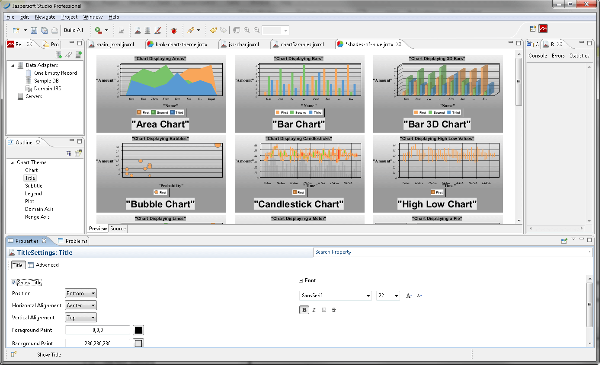
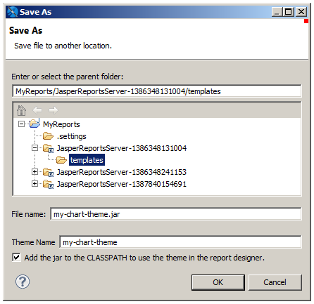

# Creating and Uploading Chart Themes

Using Jaspersoft Studio, you can create chart themes to give a custom look to a JFreeChart. You can set the fonts, colors, line widths, and other settings that determine the appearance of charts. Then upload the chart theme for use in reports generated on the server, either on a report-by-report basis or as a global setting for all charts that do not provide their own theme.

To create a chart theme in Jaspersoft Studio

1.  Select **File &gt; New &gt; Other**. The new wizard appears.

2.  Expand **Jaspersoft Studio**, select **Chart Themes**, and click **Next**. The new file dialog suggests a default file name. Chart themes use the `.jrctx` file extension.

    |  |
    |----|
    |  |
    | *Figure 1: New Chart Theme in Jaspersoft Studio* |

3.  Specify a location, enter a name, and click **Finish**.

    The chart theme editor appears. It displays several types of charts to help you understand how the theme is applied to each chart.

    The available options are based on the JFreeChart library used to generate charts.

    !!! note

        Jaspersoft Studio supports only the most common options provided by JFreeCharts.

4.  In the **Outline** view, select each category and review the available options in the **Properties** view.

5.  Select a property to change its value.

    Depending on the nature of the property, you might type text, select a color, check or clear a checkbox, or select a value from a dropdown. As you update the chart theme, the Preview tab shows your changes. For example, select Title in the Outline view and choose Bottom from the Position dropdown to move the title beneath the chart.

6.  Click a chart type in the Preview tab to zoom in to examine the effects of your changes more closely. Click again to zoom out.

    |                                                                          |
    |--------------------------------------------------------------------------|
    |  |
    | *Figure 2: A Chart Theme Edited in Jaspersoft Studio*                    |
    |                                                                          |

7.  To view the XML that defines the chart theme’s appearance, click the **Source** tab.

8.  When you are satisfied with the chart theme, click **File &gt; Save** to save the chart theme. This saves the chart theme to your local hard drive.

To export your theme as a JAR File

1.  Select your chart theme and click the Export Chart Theme jar icon on the toolbar. A Save As dialog opens.

    |                                                                          |
    |--------------------------------------------------------------------------|
    |  |
    | *Figure 3: Exporting a Chart Theme*                                      |

2.  Choose the location where you want to save your JAR. To upload to a JasperReports Server instance, select your server instance and then select the Templates directory. To create a jar on your current system, select a location on your hard drive.

3.  Enter a file name and theme name for your theme.

4.  If you want to use the theme to design reports on your current system, save to a location on your hard drive and select **Add the jar to the CLASSPATH to use the theme in the report designer**.

5.  Click **OK**. The chart theme is exported as a JAR.

!!! note

    Once you have uploaded a theme to JasperReports Server, you can use the repo: syntax in your reports to specify this JAR as your chart theme. The theme can be used at the report or server level in JasperReports Server. For more information, refer to the JasperReports Server Administrator Guide.
