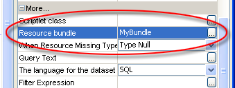
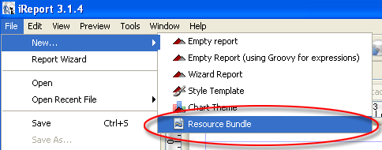
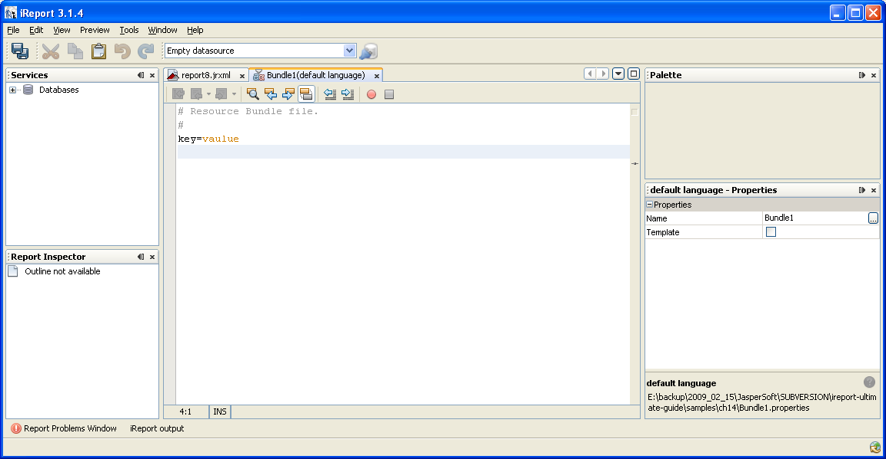
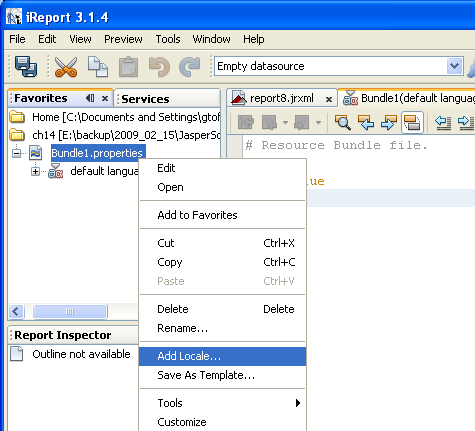
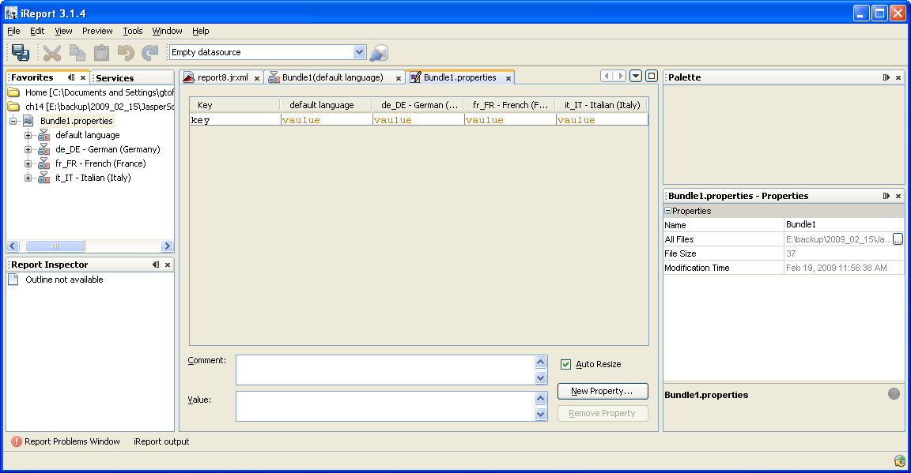
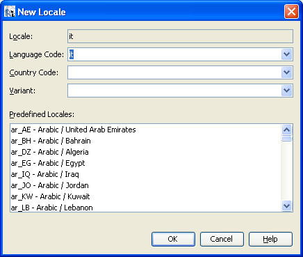
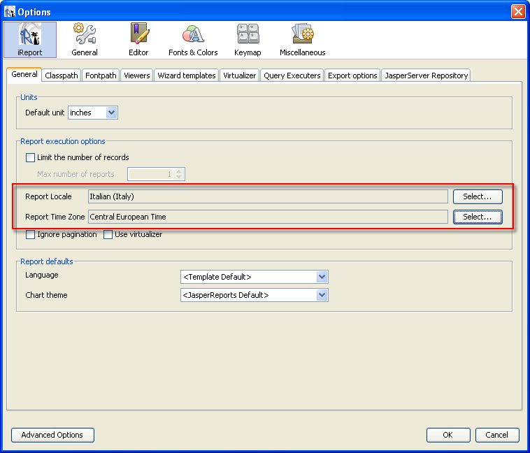
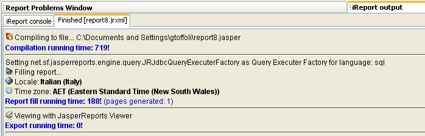

# Localization

This chapter describes how to localize the text in your reports. You can configure reports to use localized text in static text fields or in place of a text string in an expression. Translations are provided in properties files (also called resource bundles). Text you localize appears in reports based on the locale specified in the user’s operating environment. You can use the Java `msg()` function to localize complex sentences.

!!! note

    Localization in Jaspersoft Studio is implemented using Java locales and the `ResourceBundle` class. See [https://docs.oracle.com/javase/tutorial/i18n/](https://docs.oracle.com/javase/tutorial/i18n/) for more information.

This chapter has the following sections:

-   Using a Resource Bundle Base Name
-   Retrieving Localized Strings
-   Formatting Messages
-   Deploying Localized Reports
-   Generating a Report Using a Specific Locale and Time Zone

!!! note

    If you have installed the JasperReports Library samples, the I18nReport in the i18n folder shows an example of a localized report. See [JasperReports Samples](../configuration.md) for more information.

## Something

You can configure reports to provide localized text for static text fields or text strings in expressions. To configure translations for your reports, you need to do the following:

-   Replace display text in your report with localization keys.
-   Create a set of related properties files that contain your translations as key-value pairs.
-   Set your report to use the properties files you have created.

## Localization Keys

Localization keys in a report replace the text that you want translated. To localize a report, start by finding all the display text in the report design that you want translated and replacing each one with a unique key (name). Localization keys can be used in static text fields or in place of a text string in an expression.

In some cases, you might break up a long text string into several text fragments, or use the `msg()` function to build messages using arguments. More about msg here.

The dedicated JasperReports special syntax for keys in an expression is in the form:

`$R{key_name}`

A $R expression that you write in the report design triggers linguistic changes in the report output for different locales. Each $R expression refers to a name-value pair (your translations) in a resource bundle. For example, to retrieve the text for the current locale associated with `Title.Name` in the localization files, use the following:

`$R{Title.Name}`

JasperReports converts the text associated with the key `Title.Name` using the most appropriate available translation for the selected locale.

!!! note

    You can use the Java `str("key_name")` function in place of the `$R{key_name}` format.

## Creating Resource Bundles

For each language that you want to support, create a .properties file that maps the keys in the report to the translation for that language. You can specify a default .properties file that uses the most common language that is also used when the report is viewed on a system where no dedicated bundle is available.

To localize text in your report, you must create a properties file for each locale you want to support. A properties file is also called a resource bundle. You also create a "default" file that is used as a fallback whenever a message is missing in the properties file for the current locale.

!!! note

    Localization in Jaspersoft Studio is implemented using Java locales and resource bundles.

Each .properties file is a text file containing key-value pairs for a locale:

-   The keys are the keys that you declared in your report using the `$R` or `str` format. For example, if you use `$R{Title.Name}` in your report, use the corresponding key `Title.Name` in your bundle files. A file can omit some of the keys.
-   The values are the labels and descriptions in the language of the target locale.

### File Naming

File naming follows a strict convention where all files have the same base name, with additional codes that indicate the locale of the file.

-   File names are of the form &lt;base_name&gt;\_&lt;locale&gt;.properties, where:

    -   &lt;base_name&gt; is arbitrary and the same for all files.

    -   &lt;locale&gt; is a Java-compliant locale identifier, for example `fr` or `fr_CA`.

    -   You should include a default .properties file, which is used for the default locale or when a key is missing or empty in one of the other .properties files. The default properties file name is &lt;base_name&gt;.properties. It does not have a language extension.

        The effective file name (that is, the file name without the file extension and the language/country code, which you see later in this section) represents the report Resource Bundle Base Name (for example, the Resource Bundle Base Name for the resource file `i18nReport.properties` is `i18nReport`). When you generate an instance of the report, the report engine looks in the classpath for a file that has the Resource Bundle Base Name plus the `.properties` extension (so, for the previous example, it looks for a file named `i18nReport.properties`). If the report engine cannot find the file, it uses the default-mapping resource defined for the report. The Resource Bundle Base Name is specified using the report property sheet as shown in Figure 16‑1.

        Each .properties file is also called a locale bundle or resource bundle.

        A resource bundle file is a text file that has a .properties extension. You create a resource bundle in Jaspersoft Studio or a text editor.

        You set the base name of the resource bundle in the header of the JRXML file:

        &lt;jasperReport name=”StoreSales” pageWidth=”595” pageHeight=”842” columnWidth=”515”

        leftMargin=”40” rightMargin=”40” topMargin=”50” bottomMargin=”50”

        resourceBundle=”simpleTable”&gt;

        For example, simpleTable is the base name of the resource bundle file for this report. If you prefer using a graphical user interface to coding in XML, use Jaspersoft Studio to set the base name of the resource bundle.

        Normally, you localize static text in a report.

        To localize a report:

-   Replace the static text in the report with keys.

-   Create a bundle file.

These keys and the relative text translation are written in special files (one per language). Below is an example of a text localization mapping file:

<table>
<colgroup>
<col style="width: 100%" />
</colgroup>
<tbody>
<tr>
<td>
<code>Title.GeneralData=General Data</code>

<code>Title.Address=Address</code>

<code>Title.Name=Name</code>

<code>Title.Phone=Phone</code>
</td>
</tr>
</tbody>
</table>

|                                                                          |
|--------------------------------------------------------------------------|
|  |
| The Resource Bundle Base Name property                                   |

When you need to generate a report using a specific locale, JasperReports looks for a file starting with the Resource Bundle Base Name string, followed by the language and country code relative to the requested locale. For example, `i18nReport_it_IT.properties` is a file that contains all locale strings to print in Italian. In contrast, `i18nReport_en_US.properties` contains the translations in American English. So it is important to always create a default resource file that will contain all the strings in the most widely used language and a set of language-specific files for other languages.

The language codes are the lower-case, two-letter codes as defined by ISO-639 1 (a list of this code is available at <http://www.loc.gov/standards/iso639-2/php/English_list.php>), the country codes are the upper-case, Alpha-2 codes as defined by ISO-3166 (see <https://www.iso.org/obp/ui/#search>).

The default resource file does not have a language/country code after the Resource Bundle Base Name, and the contained values are used only if there is no resource file that matches the requested locale, or if the file does not include the key for a translated string.

The complete resource file name is composed as follows:

`<`resource bundle base name`>[`[\_language code](http://www.loc.gov/standards/iso639-2/php/English_list.php)`[`[\_country code](http://www.iso.org/iso/country_codes/iso_3166_code_lists/english_country_names_and_code_elements.htm)`[``_`other code`]]].properties`

Here are some examples of valid resource file names:

`i18nReport_fr_CA_UNIX i18nReport_fr_CA i18nReport_fr i18nReport_en_US i18nReport_en i18nReport`

The “other” code (or alternative code) is usually not used for reports, but it is included to identify very specific resource files. The alternative code is appended after the language and the country code ( `_UNIX` in the preceding example).

### Missing Resource Keys

If a resource key is not found in any of the suitable resource bundles, you can choose what to do by setting the report property `When Resource Missing Type`. The possible options are:

|  |  |
|----|----|
| `Type Null` | The null value is used in the expression (resulting in the string “null”) |
| `Type Empty` | The empty string is used. |
| `Raise an error` | This will stop the filling process throwing a Java exception. |
| `Type the key` | The value of the key is used as value. |

Jaspersoft Studio provides built-in support for editing the resource bundle files used for report localization.

To create a new resource bundle, select **New → Resource Bundle** (see Figure 16‑2).

|  |
|----|
|  |
| Creating a new resource bundle |

Select the file name and where to save it. When done, iReport will open the file as simple text file (see Figure 16‑3).

|  |
|----|
|  |
| The new resource bundle |

This is just the default bundle. To add new languages or switch to the visual editor for resource bundles, you need to locate the file using the Favorites window. Select **Window**→**Favorites** to open the Favorites view, and locate the resource bundle file directory. It is important that you add the containing directory, not the file itself; otherwise you’ll be not able to see the language specific bundles (see Figure 16‑4).

|  |
|----|
|  |
| The resource bundle in the Favorites view |

The bundle node in Favorites provides several tool features. Right-click the file node to open one of the editing tools for the resource bundle:

-   **Edit**. Opens a resource bundle as a text file (see Figure 16‑3)
-   **Open**. Opens the visual resource bundle editor that shows at the same time the translations for all the language you are supporting (see Figure 16‑5).

|                                                                      |
|----------------------------------------------------------------------|
|  |
| Visual Bundle Editor                                                 |

To add a new locale (meaning support for a new language), right-click the resource bundle node and select the menu item **Add locale...**. This will pop up the window shown in Figure 16‑6. It is used to set the correct language specifications (language, country and optionally a variant code).

|                                                                |
|----------------------------------------------------------------|
|  |
| New locale                                                     |

By confirming the choice, a new file will be created in the same directory as the default one; it will have the proper localization abbreviation appended to the file name, and it will be visible as a child of the bundle node in the Favorites view.

## Formatting Messages

The internationalization features included with JasperReports are based on the support provided by Java. One of the most useful features is the `msg` function, which you can use to dynamically build messages using arguments. In fact, msg uses strings as patterns. These patterns define where arguments, passed as parameters to the msg function, must be placed. The position of an argument is expressed using numbers between braces, as in this example:

`"The report contains {0} records."`

The zero specifies where to place the value of the first argument passed to the msg function. The expression:

`msg($R{text.message}, $P{number})`

uses the string referred to by the key `text.message` as the pattern for the call to msg. The second parameter is the first argument to be replaced in the pattern string. If `text.message` is the string "The report contains {0} records." and the value for the report parameter number is 100, JasperReports displays the interpreted text string as:

`The report contains 100 records.`

The reason for using patterns instead of building messages like this by dividing them into substrings translated separately (for example, `[The report contains] {0} [records]`), is that sometimes the second approach is not possible. Localization modules may not be able to create grammatically correct translations for all languages (for example, for languages in which the verb appears at the end of the sentence).

It’s possible to call the msg function in three ways, as shown below:

<table>
<colgroup>
<col style="width: 100%" />
</colgroup>
<tbody>
<tr>
<td>
<code>public String msg(String pattern, Object arg0)</code>

<code>public String msg(String pattern, Object arg0, Object arg1)</code>

<code>public String msg(String pattern, Object arg0, Object arg1, Object arg2)</code>
</td>
</tr>
</tbody>
</table>

The only difference between the three calls is the number of arguments passed to the function.

## Deploying Localized Reports

To deploy a localized report, make sure that all `.properties` files containing the translated strings are present in the classpath.

JasperReports looks for resource files using the `getBundle` method of the `ResourceBundle` Java class. To learn more about how this class works, visit <https://docs.oracle.com/javase/tutorial/i18n/>.

## Generating a Report Using a Specific Locale and Time Zone

If you wish to use a specific locale or to generate a report using a particular time zone, go to the iReport options dialog (**Tools → Options**) and specify the preferred locale and time zone in the **Report execution options** section (Figure 16‑7).

|  |
|----|
|  |
| Locale and Time Zone options |

You will see the current settings in the log window each time you run a report, as shown in Figure 16‑8.

|                                                                          |
|--------------------------------------------------------------------------|
|  |
| Locale and time zone used are specified in the execution log             |
