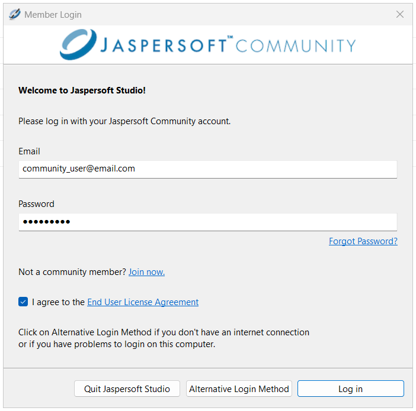
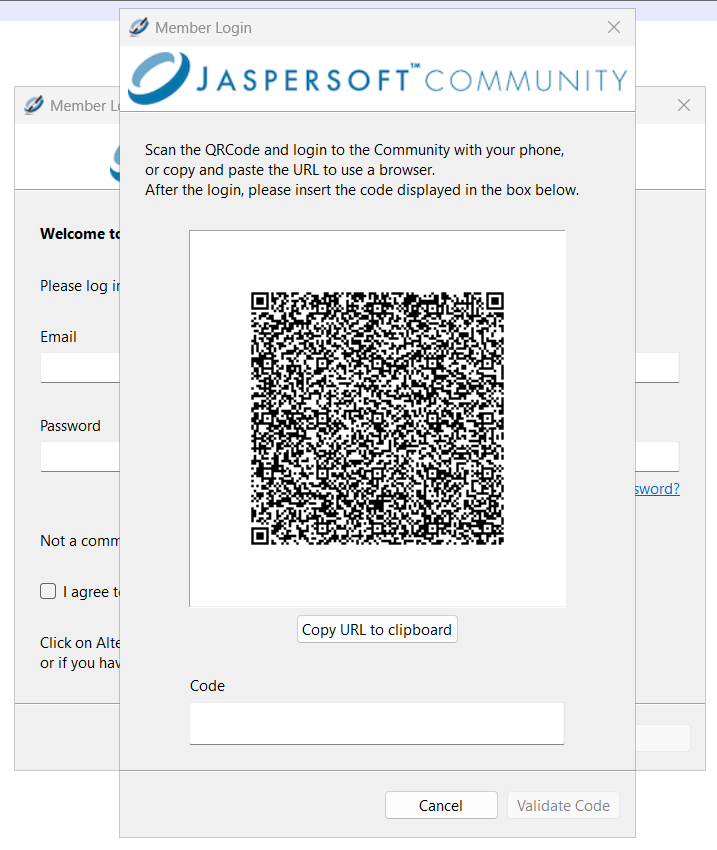
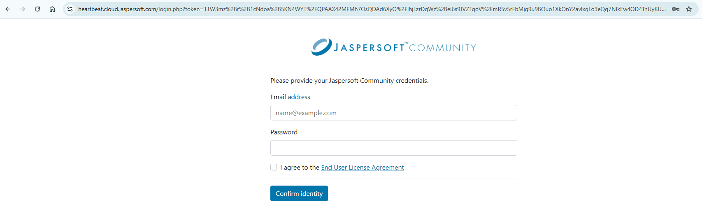
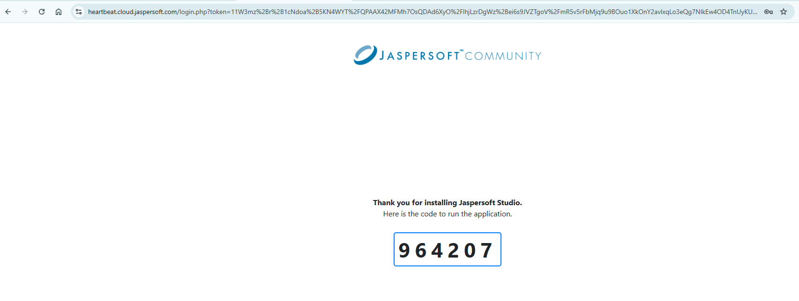
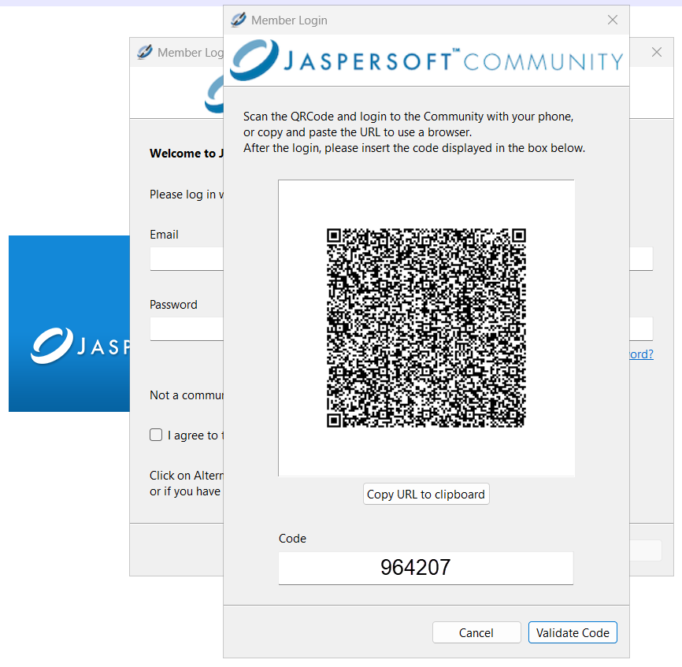
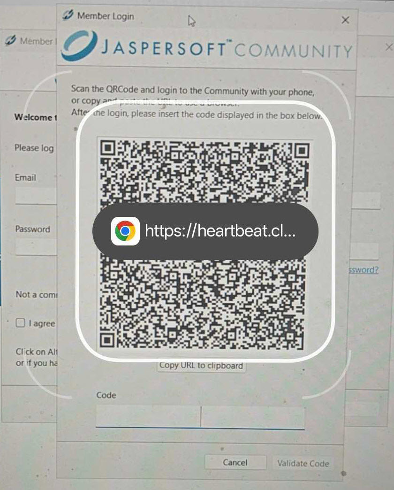
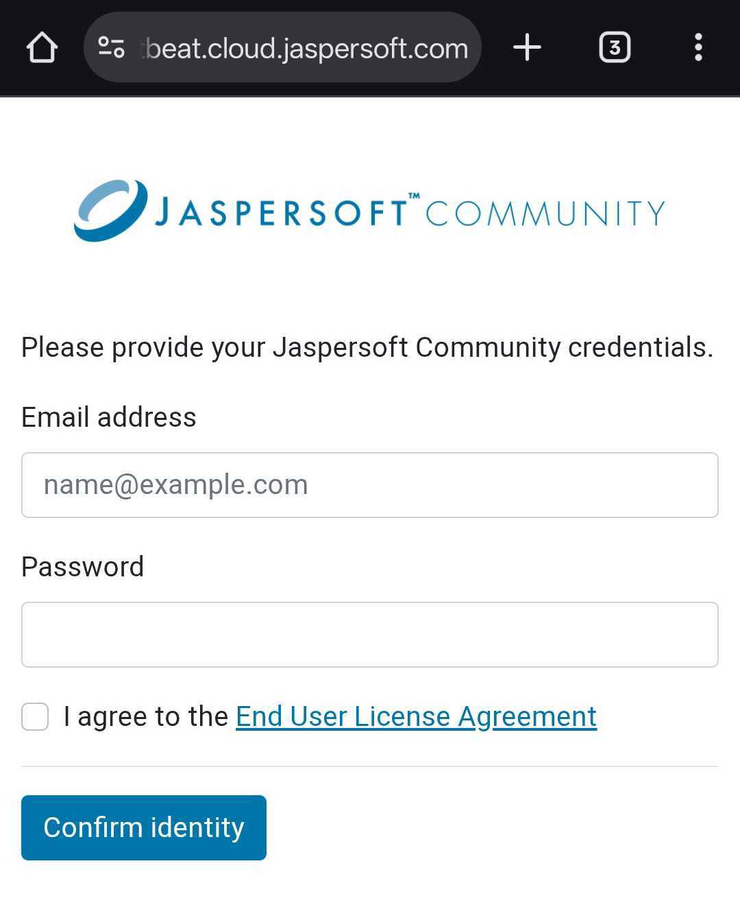
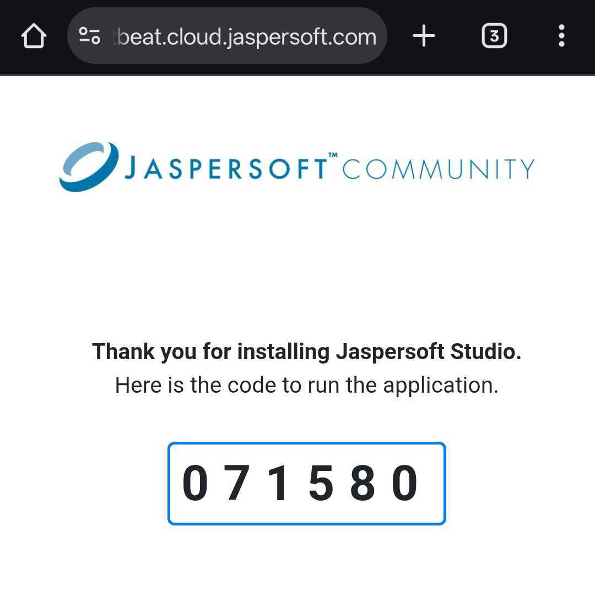
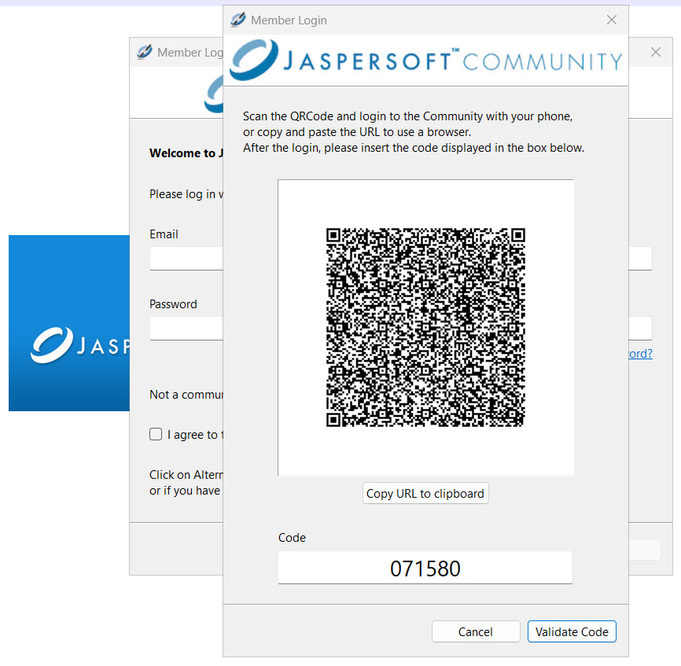

# Logging in to the Jaspersoft Community

You need an active Internet connection to run Jaspersoft Studio. When prompted, on the **Member Login** screen, enter the **Email** and **Password**.

You can view various options available on the **Member Login** dialog, including:

- **Forgot Password**: Resets your password.
- **Join Now**: Opens the **Join the Jaspersoft Community** [page](https://community.jaspersoft.com/register/). You can create an account and join the community by filling the form.
- **End User License Agreement**: Opens the **End User License Agreement** (EULA) document.
- **Quit** Jaspersoft Studio: Quits Jaspersoft Studio.
- **Alternative Login Method**: Provides a secondary, smartphone-based activation method to Jaspersoft® Studio Community. For more information, see Alternative Login Method.
- **Log in**: Logs in to Jaspersoft Studio.

Jaspersoft Studio starts only when the credentials are valid and login is successful.

Before you log into Jaspersoft Studio, you must agree to the **End User License Agreement**.

## Alternative Login Method

The **Alternative Login Method** provides a robust, smartphone-based activation process for Jaspersoft Studio Community, primarily designed for users with limited or no internet connectivity. When network access is restricted, Jaspersoft Studio generates an encrypted QR code. Users scan this code with their smartphone, log in to the Jaspersoft community online, and receive a unique activation code. Entering this code back into the Jaspersoft Studio completes the registration, enabling immediate offline usage and facilitating installation tracking.

Following are the steps to use this functionality:

1.  Click **Alternative Login Method**, the QR code dialog opens.

    

2.  On this dialog, you can either scan the QR code or use **Copy URL to clipboard** option to log in to Jaspersoft Studio.

3.  If you want to use the **Copy URL to clipboard** option:

    1.  Click **Copy URL to clipboard**, the option changes to **URL copied!**, specifying that the URL is copied and is available.

    2.  Paste the copied URL into the browser, you are navigated to the Jaspersoft community page.

        

    3.  Provide your **Email address** and **Password**, confirm your acceptance of the End User License Agreement, and click **Confirm identity**. A 6-digit code is displayed on the screen.

        

    4.  On the QR code page, enter the above code in the **Code** textbox.

        

    5.  Click **Validate Code** to successfully login to Jaspersoft Studio.

4.  If you want to scan the QR code:

    1.  Open the Chrome browser on your phone.

    2.  Click the camera icon on the Search bar. Point your camera at the scanner. The specified view appears on your phone screen.

        

    3.  Click the search button, you will be directed to the Jaspersoft community page.

        

    4.  Provide your valid credentials, select the agreement checkbox, and click **Confirm identity**. A verification code appears on the screen.

        

    5.  Enter the code in the **Code** textbox.

    6.  Click **Validate Code** to successfully login to Jaspersoft Studio.
