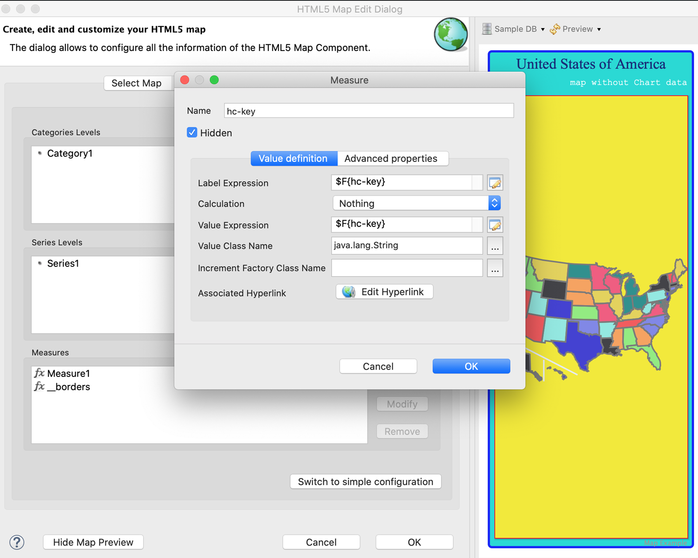
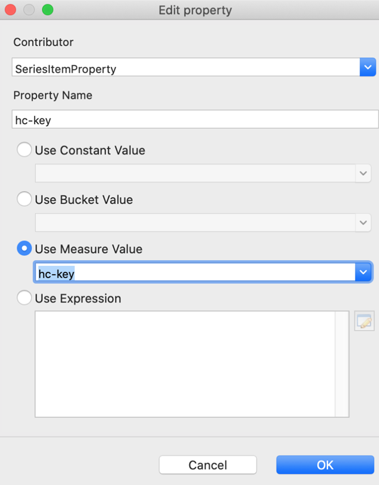
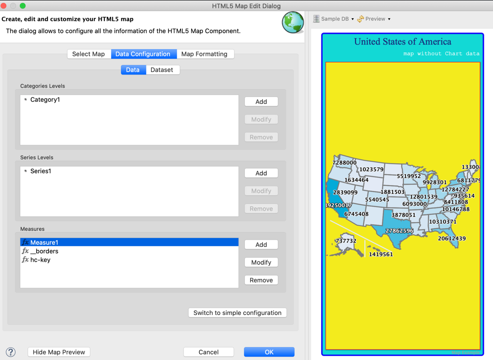
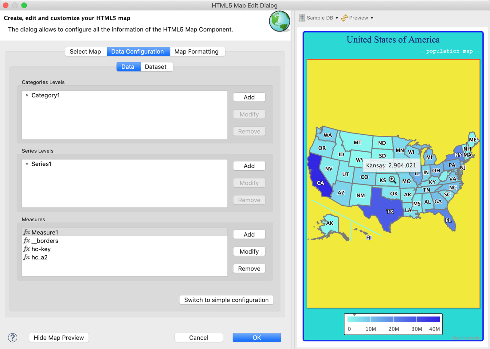
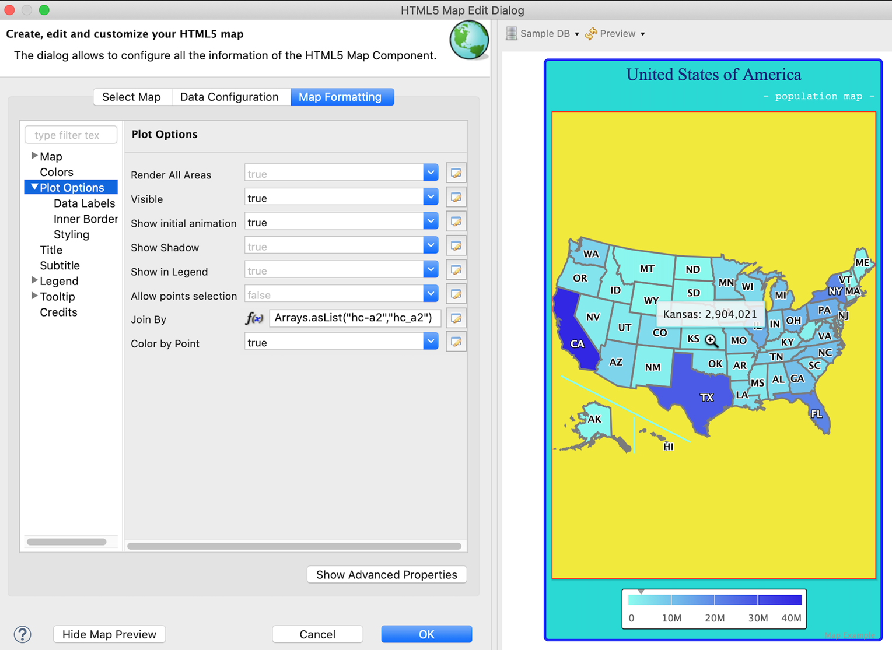
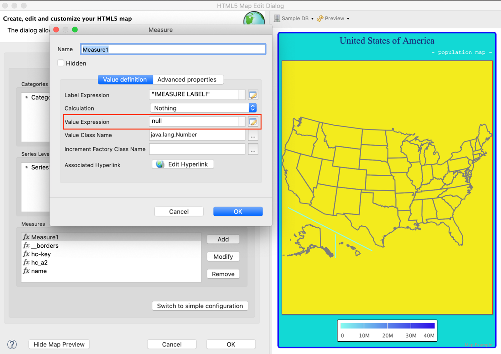
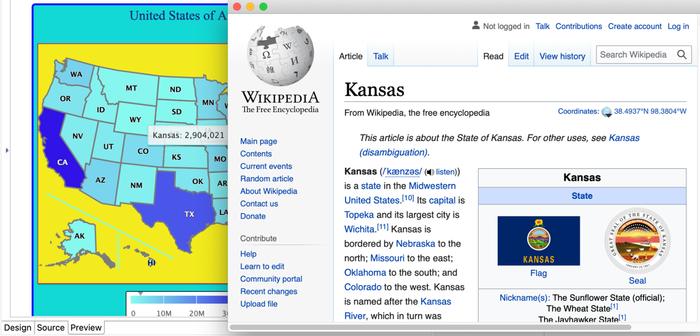
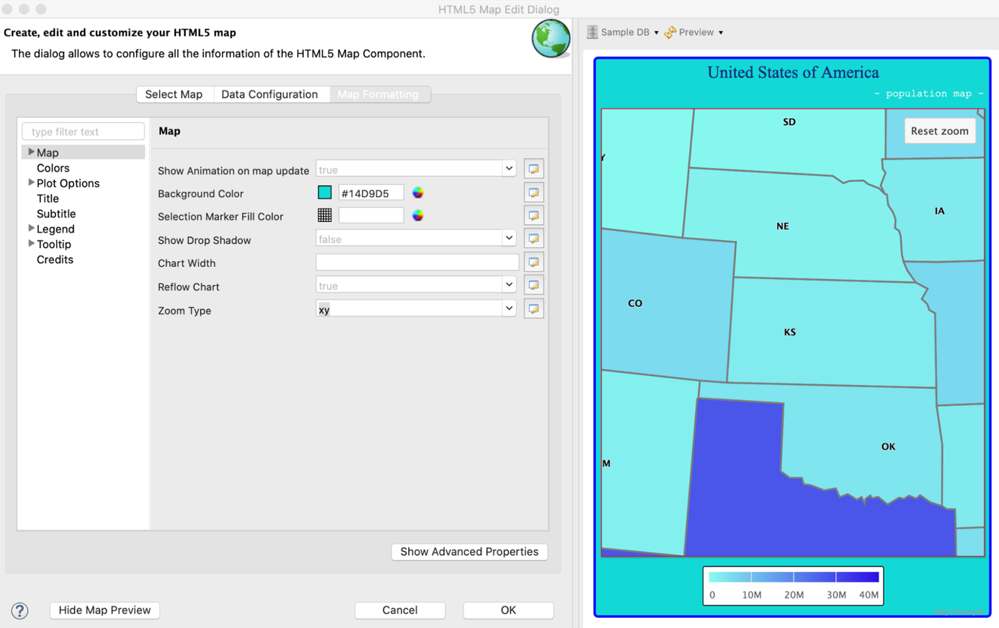
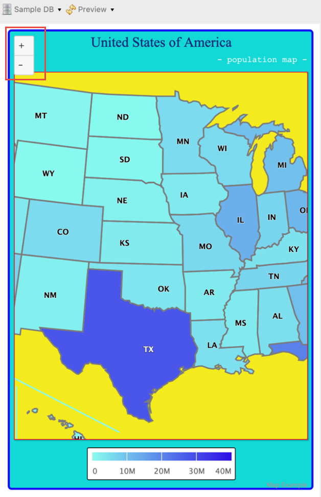

# Chart Data Set

While the map data set contains geographic localization information, the chart data set contains the business logic information. HTML5 Maps can also be used as charts, you can display information over the map to get an accurate data visualization. For instance, you can display population density, temperatures, weather information for a given region, statistics of social phenomena such as people migrations, the distribution of various resources..

The two sets of data, map data and chart data are generated independently of each other. You can use both of them in the same map element. The data can be joined by using a field or column with common values in both Map and Chart data sets.

This section describes:

-   Retrieving Chart Data

-   Joining Data Using the Default hc-key Field

-   Configuring Chart Data of the Map

-   Joining Data Using a Pair of Related Fields

-   Rendering a Subregion of the Map

-   Creating a Hyperlink

-   Zooming in the Map

-   Adding Map Navigation Control

## Retrieving Chart Data

To retrieve the chart data

1.  In the **Outline** view, right-click the report name and select **Dataset and Query**.
2.  Choose Sample DB from the data adapters list in the upper-left corner and enter the SQL query in the query panel, for example:

``` sql
SELECT "hc-key", "hc_a2" , "name" ,"region" , "x", "y", "value"
FROM
(VALUES
('us-al', 'AL', 'Alabama', 'South', 6, 7, 4849377),
('us-ak', 'AK', 'Alaska', 'West', 0, 0, 737732),
('us-az', 'AZ', 'Arizona', 'West', 5, 3, 6745408),
('us-ar', 'AR', 'Arkansas', 'South', 5, 6, 2994079),
('us-ca', 'CA', 'California', 'West', 5, 2, 39250017),
('us-co', 'CO', 'Colorado', 'West', 4, 3, 5540545),
('us-ct', 'CT', 'Connecticut', 'Northeast', 3, 11, 3596677),
('us-de', 'DE', 'Delaware', 'South', 4, 9, 935614),
('us-dc', 'DC', 'District of Columbia', 'South', 4, 10, 7288000),
('us-fl', 'FL', 'Florida', 'South', 8, 8, 20612439),
('us-ga', 'GA', 'Georgia', 'South', 7, 8, 10310371),
('us-hi', 'HI', 'Hawaii', 'West', 8, 0, 1419561),
('us-id', 'ID', 'Idaho', 'West', 3, 2, 1634464),
('us-il', 'IL', 'Illinois', 'Midwest', 3, 6, 12801539),
('us-in', 'IN', 'Indiana', 'Midwest', 3, 7, 6596855),
('us-ia', 'IA', 'Iowa', 'Midwest', 3, 5, 3107126),
('us-ks', 'KS', 'Kansas', 'Midwest', 5, 5, 2904021),
('us-ky', 'KY', 'Kentucky', 'South', 4, 6, 4413457),
('us-la', 'LA', 'Louisiana', 'South', 6, 5, 4649676),
('us-me', 'ME', 'Maine', 'Northeast', 0, 11, 1330089),
('us-md', 'MD', 'Maryland', 'South', 4, 8, 6016447),
('us-ma', 'MA', 'Massachusetts', 'Northeast', 2, 10, 6811779),
('us-mi', 'MI', 'Michigan', 'Midwest', 2, 7, 9928301),
('us-mn', 'MN', 'Minnesota', 'Midwest', 2, 4, 5519952),
('us-ms', 'MS', 'Mississippi', 'South', 6, 6, 2984926),
('us-mo', 'MO', 'Missouri', 'Midwest', 4, 5, 6093000),
('us-mt', 'MT', 'Montana', 'West', 2, 2, 1023579),
('us-ne', 'NE', 'Nebraska', 'Midwest', 4, 4, 1881503),
('us-nv', 'NV', 'Nevada', 'West', 4, 2, 2839099),
('us-nh', 'NH', 'New Hampshire', 'Northeast', 1, 11, 1326813),
('us-nj', 'NJ', 'New Jersey', 'Northeast', 3, 10, 8944469),
('us-nm', 'NM', 'New Mexico', 'West', 6, 3, 2085572),
('us-ny', 'NY', 'New York', 'Northeast', 2, 9, 19745289),
('us-nc', 'NC', 'North Carolina', 'South', 5, 9, 10146788),
('us-nd', 'ND', 'North Dakota', 'Midwest', 2, 3, 739482),
('us-oh', 'OH', 'Ohio', 'Midwest', 3, 8, 11614373),
('us-ok', 'OK', 'Oklahoma', 'South', 6, 4, 3878051),
('us-or', 'OR', 'Oregon', 'West', 4, 1, 3970239),
('us-pa', 'PA', 'Pennsylvania', 'Northeast', 3, 9, 12784227),
('us-ri', 'RI', 'Rhode Island', 'Northeast', 2, 11, 1055173),
('us-sc', 'SC', 'South Carolina', 'South', 6, 8, 4832482),
('us-sd', 'SD', 'South Dakota', 'Midwest', 3, 4, 853175),
('us-tn', 'TN', 'Tennessee', 'South', 5, 7, 6651194),
('us-tx', 'TX', 'Texas', 'South', 7, 4, 27862596),
('us-ut', 'UT', 'Utah', 'West', 5, 4, 2942902),
('us-vt', 'VT', 'Vermont', 'Northeast', 1, 10, 626011),
('us-va', 'VA', 'Virginia', 'South', 5, 8, 8411808),
('us-wa', 'WA', 'Washington', 'West', 2, 1, 7288000),
('us-wv', 'WV', 'West Virginia', 'South', 4, 7, 1850326),
('us-wi', 'WI', 'Wisconsin', 'Midwest', 2, 5, 5778708),
('us-wy', 'WY', 'Wyoming', 'West', 3, 3, 584153)
) s("hc-key", "hc_a2" , "name" ,"region" , "x", "y", "value") ORDER BY "region"
```

3\. Click **Read Fields** and then click **OK**.

Now the chart data is prepared, and the "value" field represents the population of each state as reported in 2016. You can represent these population values on the map either by using associated colors, data labels, or tooltips.

The three fields that contain common values with the GeoJSON map data are "hc-key", "hc_a2" and "name". Both "hc-key" and "name" correspond to the similar named fields in the GeoJSON file, and "hc_a2" corresponds to hc-a2 GeoJSON field. The following shows the joining process:

-   If a field named `hc-key` is present in the chart data, then by default, it associates with the `hc-key` field in the GeoJSON map data, and there is no need to set the `plotOptions.map.joinBy` property.

-   If there is no `hc-key` field, or if you prefer to use another field to join data, then there are two possibilities:

    -   If the chart data field has the same name as the GeoJSON map data field (for this example, the common field is "name"), then we need to set the `plotOptions.map.joinBy` property with the following common field name:<br>
        `plotOptions.map.joinBy = "name"`
    -   If the related fields of chart data and GeoJSON map data have different names (for this example, "hc_a2" and "hc-a2"), then we need to set the `plotOptions.map.joinBy` property with an array containing the two field names (starting with the GeoJSON field name):<br>
        `plotOptions.map.joinBy = Arrays.asList("hc-a2","hc_a2")`

## Joining Data Using the Default hc-key Field

1.  Right-click the map and select the **Edit Map properties**. The **HTML5 Map Edit Dialog** is displayed.
2.  Select **Data Configuration** &gt; **Data**. For this example, use the following values.

-   **Entity Expression**: `$F{hc-key}`

    -   **Value Expression**: `$F{value}`

        1.  Click the **Switch to advanced configuration**.

            |  |
            |----|
            |  |
            | *Figure 1: Advanced Configuration for Map* |

        2.  If there is no hc-key under Measures, click **Add** and follow step 4 to step 11 to add the hc-key value for each chart data point. Enter the following values:

    -   **Name**: `hc-key`

    -   Select the **Hidden** checkbox

    -   **Label Expression**: `$F{hc-key}`

    -   **Calculation**: Nothing

    -   **Value Expression**: `$F{hc-key}`

    -   **Value Class Name**:` java.lang.String`

        |                                                              |
        |--------------------------------------------------------------|
        |  |
        | *Figure 2: Adding Measure Values*                            |

        1.  Click **OK**.
        2.  Under Measures, select Measure1 and click **Modify**.
        3.  Click the **Advanced Properties** tab and click **Add**. The **Edit Property** dialog is displayed.
        4.  Set the following values:

    -   **Contributor**: `SeriesItemProperty`

    -   **Property Name**: `hc-key`

1.  Select the **Use Measure Value** and then select the `hc-key` from the drop-down list.

    |                                                                    |
    |--------------------------------------------------------------------|
    |  |
    | *Figure 3: Selecting Use Measure Value*                            |

2.  Click **OK**.

3.  Click **OK** again.

4.  Click  to refresh the preview.

|  |
|----|
|  |
| *Figure 4: Map with Chart Data* |

You can see that the color of the map has been changed. This is because when you link the chart data to the map, the **Color Axis** property takes precedence over the **Color by Point** property.

## Configuring Chart Data of the Map

You can configure chart data of the map using the **Map Formatting** tab in the **HTML5 Map Edit Dialog**.

1.  To add a subtitle to an HTML5 map, right-click the map and select the **Edit Map properties**. The **HTML5 Map Edit Dialog** is displayed.

    1.  Click the **Map Formatting** tab.
    2.  Select the **Subtitle** section and enter your subtitle in the **Subtitle** text box. For this example, enter the following:

-   **Subtitle**: `- population map -`

    1.  Select the **Colors** section and set the following:

    -   **Min**: `0`

    -   **Max**: `40000000`

    -   **Tick Interval**: `10000000`

    -   **Min Color**:` #88FCEF`

    -   **Max Color**: `#2E0EE6`

        1.  To configure a map legend for adding quantitative information, select the **Legend** section and set the following. For example:

    -   **Show Legend**: `true`

    -   **Background Color**: `#FFFFFF`

        1.  Select the **Tooltip** section and set **Show Tooltip** to true.

        2.  To add `hc_a2` value for each chart data point, on the **Data Configuration** tab, click **Switch to advanced configuration**.

        3.  In the **Measures** section, click **Add**. The **Measure** dialog is displayed.

            1.  Enter the following values:

        -   **Name**: `hc_a2`

        -   Select the **Hidden** checkbox

        -   **Label Expression**: `$F{hc_a2}`

        -   **Calculation**: Nothing

        -   **Value Expression**: `$F{hc_a2}`

        -   **Value Class Name**: `java.lang.String`

            1.  Click **OK**.

                1.  Under **Measures**, select Measure1 and click **Modify**.
                2.  Click the **Advanced Properties** tab and click **Add**. The **Edit Property** dialog is displayed.
                3.  Set the following values:

        -   **Contributor**: `SeriesItemProperty`

        -   **Property Name**: `hc_a2`

        -   Select the **Use Measure Value** and then select `hc_a2` from the drop-down list.

            1.  In the **Plot Options** section, select **Data Labels** and set the following:

    -   **Enabled**: `true`

    -   **Format**: `{point.hc_a2}`

1.  Click  to refresh the preview.

|  |
|----|
|  |
| *Figure 5: Map with Configured Chart Data* |

## Joining Data Using a Pair of Related Fields

If chart data does not provide a hc-key field and has another field such as hc_a2, that uniquely identifies the state or sub-region, then you can use a pair of related fields to join the data. The following example shows you how to join data using a pair of related fields.

1.  In the **Plot Options** section in the **HTML5 Map Edit Dialog**, set the following expression for the **Join By** property:<br>
    `Arrays.asList("hc-a2","hc_a2")`

    !!! note

        In the join expression, always start with the name of the field in the GeoJSON map data (that is "hc-a2").

2.  Click  to refresh the preview. You can see that the data is correctly mapped and the map remains the same.

|                                                                |
|----------------------------------------------------------------|
|  |
| *Figure 6: Joining by hc-a2 and hc_a2 Fields*                  |

## Rendering a Subregion of the Map

You can render a subregion by providing the chart data for that specific subregion. The following example shows how to render a subregion depending on a set of conditions.

1.  In the HTML5 Map Edit dialog, under **Measures**, select Measure1 and click **Modify**. The Measure dialog is displayed.
2.  Click  to open the **Expression Editor** for **Value Expression**. For this example, enter the following expression:<br>
    `$F{region}.startsWith("W") ? $F{value}: null`<br>
    This expression defines the data for the West region of the United States.
3.  Click **Finish**.
4.  On the **Map Formatting** tab, select the **Plot Options** section and set **Render All Areas** to false.
5.  Click  to refresh the preview.

|  |
|----|
|  |
| *Figure 7: Displaying Data for the West Region of the United States* |

In case you provide null for the **Value Expression** and set the inner borders visible and the **Render All Areas** to false, the map looks like this:

|  |
|----|
|  |
| *Figure 8: Setting Value Expression to Null* |

## Creating a Hyperlink

The HTML5 map component also supports hyperlinks. You need to create a hidden measure to associate a hyperlink with every state on the map.

To create a hyperlink

1.  Change the expression of **Value Expression** back to `$F{value}`.
2.  Under Measures, click **Add** to add a new hidden measure and enter the following information:

-   **Name**: `linkName`

    -   Select the **Hidden** checkbox.

    -   **Label Expression**: `$F{name}`

    -   **Calculation**: `Nothing`

    -   **Value Expression**: `"https://en.wikipedia.org/wiki/" +$F{name}`

    -   **Value Class Name**:` java.lang.String`

        1.  Click **OK**.
        2.  Select Measure1 and click **Modify**.
        3.  Click **Edit Hyperlink**. The **Edit Hyperlink Information** dialog is displayed.
        4.  Enter the following information:

    -   Select **Use Hyperlink** checkbox.

    -   **Hyperlink Target**: `Blank`

    -   Hyperlink Type: `Reference`

    -   Select **Use Measure Value** and then select `linkName` from the list.

1.  Click **OK**.
2.  Click **OK** again.
3.  Preview the map. In the HTML Preview, click the state to open the associated wiki page for that state.

|                                                                          |
|--------------------------------------------------------------------------|
|  |
| *Figure 9: Map with Hyperlinks*                                          |

## Zooming in the Map

To Zoom in the map

1.  On the Map Formatting tab, select the Map section and enter the following information:<br>
    **Zoom Type**: `xy`

    !!! note

        Because the HTML5 maps are two-dimensional, setting the **Zoom Type** to ‘x’ or ‘y’ generates only proportional responses. For instance, if Zoom Type is set to ‘x’ only, the ‘y’ dimension cannot grow beyond the y-axis bounds, it enlarges with a small fraction. As a consequence, the ‘x’ dimension enlarges proportionally with the same fraction.

2.  Click  to refresh the preview.

3.  In the preview pane, drag the mouse over a map to zoom in.

|                                                                      |
|----------------------------------------------------------------------|
|  |
| *Figure 10: Zoomed Region of a Map*                                  |

The zoomed region is magnified. You can also reset the map dimensions to their initial values by clicking the **Reset zoom** button in the upper-right corner of the **Preview** window.

## Adding Map Navigation Control

You can add the map navigation control for zoom in and zoom out. To do so:

1.  In the **Map Formatting** tab, click **Show Advanced Properties**.
2.  Click the **mapNavigation** node to expand it.
3.  Set the enabled property to true.
4.  Click  to refresh the Preview.

|  |
|----|
|  |
| *Figure 11: Map Navigation Control for Zoom in or Zoom out* |

The map navigation control button is added on the upper-left corner in the Preview window. You can click the "+" or "-" button to zoom in or zoom out the map.
