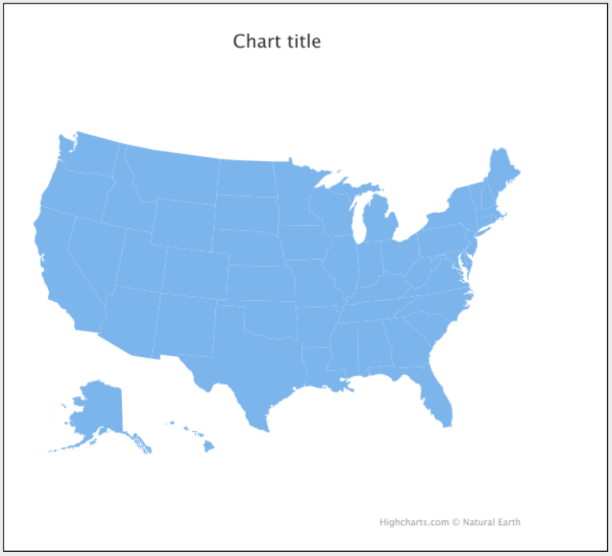
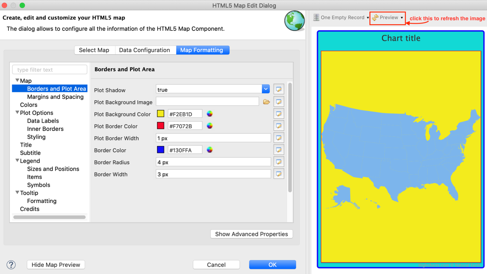
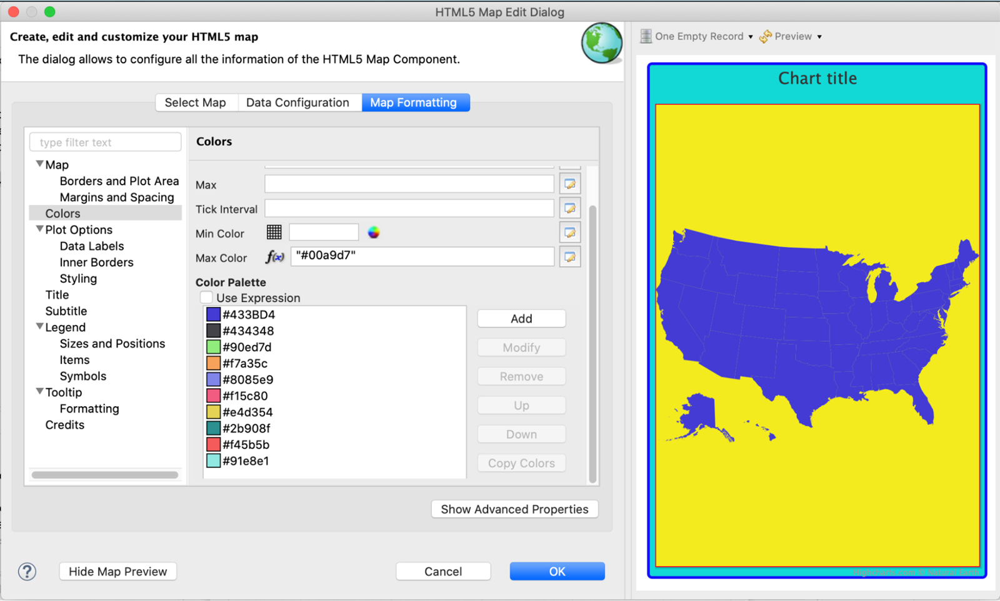
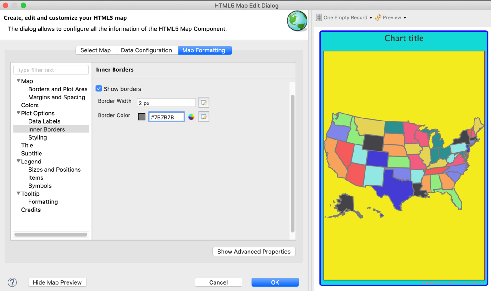
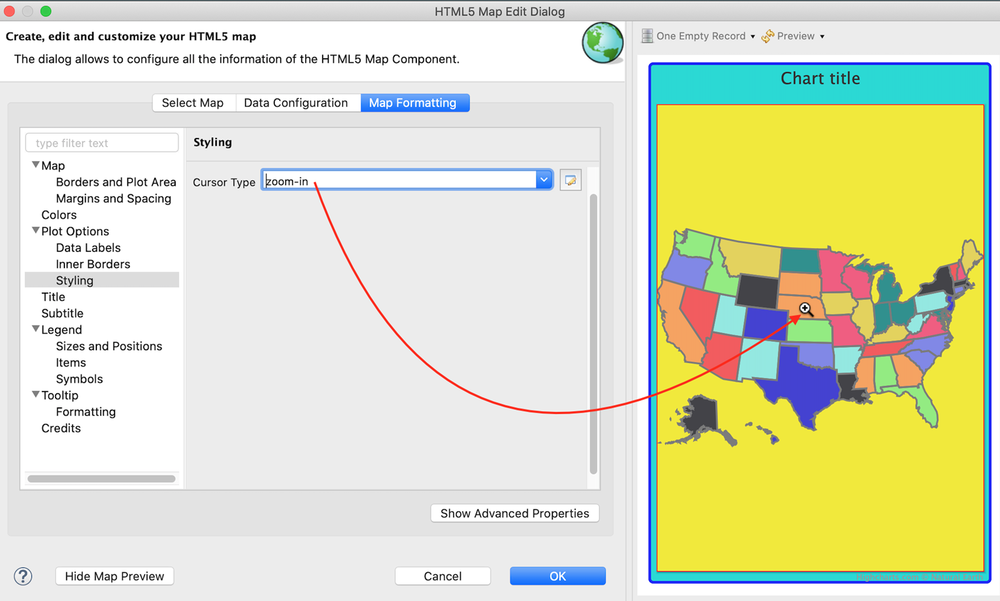
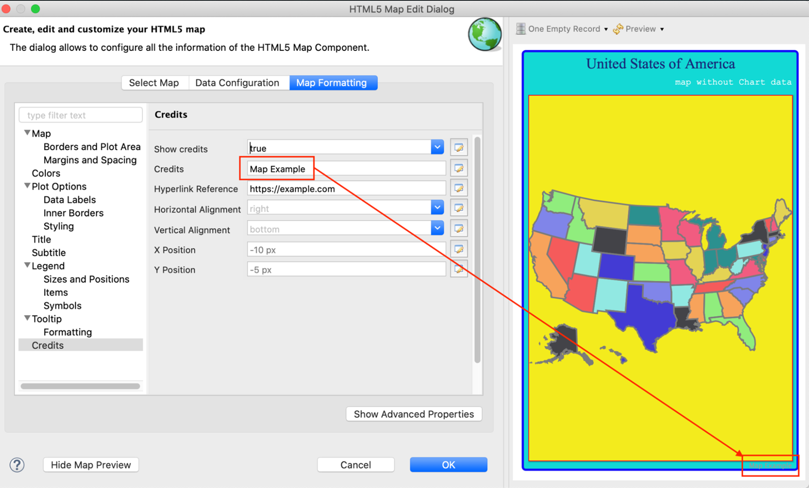

# Working With HTML5 Map Components

The HTML5 Maps are a kind of Highcharts that lets you explore geographic maps. Jaspersoft Studio provides advanced and interactive HTML5 Maps that are implemented through the Highcharts Map library. You can add an HTML5 Map to your reports. The HTML5 Map requires two sets of data to render properly: map data set and chart data set.

- This chapter has the following sections:

- Map Data Set

- [Chart Data Set](chart-data.md)

## Map Data Set

The HTML5 Map component is based on the Highcharts Map library and the [Map collection](https://code.highcharts.com/mapdata/) files provided by this library. Each file in the Map collection provides a specific set of data in the GeoJSON format and the information required to draw the map in a given report.

The GeoJSON format contains some general information such as title and copyright information. It also contains a collection of feature elements. Each feature is related to a given region on the map. For example, in the case of the map of the United States, each feature in the GeoJSON file corresponds to the state of the United States and provides entries for the element identification like country name, region, state name, postal code, latitude and longitude.

!!! note

    To use a custom location for Map collection files, you must define the new location URL using the `com.jaspersoft.jasperreports.highcharts.maps.collection.base.url` property in the `jasperreports.properties` file.

    Additionally, to avoid conflicts with Cross-Site Request Forgery (CSRF) protection, the hosting domain must be added to the JasperReports Server whitelist to ensure the maps load correctly. For more information, see the [Configuring CSRF Protection](https://community.jaspersoft.com/documentation/jasperreports-server/tibco-jasperreports-server-security-guide/v1000/jasperreports-server-security-guide-_-application-security-_-configuring_csrf_protection/#top) section in the JasperReports Server Security Guide.

This section describes:

- Creating a Simple HTML5 Map Component

- Customizing HTML5 Map Components

- Customizing the Map Copyright Information

### Creating a Simple HTML5 Map Component

To create the report for the map

1.  Create a report and choose a blank template.
2.  For creating a simple map component, there is no need to connect to a data source. Select **One Empty Record - Empty rows**.
3.  Click **Next** and then click **Finish**.
4.  Delete all bands except for **Title** and **Summary**.
5.  Enlarge the Summary band to 500 pixels by changing the **Height** entry in the **Band Properties** view.

To create the simple map component

1.  Click  **HTML5 Maps** in the **Components Pro** section of the **Palette**. The cursor changes to show that an element is selected. Drag to fill the Summary band of your report. The **HTML5 Map Edit Dialog** is displayed.
2.  Select an option from the **Categories** on the left and double-click the country or region from the **Map List** that you want to display, for this example, select the Countries option and double-click the United States of America.
3.  Click **OK** to close the **HTML5 Map Edit Dialog**.
4.  Preview the report.

|                                                                          |
|--------------------------------------------------------------------------|
|  |
| *Figure 1: Simple HTML5 Map Component Example*                           |

### Customizing HTML5 Map Components

Now you have a simple map component and you can customize its appearance to meet your requirements. For example, you can add background colors, borders, inner borders.

Adding background color and border to the map

1.  Right-click the HTML5 element and select **Edit Map properties**. The **HTML5 Map Edit Dialog** is displayed.

2.  On the **Map Formatting** tab, select the **Map** section and set the **Background Color**, for this example, enter the following value:

    - **Background Color**: `#14D9D5`

3.  Select the **Borders and Plot Area** section and enter the following values:

    - **Plot Shadow**: `true`
    - **Plot Background Color**: `#F2EB1D`
    - **Plot Border Color**: `#F7072B`
    - **Plot Border Width**: `1 px`
    - **Border Color**: `#130FFA` (this refers to the map regions outside the plot area)
    - **Border Radius**: `4 px`
    - **Border Width**: `3 px`

4.  To preview the map from inside the dialog, click **Show Map Preview**.

|                                                                      |
|----------------------------------------------------------------------|
|  |
| *Figure 2: Background Color of the Map*                              |

To set the color of the entire map

1.  On the **Map Formatting** tab, select the Colors section and select the first color from the **Color Palette**.

2.  Click Modify, **Pick the new color** dialog is displayed.

3.  On the **Advanced Colors** tab, enter the following value:

    - Hex: `#433BD4`

4.  Click **OK**.

    |  |
    |----|
    |  |
    | *Figure 3: Customizing Map Color* |

5.  Click  to refresh the preview.

|                                                          |
|----------------------------------------------------------|
|  |
| *Figure 4: Preview in the HTML5 Map Edit Dialog*         |

You can color each state or region with a different color. To do so, select the **Plot Options** section and set **Color by Point** to true. Color for each region is picked from the **Color Palette**. The process flows in a circular way. When the last color is picked up from the palette, the next color is the first color in the same palette.

Adding inner borders to a map

In a simple map, you can display and configure the inner borders that distinguishes states or adjacent regions on a given map.

1.  On the **Map Formatting** tab, select the **Plot Options** section.
2.  Click the **Inner Borders** subsection and select the **Show Borders** checkbox.
3.  Set **Border Width** to 2 px and **Border Color** to \#7B7B7B.
4.  Click  to refresh the preview.

|  |
|----|
|  |
| *Figure 5: Simple Map with Inner Borders and Color by Point Property Enabled* |

To change the cursor type

1.  On the **Map Formatting** tab, select the **Plot Options** section.
2.  Click the **Styling** subsection and select the `zoom-in` option from the drop-down list in the **Cursor Type**.
3.  Click  to refresh the preview.

|  |
|----|
|  |
| *Figure 6: Selecting Cursor Type* |

Using the Map Component

Like the Highcharts component, in the map formatting tab, you can edit the properties of the map using the following map components:

- **Title**: Set properties for the map title.
- **Subtitle**: Set properties for the map subtitle.
- **Legend**: Set properties for the map legend, it is useful when you display data on the map.
- **Tooltip**: Provides general settings for tooltips on the map.

### Customizing the Map Copyright Information

The copyright information is included in the GeoJSON map data. For the HTML5 Map component, credits are enabled by default and they are auto-generated. Copyright information is mandatory for some maps that are created by third parties. It is recommended to include copyright information either on the map or on the web page. In case you need to modify this information, you can customize the copyright information as required.

To customize the map copyright information

1.  On the **Map Formatting** tab, select the **Credits** section. For this example, enter the following information:

    - **Show credits**: `true`
    - **Credits**: `Map Example`
    - **Hyperlink Reference**: `https://example.com`

2.  Click  to refresh the preview.

|                                                                          |
|--------------------------------------------------------------------------|
|  |
| *Figure 7: Customizing Map Copyright Information*                        |
