# Working With the Map Component

!!! note

    Starting Jaspersoft Studio version 10.1.0, the Google Maps component is available only in Jaspersoft Studio Professional.

The Map element in the Palette view lets you add Google Maps to your reports. You can set the center, zoom, and scale for your map, as well as markers and paths. The Properties view for a map element has tabs to control appearance and map properties, set authentication for Google business license, and create markers and paths.

To add a Map component to your report

1.  Drag the Map component 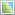 from the Palette to your report. Usually, you want to add the map to a component that is included only once, such as the Title band or Summary band.

!!! note

    If you are experiencing strange issues with Google Maps interactive usage in your report, you can disable it in the `.ini` file.

To disable Google Maps in Jaspersoft Studio Professional

1\. Locate the `.ini` file (for example, `Jaspersoft Studio.ini`). This file is in your `<jss-install>` directory on Windows and Linux, and in the `<jss-install>/Contents/Eclipse` directory on Mac.

2\. Open the file in a text editor and add the following line:

`-Dcom.jaspersoft.studio.widgets.googlemap.disabled=true`

3\. Save the file.

This topic contains the following sections:

- Working with Map Properties

- Working with Authentication Properties

- Working with Markers

- Working with Paths

- Properties for Markers and Paths

## Working with Map Properties

The **Map** tab in the **Properties** view lets you set the basic properties for the map:

1.  Select a map component in your report and click **Map** in the **Properties** view.

|  |
|----|
|  |
| *Figure 1: Map tab in Map Properties* |

You can set the following map properties using the **Map** tab:

- **Map Preview**: Opens a Google Maps window. This window supports standard Google Maps functionalities, such as dragging, zooming, and switching between **Map** and **Satellite** views.

|                                                                     |
|---------------------------------------------------------------------|
| 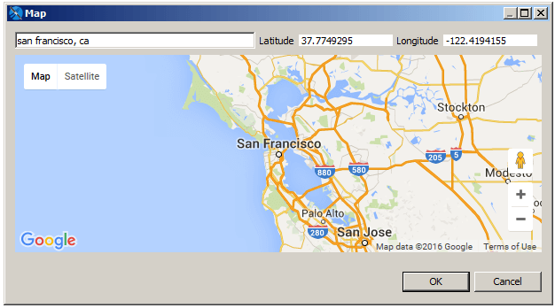 |
| *Figure 2: Setting a map location*                                  |

Changes to this window are reflected in the map in your report. In addition, you can change the map's center in any of the following ways. When you close the preview, the map is automatically centered at the selected location:

- **Address**: Enter an address in the entry bar to center the map at that location.

<!-- -->

- - **Latitude** and **Longitude**: Enter a latitude and longitude to center your map at that location.
  - Double-click: Double-click anywhere on the map to center it at that location.
- **Map Type**: The Google Maps view. Options are: roadmap, satellite, terrain, and hybrid.
- **Latitude**: The latitude of the map center. You can type directly in the entry bar, or click 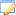 to enter an expression.
- **Longitude**: The longitude of the map center. You can type directly in the entry bar, or click  to enter an expression.
- **Address** A String representing the address of the center. You can type directly in the entry bar, or click  to enter an expression. The value must be enclosed in quotes, for example, "350 Rhode Island Ave., San Francisco, CA".
- **Zoom**: Integer representing the Google Maps zoom level. You can type directly in the entry bar, or click  to enter an expression.
- **Language**: String that sets the in-map language. You can type directly in the entry bar, or click  to enter an expression. The value must be enclosed in quotes, for example, "ru-RU". See the Google Maps documentation for more information.
- **Map Scale**: Sets the size of the scale bar at the bottom of the map.
- **Evaluation Time**: Dropdown that lets you set the evaluation time of the map. See [Evaluation Time](variables-other-properties.md) for more information.
- **Image Type**: Dropdown that lets you set the image type to use when the map is embedded in your report.
- **On Error Type**: Dropdown that lets you set the type of message to display when there is an error with the map.

## Viewing Authentication Properties

If you want to use a Google Maps key or business client license, we recommend that you configure these as global Jaspersoft Studio properties. You can view the status of your Google Maps license information on the **Authentication** tab.

|  |
|----|
| 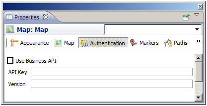 |
| *Figure 3: Authentication tab in the Properties view for a map component* |

To configure your Google Maps license and/or version information

1.  Select **Window \> Preferences** to open the **Preferences** dialog (**Eclipse \> Preferences** on Mac).
2.  Navigate to **Jaspersoft Studio \> Properties**.
3.  To configure a property, click **Add** to open the Properties dialog, enter the name of the property and the property's value, then click **OK**. You can configure the following Google Maps APIs properties. See the JasperReports Library configuration reference for more information on each property:

- `net.sf.jasperreports.components.map.client.id`: Specifies the client ID for Google Maps API for Business. If set, it takes precedence over the API key property. It usually works along with the signature property for signed URLs.
- `net.sf.jasperreports.components.map.key`: Specifies the Google Maps API key.
- `net.sf.jasperreports.components.map.signature`: Specifies the encrypted client signature for signed request URLs.
- `net.sf.jasperreports.components.map.version`: Indicates which version of the Google Maps API should be loaded.

1.  When you have specified all your properties, click **OK** to exit the Preferences dialog.

!!! note

    Setting the property globally sets the properties when the report is run inside Jaspersoft Studio. If you are publishing your reports to another environment, you must enable these properties in the `jasperreports.properties` file in your environment.

## Working with Markers

A marker identifies a location on a map. You can create markers manually, either using a fixed location that is known when the report is created, or using an expression based on report data. You can also define markers based on a dataset. A single map can include both manual markers and markers from one or more datasets. This section describes:

- Marker Properties

- Static Markers

- Adding Markers Using the Map

- Dynamic Markers

- Modifying Markers

### Marker Properties

You can set properties for each marker. The marker properties available are a subset of Google Maps' properties. See Table 1-3, “Marker and Path Properties,” on page 1 for more information.

### Adding Markers Manually

The manually added markers can be used for a fixed address or location that is known when the report is created. You can also use an expression, for example to set a location based on a parameter value. This method only displays as many markers as you explicitly create.

To define a marker manually

1.  Open or create a report and add a map component. Make sure to set the map's center to a location near your marker. For this example, use the following coordinates:

**Latitude** – 37.7656842

**Longitude** – -122.403

1.  With the map component selected, click the **Markers** tab in the **Properties** view.

|  |
|----|
| 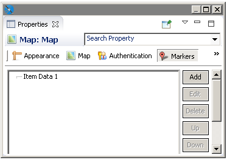 |
| Markers tab with one marker |

1.  To specify the marker properties, click **Add** in the **Markers** tab.

The **Markers** dialog opens.

1.  To enter an individual marker, select the **Markers** tab and click **Add** again.

The **Marker** dialog opens.

|  |
|----|
| 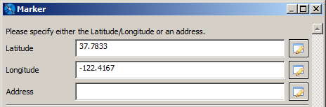 |
| *Figure 4: Defining a static marker* |

1.  Specify a location for your marker. You can do this by entering latitude and longitude, entering an address, or defining markers on the map preview:

- **Latitude and Longitude**: Enter the latitude and longitude coordinates for your marker. You can type directly in the entry bar, or click  to enter an expression. For this example, enter the following values:
  - **Latitude** – 37.833
  - **Longitude** – -122.4167
- **Address**: The address is used only if **Latitude** and **Longitude** are blank. You can type directly in the entry bar, or click  to enter an expression.

1.  (Optional) Set the title for your marker, if any.
2.  (Optional) To have a new browser window or tab open with related information when a user clicks the marker, enter the URL and select the Target type.
3.  (Optional) Set your icon type (default or custom) and icon properties:

- If you are using the default marker, you can set additional properties, such as color, label. These properties are not available for a custom icon. This example uses the color 00CCFF and the label J.

|  |
|----|
| 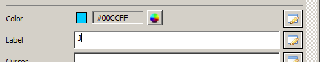 |
| *Figure 5: Setting color and label for a marker* |

- To use a marker icon other than the default, click **Custom Icon** to specify a URL that points to the image to use. Currently, we do not support loading an image directly from the repository or as a resource local to the report. Instead, the JavaScript API loads the icon from the URL. Then set additional optional properties for your marker, such as icon height, width, origin, and anchor.

1.  Click **OK** to return to the Markers dialog.
2.  To create additional markers, click **Add**, enter the marker properties, then click **OK** to return to the **Markers** dialog.
3.  Click **OK** to create your markers.
4.  Once you have defined your markers, preview your report in HTML. For this example, select the Empty Data Set for your preview.

|  |
|----|
| 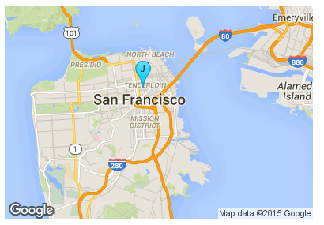 |
| *Figure 6: A map with a marker* |

### Adding Markers Using the Map

You can also add markers using the map preview. This only supports a fixed address or location that is known when the report is created.

To define a marker manually using the map

1.  Open or create a report and add a map component. Make sure to set the map's center to a location near your marker. For this example, use the following coordinates:

**Latitude** – 37.7656842

**Longitude** – -122.403

1.  With the map component selected, click the **Markers** tab in the **Properties** view.

|  |
|----|
|  |
| Markers tab with one marker |

1.  To specify the marker properties, click **Add** in the **Markers** tab.

The **Markers** dialog opens.

1.  To enter an individual marker, select the **Map** tab. You can perform the following tasks:

- To create a marker by selecting a location on the map, right-click on the location you want and select **Add marker**.
- To delete one or more markers, select the markers in the panel at the right and press **Delete**, or right-click on the marker and select **Delete**.
- To edit a marker's location, double-click the marker to open the **Marker** dialog.

### Adding Markers Using a Dataset

The steps above define a fixed number of markers. You can also dynamically define the markers based on locations defined in your report's data or another dataset. A single map can include both manual markers and markers from one or more datasets.

#### Sample Data

In this example, we use a CSV file containing the following data for San Francisco landmarks. This file includes data used by markers and paths.

<table>
<caption>
Sample CSV Data for Markers and Paths
</caption>
<colgroup>
<col style="width: 100%" />
</colgroup>
<tbody>
<tr>
<td><pre class="text"><code>landmark, latitude, longitude, path, style
Fisherman&#39;s Wharf, 37.8085636, -122.409714, path1, style1
Golden Gate Bridge, , , path1, style1
Cliff House, 37.778485, -122.513963, path1, style1
Stern Grove, 37.7358667, -122.4771518, path1, style1
Stern Grove, 37.7358667, -122.4771518, path2, style2
Golden Gate Park, , , path2, style2
Union Square, 37.788527, -122.407235, path2, style2
&quot;Willie Mays Plaza, San Francisco, CA&quot;, 37.778595, -122.38927, path1, style1
Twin Peaks, 37.7544066, -122.4476845, path2, style2</code></pre></td>
</tr>
</tbody>
</table>

Define the San Francisco data adapter

1.  Create a data file with the path data that you want. For this example, create a CSV file with the data provided above. Make sure to include a blank line at the end of the file.
2.  Click 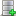 on the main toolbar. When prompted, navigate to the same folder as your report.
3.  Name the file `SFDataAdapter.jrdax` and click **Next**.
4.  Select **CSV File** as the data adapter type and click **Next**. The CSV File dialog opens.

|  |
|----|
|  |
| *Figure 7: Creating a sample data adapter for markers and paths* |

1.  Name your adapter, for example, SF Landmarks Data Adapter.
2.  Click **File** and select the CSV file you created.
3.  Click **Get column names from the first row of the file**.
4.  Select **Skip the first line**.
5.  Click **Finish** to create the adapter.

Create a dataset in your report

1.  Right-click the root node of the report in the outline view and select **Create Dataset**.
2.  Name the dataset SFLandmarksDataset and make sure that **Create new dataset from a connection or Data Source** is selected, and click **Next**.
3.  Select the SFDataAdapter.jrdax data adapter and click **Next**.
4.  Click **\>\>** to select all fields and click **Finish**.

The dataset is created in your report.

1.  Click the **SFLandmarksDataset** in the outline view.
2.  In the **Properties** view, enter `SFDataAdapter.jrdax` in the **Default Data Adapter** entry box. Setting the default data adapter lets you use a different dataset from the one used in the main report. See [, “Default Data Adapter ,” on page 1](data-adapters/data-adapters-using-in-reports.md) for more information.

|  |
|----|
| 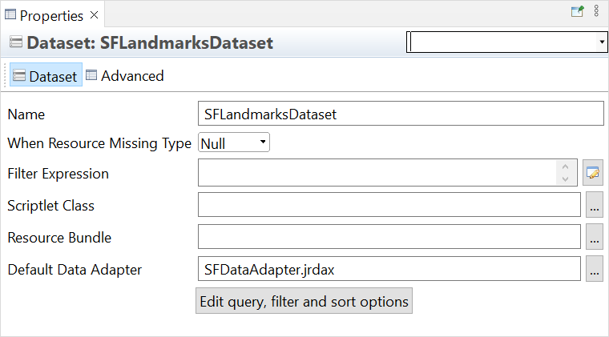 |
| *Figure 8: Setting the default data adapter for a dataset* |

#### Using the dataset to set markers

1.  Add a map component to the report, or select an existing map in the **Design** tab.
2.  If you have not set the map center or zoom level, do so. For this example, click the **Map** tab in the **Properties** view, and use the map preview to select "San Francisco, CA" as the center. Then enter 11 in the **Zoom** field.
3.  Click the **Markers** tab in the **Properties** view.
4.  Click **Add** to open the **Markers** dialog.
5.  Select the **Dataset** tab and select **Use Dataset**.
6.  In the **Dataset Run** section, select your dataset and accept the default settings. For this example, use **SFLandmarksDataset**. You have already set the default data adapter for this dataset.
7.  Click the **Markers** tab and then click **Add**. The **Marker** dialog opens.

|  |
|----|
| 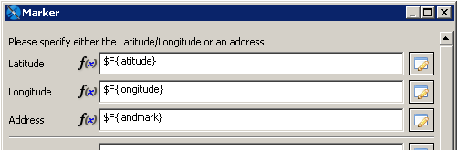 |
| *Figure 9: Using expressions to set markers from a dataset* |

1.  For a dataset, you typically want to use expressions for your values. For each property you want to read from the dataset, click  on the entry bar, select **Use Expression** and enter the expression to use. For this example, use the following expressions:

- Latitude: `$F{latitude}`
- Longitude: `$F{longitude}`
- Address: `$F{landmark}`

!!! note

    You can use expressions to pass parameters to a map component dynamically. Expressions allow you to evaluate data in your dataset and use the results to populate the map. In the component's properties, properties based on expressions show `f(x)` next to the field.

1.  Click **OK**. The **Markers** dialog displays the markers you just created.

|  |
|----|
| 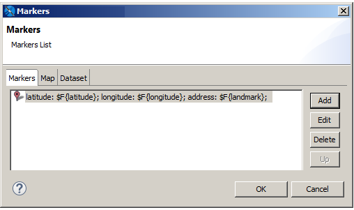 |
| *Figure 10: Item data for markers created from a dataset* |

1.  Click **OK**. Your markers are displayed on the **Marker** tab of the **Properties** view, along with any other markers you have created.

|  |
|----|
| [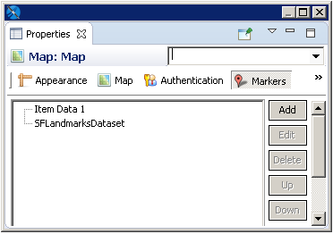](assets/files/jss-google-maps-markers-from-dataset.png) |
| *Figure 11: Properties view showing markers added manually and markers defined from a dataset* |

1.  Preview your report in HTML. The example below shows the markers from the sample dataset along with a static marker.

|  |
|----|
| 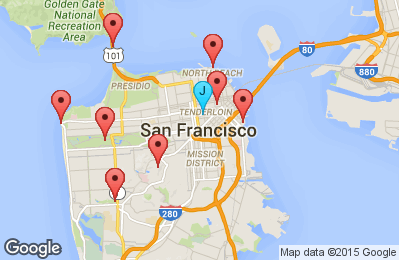 |
| *Figure 12: San Francisco landmarks shown on a map* |

### Modifying Markers

To edit a marker

1.  Select the map and click the **Markers** tab in the **Properties** view.
2.  Select the marker that you want to change and click **Edit**.
3.  To change the dataset, make sure you have set up another dataset in your report before editing the marker. Then you can select the Dataset tab here and select the new dataset from the **Dataset Run** menu.
4.  To change marker properties, select the **Markers** tab, and edit your properties.

To delete a marker

1.  Select the map and click the **Markers** tab in the **Properties** view.
2.  Select the marker that you want to delete and click **Delete**.

### Marker Series

To visually distinguish different categories of markers on a map, each with its own label and icon, you need to organize them into distinct series. This involves assigning a series name to each **Item Data** element on the map. **Item Data** with the same series name will have their markers grouped accordingly.

To define a marker series name

1.  Click the **Markers** tab in the **Properties** view.

2.  Select an **Item Data** element and click **Edit**.

3.  The **Markers** dialog opens. You can specify a **Series Name Expression** as shown in the example below:

    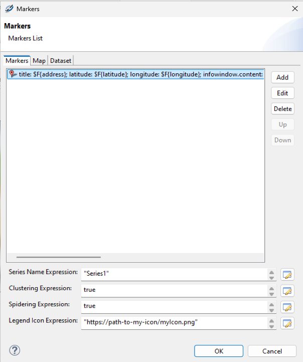

4.  Click **OK**.

#### Marker Clustering

Marker clustering can be applied in two ways:

- across the entire map

- independently for each marker series.

To enable map-wide marker clustering

1.  Click the **Markers** tab.

2.  Check the **Marker Clustering** box.

To enable clustering for a specific marker series

1.  Select its corresponding **Item Data** element in the **Markers** list.

2.  Click **Edit**.

3.  In the settings, set the **Clustering Expression** to `true` (as shown in the **Markers** dialog).

#### Marker Spidering

Marker spidering can be applied in two ways:

- across the entire map

- independently for each marker series.

To enable map-wide marker spidering

1.  Click the **Markers** tab.

2.  Check the **Marker Spidering** box.

To enable spidering for a specific marker series

1.  Select its corresponding **Item Data** element in the **Markers** list.

2.  Click **Edit**.

3.  In the settings, set the **Spidering Expression** to `true` (as shown in the **Markers** dialog).

    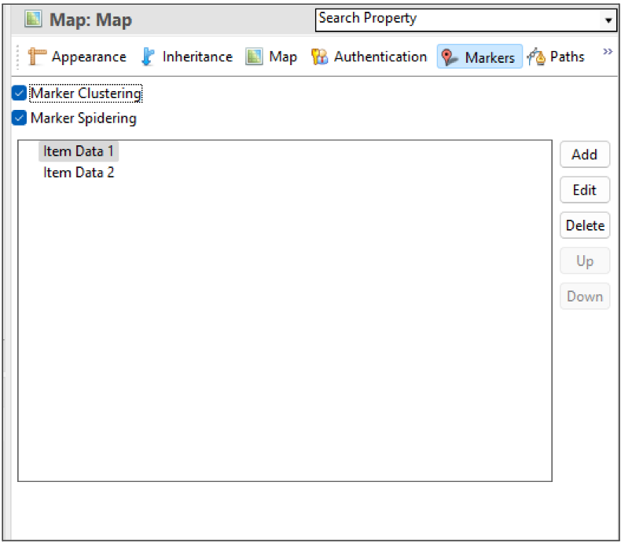

#### Map Legend

You can use a map legend to clearly communicate the meaning of different marker series on a map, especially if you are using multiple series. The properties for configuring the legend are grouped within the `<legend/>` element and include:

- `enabled`: flag that enables the legend element

- `label`: the legend title

- `position`: specifies the legend position on the map. [This page](https://developers.google.com/maps/documentation/javascript/reference/control#ControlPosition) lists all the possible values. The default value is `RIGHT_CENTER`.

- `orientation`: specifies how legend items will be aligned within the legend control. Possible values are:

  - `vertical` (default value)

  - `horizontal`

- `legendMaxWidth`: specifies the maximum width of the legend control, in pixels.

- `legendMaxWidth.fullscreen`: specifies the maximum width of the legend control, in pixels, when the map is turned full screen.

- `legendMaxHeight`: specifies the maximum height of the legend control, in pixels.

- `legendMaxHeight.fullscreen`: specifies the maximum height of the legend control, in pixels, when the map is turned full screen.

- `useMarkerIcons`: if enabled, the pin icons representing the markers are used for the legend items as well.

To further customize how the legend item appears, you can define a specific **Legend Icon Expression** for each marker series within its **Item Data** element (as shown in the **Markers** dialog). This expression should specify the URL or file path to the desired icon representing that series in the legend.

Alternatively, if you only need a default icon for a marker series in the legend, you can override this context property in your JRXML file:

`net.sf.jasperreports.components.map.default.marker.icon`

It should contain the URL or file path of the default icon.

!!! note

    By default, the pin icons on the map and their corresponding items in the legend should be identical, assuming no customization has been applied and the default icon is used.

    If you observe a discrepancy, it could be due to the default pin icon value defined within the context in the `net.sf.jasperreports.components.map.default.marker.icon` property.

    To disable it, set the following property in the JRXML file:

    `<net.sf.jasperreports.components.map.default.marker.icon" value=""/>`

## Working with Paths

You can add one or more paths to your maps. A path is defined by:

- A name that serves as a path identifier; the name must be unique in your report.

- A collection of places (points) on the map defined by latitude/longitude coordinates or addresses. These are connected to form the path.

- (Optional) A style that specifies various style configuration properties, such as line and fill color, line weight, and opacity.

### Defining Path Styles

A path style specifies the properties (for example, color and weight) of the lines between the points on your path. See Table 1-3, “Marker and Path Properties,” on page 1 for more information. You can create a path style manually, or you can save your path styles as a dataset.

#### Defining Path Styles Manually

1.  Edit the map component's properties.
2.  On the **Paths** tab, in the **Styles** section, click **Add**.
3.  In the **Style** dialog, enter the properties you want for the path. See Table 1-3, “Marker and Path Properties,” on page 1 for more information about available properties.
4.  Click **OK**.

#### Defining Path Styles Using a Dataset

<table>
<caption>
Sample CSV Data for Path Styles
</caption>
<colgroup>
<col style="width: 100%" />
</colgroup>
<tbody>
<tr>
<td><pre class="text"><code>name, strokecolor, strokeopacity, strokeweight, fillcolor, fillopacity, ispolygon
&quot;style1&quot;, &quot;#0000FF&quot;, 0.6, 1, &quot;#FF33FF&quot;, 0.4, true
&quot;style2&quot;, &quot;#FF0000&quot;, 0.8, 2, , , false</code></pre></td>
</tr>
</tbody>
</table>

Create a data adapter for your path styles

1.  Create a data file with the path data that you want. For this example, create a CSV file with the data provided above. Make sure to include a blank line at the end of the file.
2.  Click  on the main toolbar.
3.  When prompted, navigate to the same folder as your report.
4.  For this example, name the file `PathStylesDataAdapter.jrdax` and click **Next**.
5.  Select **CSV File** as the data adapter type and click **Next**.
6.  Name your adapter, for example, Path Styles Adapter.
7.  Click **File** and select the CSV file you created.
8.  For this example, click **Get column names from the first row of the file** and select **Skip the first line**.
9.  Click **Finish** to create the adapter.

Create a dataset in your report

1.  Right-click the root in the outline view and select **Create Dataset**.
2.  Name the dataset and click **Next**. For this example, name the dataset PathStyles.
3.  Select the data adapter for your path styles (Path Styles Data Adapter) and click **Next**.
4.  Click **\>\>** to select all fields and click **Finish**.
5.  Select the dataset (PathStyles) you just created in the outline view.
6.  In the Properties view, enter the filename of the data adapter (PathStylesDataAdapter.jrdax) in the Default Data Adapter entry box. Setting the default data adapter lets you use a different dataset from the one used in the main report. See [, “Default Data Adapter ,” on page 1](data-adapters/data-adapters-using-in-reports.md) for more information.

Define a style using a dataset

1.  Create your data source, a data adapter that points to it, and a dataset that uses the data adapter.
2.  Add a map component to the report, or select an existing map in the **Design** tab.
3.  Select the **Paths** tab in the **Properties** view.
4.  In the **Styles** section, click **Add** to open the **Items** dialog.
5.  Click the **Dataset** tab in the **Path** dialog and select **Use Dataset**.
6.  In the **Dataset Run** section, select your styles dataset (PathStyles) and accept the default settings. You have already set the default data adapter for this dataset.
7.  Select the **Items** tab and click **Add** to open the **Style** dialog.
8.  For each property you want to read from the dataset, click  on the entry bar, select **Use Expression** and enter the expression to use. For this example, use the following expressions:

- Name: `$F{name}`
- Stroke Color: `$F{strokecolor}`
- Stroke Opacity: `$F{strokeopacity}`
- Stroke Weight: `$F{strokeweight}`
- Fill Color: `$F{fillcolor}`
- Fill Opacity: `$F{fillopacity}`
- Is Polygon: `$F{ispolygon}`

1.  Click **OK** to return to the Items dialog.
2.  Click **OK** to create the style set.

|  |
|----|
| 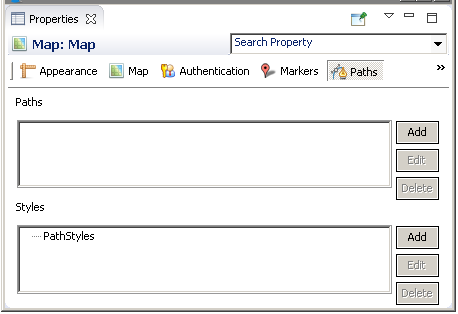 |
| *Figure 13: Styles on the Path tab of the Properties view for a map* |

### Defining a Path Manually

To define a path using the Add button.

1.  On the **Paths** tab, use the **Styles** section to define a style to associate with the path: click **Add** to do so.

Style properties can be added manually or by specifying a dataset. The style name sets the style property when adding points to the path.

1.  In the **Paths** section, click **Add** to open the **Markers** dialog.
2.  To add a point to the path, click **Add** to open **Path** dialog. For each point, specify the following:

<!-- -->

1.  The path name (to identify which path includes the point).
2.  The latitude/longitude coordinates or the address of the point.
3.  Additional optional properties, such as the name of a path style.

Click **OK** to add your point.

1.  Use the **Up** and **Down** buttons to change the order in which the points appear.
2.  Preview your report in HTML to see your path.

To add points to a path using the map preview

1.  On the **Paths** tab, use the **Styles** section to define a style to associate with the path: click **Add** to do so.

Style properties can be added manually or by specifying a dataset. The style name sets the style property when adding points to the path.

1.  In the **Paths** section, click **Add** to open the **Markers** dialog.
2.  Select the **Maps** tab in the **Markers** dialog.

<!-- -->

1.  Select your path from the **Paths** menu. The **Paths** menu has the following characteristics:

- If you already have static paths defined for your map, you can select a path name from the **Paths** menu. Points you create are added to the currently selected path. You can switch between paths at any time.

<!-- -->

- If you have not created any static paths, then you can enter a name on this menu. If a static path exists, you cannot create a one.

1.  To add a point to the current path, right-click on the location you want and select **Add marker**.
2.  To delete one or more markers, select the markers in the panel at the right and press **Delete**, or right-click on the marker and select **Delete**.

!!! note

    You cannot set formatting or styles using the map preview.

### Defining a Path Using a Dataset

1.  Create a CSV file, a data adapter that points to it, and a dataset that uses the data adapter. This example uses the same data as in Sample Data. Pay close attention when adding points to your data: they are connected on the map in the order that they appear in the data. If they are not in a sensible order in the data, the path does not make sense, either.
2.  Define the styles that your paths use. This example uses the styles defined in Defining Path Styles Dynamically.
3.  Add a map component to the report, or select an existing map in the Design tab.
4.  If you have not set the center or zoom, do so. For this example, click the **Map** tab in the **Properties** view, enter "San Francisco, CA" in the **Address** field, and enter 11 in the **Zoom** field.
5.  Select the **Paths** tab in the **Properties** view.
6.  In the **Paths** section, click **Add** to open the **Markers** dialog.
7.  Click the **Dataset** tab in the **Markers** dialog and select **Use Dataset**.
8.  In the **Dataset Run** section, select **SFLandmarksDataset** and accept the default settings. You have already set the default data adapter for this dataset.
9.  For each property you want to read from the dataset, click  on the entry bar, select **Use Expression**, and enter the expression to use. For this example, use the following expressions:

- Path Name: `$F{path}`
- Latitude: `$F{latitude}`
- Longitude: `$F{longitude}`
- Address: `$F{landmark}`
- Style: `$F{style}`

1.  Click **OK**. The path information is added to the **Path** section in the **Properties** view.
2.  Preview your report in HTML. The following image shows the example without markers. If you added the markers earlier, they are also visible.

|  |
|----|
| 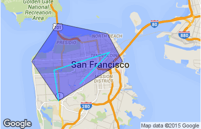 |
| *Figure 14: Paths on a map* |

### Modifying Paths and Path Styles

To edit a path or path style

1.  Select the map and click the **Paths** tab in the **Properties** view.
2.  Select the path or style that you want to change and click **Edit**.
3.  To change the dataset, make sure you have set up another dataset in your report before editing the path or path style. Then you can select the Dataset tab here and select the new dataset from the **Dataset Run** menu.
4.  To change path or style properties, select the Items tab, and edit your properties.

To delete a path or path style

1.  Select the map and click the **Paths** tab in the **Properties** view.
2.  Select the path or style that you want to delete and click **Delete**.

## Properties for Markers and Paths

The available properties are a subset of the properties available through the Google Maps APIs. See <https://developers.google.com/maps> for more information.

<table>
<caption>
Marker and Path Properties
</caption>
<colgroup>
<col style="width: 50%" />
<col style="width: 50%" />
</colgroup>
<thead>
<tr>
<th>Property</th>
<th>
Description
</th>
</tr>
</thead>
<tbody>
<tr>
<td>Name</td>
<td>
String. Name used to identify the marker or path; must be unique for markers or paths in the report.
</td>
</tr>
<tr>
<td>Latitude</td>
<td>Number between -90 and 90. The latitude of a location is in degrees.</td>
</tr>
<tr>
<td>Longitude</td>
<td>Number between -180 and 180. The longitude of a location is in degrees.</td>
</tr>
<tr>
<td>Address</td>
<td>String. The address or placeID of a location. Only used if Latitude and Longitude are not available.</td>
</tr>
<tr>
<td>Color</td>
<td>String. The color of the path or marker. For best results, use hexadecimal representation, as not all Google API implementations support color strings.</td>
</tr>
<tr>
<td>Clickable</td>
<td>Boolean. When <code>true</code>, the marker or path can handle mouse events. Default is <code>true</code>.</td>
</tr>
<tr>
<td>Draggable</td>
<td>Boolean. When <code>true</code>, a user can drag the marker or path contour. Default is <code>false</code>.</td>
</tr>
<tr>
<td>Visible</td>
<td>Boolean. When <code>true</code>, the marker or path is visible. Default is <code>true</code>.</td>
</tr>
<tr>
<td>Z Index</td>
<td>Number. The index determining the order in which objects are displayed on the map. Elements with higher values are displayed in front of similar elements with lower values. Markers are always displayed in front of paths.</td>
</tr>
<tr>
<td colspan="2">Properties for Markers Only</td>
</tr>
<tr>
<td>Title</td>
<td>String. Text shown on rollover.</td>
</tr>
<tr>
<td>Url</td>
<td>String. Target URL to access when the marker is clicked.</td>
</tr>
<tr>
<td>Target</td>
<td>String. Target attribute specifying where to open the linked document.</td>
</tr>
<tr>
<td>Icon</td>
<td>String. URL for the icon.</td>
</tr>
<tr>
<td>Custom Icon</td>
<td>
Use Custom Icon settings to use a marker icon other than the default. You must specify a URL that points to the image to use. Currently, we do not support loading an image directly from the repository or as a resource local to the report. Instead, the JavaScript API loads the icon from the URL.

You can set additional optional properties for your marker, such as icon height, width, origin, and anchor.
</td>
</tr>
<tr>
<td>Shadow</td>
<td>String. URL for the shadow.</td>
</tr>
<tr>
<td>Custom Shadow Icon</td>
<td>
Use Custom Shadow Icon settings to use a shadow icon other than the default. You must specify a URL that points to the image to use. Currently, we do not support loading an image directly from the repository or as a resource local to the report. Instead, the JavaScript API loads the icon from the URL.

You can set additional optional properties for your shadow, such as height, width, origin, and anchor.
</td>
</tr>
<tr>
<td>Info Window</td>
<td>Use the Info Window settings to add an info window. You can define the window content, pixel offset, and maximum width.</td>
</tr>
<tr>
<td>Label</td>
<td>String. Single character that appears on the marker. Not available for custom markers.</td>
</tr>
<tr>
<td>Cursor</td>
<td>String. Mouse cursor to show on hover. Not available for custom markers.</td>
</tr>
<tr>
<td>Flat</td>
<td>Boolean. Not available for custom markers.</td>
</tr>
<tr>
<td>Optimized</td>
<td>Boolean. Not available for custom markers.</td>
</tr>
<tr>
<td>Raise on Drag</td>
<td>Boolean. Not available for custom markers.</td>
</tr>
<tr>
<td>Size</td>
<td>String. Not available for custom markers.</td>
</tr>
<tr>
<td colspan="2">Properties for Paths and Path Styles Only</td>
</tr>
<tr>
<td>Parent Style</td>
<td>
String. Name of path style to use as a parent style. The current style inherits the parent's properties if the parent style is present in the report. Elements set locally in the current style override elements set in the parent.
</td>
</tr>
<tr>
<td>Stroke Color</td>
<td>String. Color of the stroke; for most consistent results, use hexadecimal format. The default is #000000.</td>
</tr>
<tr>
<td>Stroke Opacity</td>
<td>Number. The path's opacity. Number between 0 (transparent) and 1 (opaque). The default is 1.</td>
</tr>
<tr>
<td>Stroke Weight</td>
<td>Number. Path weight in pixels. Default</td>
</tr>
<tr>
<td>Fill Color</td>
<td>String. Color of the fill for the polygon when <strong>Is Polygon</strong> is <code>true</code>. Takes values in hexadecimal format. The default is null.</td>
</tr>
<tr>
<td>Fill Opacity</td>
<td>Number. The opacity for the polygon's fill when <strong>Is Polygon</strong> is <code>true</code>. Number between 0 (transparent) and 1 (opaque). The default is 1.</td>
</tr>
<tr>
<td>Is Polygon</td>
<td>Boolean. When <code>true</code>, creates a polygon (closed path) by connecting the last point on the path to the first point. The default is <code>false</code> (open polyline).</td>
</tr>
<tr>
<td>Editable</td>
<td>Boolean. When <code>true</code>, a user can edit the path by dragging the control points on the path line. Default is <code>false</code>.</td>
</tr>
<tr>
<td>Geodesic</td>
<td>Boolean. When <code>true</code>, dragged paths follow the great circles on the earth's surface. In this case, since the map is a projection, the lines may not appear straight. When <code>false</code>, paths are straight lines on the map. Defaults to <code>false</code>.</td>
</tr>
</tbody>
</table>
