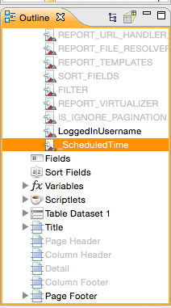
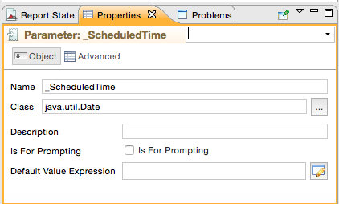
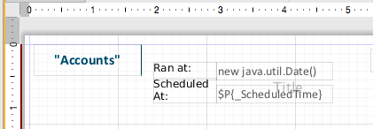
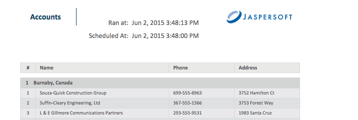

# Adding a Date/Time Stamp to Scheduled Output in JasperReports Server

When you add a parameter named `_ScheduledTime` to a JRXML report design in Jaspersoft Studio, and then schedule the report to run in JasperReports Server, the output includes a date/time stamp showing when the report ran. The following procedure describes how to set up and use this parameter:

To display the date/time that the report ran

1.  Open Jaspersoft Studio, and open an existing report.

2.  In the Outline view, right-click Parameters, and select **Create Parameter**.

3.  Rename the parameter `_ScheduledTime`.

    The new parameter appears in the **Outline** view.

    |  |
    |----|
    |  |
    | *Figure 1: \_ScheduledTime Parameter in Outline View* |

4.  Set the following parameter properties:

    - **Class** = java.util.Date
    - **Is for Prompting** = unchecked

    |  |
    |----|
    |  |
    | *Figure 2: \_ScheduledTime Parameter Properties* |

5.  Drag the **\_ScheduledTime** element from the **Outline** view to a valid location, such as the **Title Band**, in the **Designer**:

    |  |
    |----|
    |  |
    | *Figure 3: Report Design Includes the \_ScheduledTime Parameter Element* |

6.  Now you can set other properties, such as the text color of the date/time stamp. In **Properties**, check **Blank when Null** to prevent the word null from appearing on the report when it runs unscheduled.

7.  Compile the report, and upload it to JasperReports Server. For more information about uploading reports to JasperReports Server, see [Accessing JasperReports Server from Jaspersoft Studio](../jrs-server/jss2jrs.md).

8.  In the server, schedule the report to run immediately.

9.  Open the output file.

|  |
|----|
|  |
| *Figure 4: Output Showing the Scheduled Time the Report Actually Ran* |

The date and time the report actually ran appears in the output, as well as the scheduled time. In the screenshot above, there was a 13-second delay between the scheduled start time and the actual run time.
