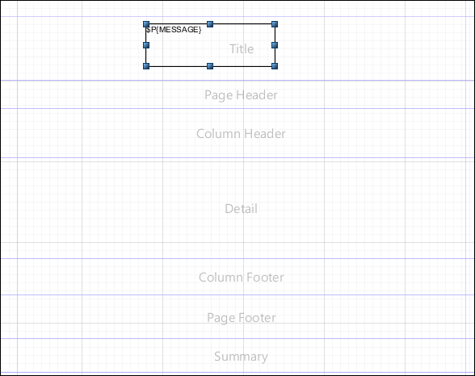
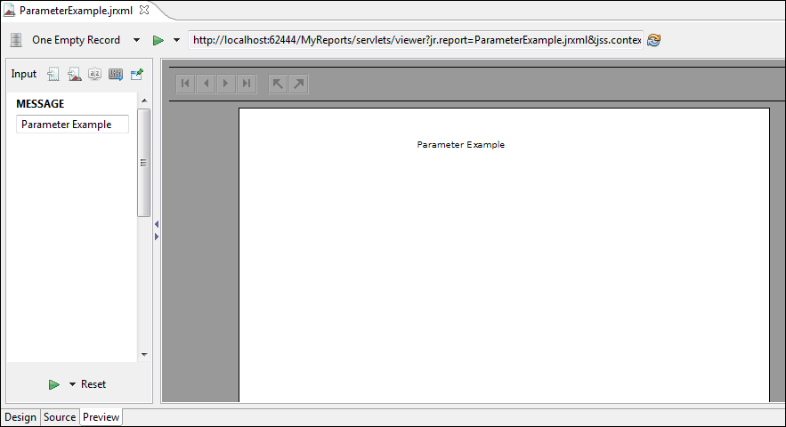

# Parameters Prompt

If you set a parameter to be used as a prompt, when running the report, Jaspersoft Studio asks for the value of the parameter.

To create a parameter prompt

Create a simple report with the template **Blank A4**, name **ParameterExample** and data adapter **One Empty Record - Empty Rows**.

1.  In this report, create a parameter and rename it (from its **Properties** view) to `MESSAGE`, with type `java.lang.String`, and select the **Is For Prompting**) checkbox.
2.  Drag the parameter from the outline view into the **Title** band. Jaspersoft Studio creates a text field to display the parameter value. You should have something like the following image.

|                                                      |
|------------------------------------------------------|
|  |
| *Figure 1 Parameter in Title Band*                   |

To compile and preview the report

1.  Click the **Preview** tab.

    Be sure that the **Input Parameter** window is open. If not, click the gray right-arrow to the left of the **Preview** screen.

2.  Add a value for the **MESSAGE** parameter. For this example, type **Parameter Example**.

3.  Press the **Play** button. The message is printed in the title band.

|                                                                          |
|--------------------------------------------------------------------------|
|  |
| *Figure 2 Preview Tab with Parameter Value*                              |

Jaspersoft Studio provides input dialogs for parameters of type String, Date, Time, Number, and Collection.
