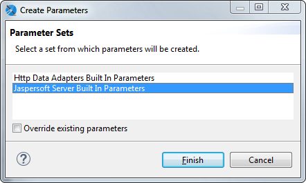
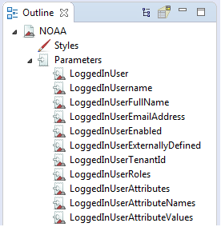
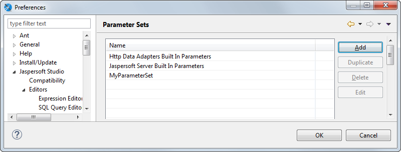
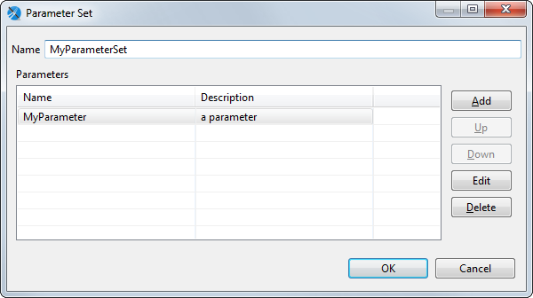

# Parameter Sets

A parameter set is a set of pre-defined parameters that you can add to your report. For example, you could create a set that contains parameters for your database address fields (Country, State, City, Zip Code, Street). Then whenever you want to use address parameters, you can add the set to the report and use the parameters, instead of adding individual parameters.

Jaspersoft Studio includes the following parameter sets:

- Http Data Adapters Built In Parameters – Parameters that can be used with a data adapter that connects to a web service.

- Jaspersoft Server Built In Parameters – Parameters used to retrieve user metadata from JasperReports Server. For example, these parameters let you filter the data in your report depending on user roles or organization. You must have a valid connection to a JasperReports Server instance to use these parameters. See [Accessing JasperReports Server from Jaspersoft Studio](../jrs-server/jss2jrs.md) for more information.

To add a parameter set to your report

1.  Right-click the **Parameters** node and choose **Create Parameter Set**.

The **Parameters** dialog is displayed with the list of available parameter sets.

|  |
|----|
|  |
| *Figure 1: Adding a parameter set* |

1.  Select the parameter set you want to add to your report and click **Finish**.

The parameters in the set are added to your report.

|  |
|----|
|  |
| *Figure 2: Result of adding a parameter set* |

To create a new parameter set

1.  Select **Window \> Preferences** to open the Preferences dialog (**Eclipse \> Preferences** on Mac).
2.  Select **Jaspersoft Studio \> Parameter Sets**.

|  |
|----|
|  |
| *Figure 3: Preferences \> Jaspersoft Studio \> Parameter Sets* |

1.  To create a parameter set, click **Add**.

The **Parameter Set** dialog is displayed.

|  |
|----|
|  |
| *Figure 4: Parameter Set dialog* |

1.  To create an individual parameter inside your set, click **Add** in the **Parameter Set** dialog.

The **Parameter** dialog is displayed.

|  |
|----|
|  |
| *Figure 5: Configuring a parameter in a set* |

1.  Add and configure the parameter. The following settings are available:

- **Name** – Name of the parameter.
- **Class** – Class type of the parameter.
- **Description** – A string describing the parameter. This is shown as the parameter tooltip in the **Input Parameters** pane in preview.
- **Nested Type Name**
- **Is for Prompting** – Enable this to have the Jaspersoft Studio prompt for the parameter when you preview the report. If you have this selected and are publishing the report to the server, you need to create input controls on the server. May also be passed to an external application.
- **Value** – Default value for the parameter. This value is used if no value is provided for the parameter from the application that runs the report. The type of value must match the type declared in the **Class** field. For example, if you are creating a Country parameter, you might use the value `$F{SHIPCOUNTRY}` for your parameter.

1.  Click **OK** to create the parameter and return to the **Parameter Set** dialog.
2.  When you have created all the parameters you want, click **OK** to return to the **Preferences** dialog.
3.  Click **OK** to return to the **Design** view and create your parameter set.

To use your parameter set in a report, select **Create Parameter Set** from the **Parameters** context menu in **Outline** view.
