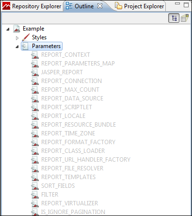
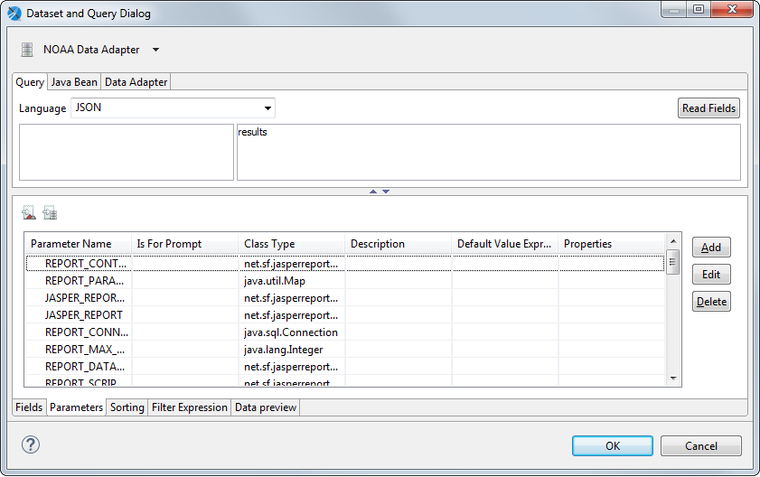
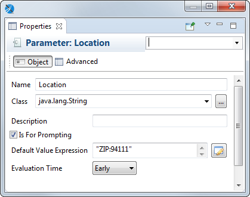
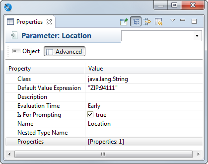
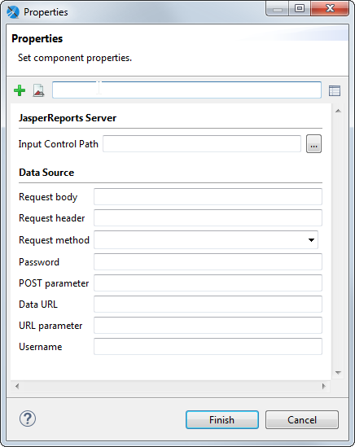

# Working With Parameters

Parameters are the best communication channel between the report engine and the execution environment (your application). Parameters are used in expressions and queries. By setting parameters, you can change the behavior of an expression or return different fields from a query.

A parameter can have a default value defined by means of the default expression property. This expression is evaluated by JasperReports only when a value for the parameter has not been provided by the user at run time.

## Managing Parameters

You can manage parameters using the **Outline** view or on the **Parameters** tab of the **Dataset and Query Dialog**.

|                                                |
|------------------------------------------------|
|  |
| *Figure 1 Parameters in Outline View*          |

|  |
|----|
|  |
| *Figure 2 Parameters in Dataset and Query Dialog* |

### Managing Parameters Using Outline View

-   To delete a parameter, right-click on it and select **Delete**. Parameters with light gray names are created by the system and cannot be deleted or edited.
-   To view or edit parameter properties, right-click on the parameter and choose **Show Properties**. To view or edit advanced properties, click the **Advanced** tab in the **Properties** view, select **Properties**, and click **…**.
-   To sort the list of parameters alphabetically in the **Outline** view, right-click the **Parameters** node and select **Sort Alphabetically**. This does not affect the order of the parameters in the report.
-   To toggle show/hide system parameters, right-click the **Parameters** node and select **Hide Default Parameters**.
-   To add a parameter, right-click the **Parameters** node and choose **Create Parameter**.
-   To add a parameter set, right-click the **Parameters** node and choose **Create Parameter Set**.
-   To change the order of parameters on the menu, select the parameter you want to move and drag it up and down.

### Managing Parameters Using the Parameters tab in the Dataset and Query Dialog

-   To toggle show/hide system parameters, click .
-   To toggle show/hide parameter properties, click .
-   To add a parameter, click **Add** on the **Parameters** tab.
-   To delete a parameter, select it in the **Parameters** tab and click **Delete**. The **Delete** button is grayed out for system parameters, which cannot be deleted or edited.
-   To add a parameter property, make sure that parameter properties are displayed, select the **Parameter**, and click **Add Property**.
-   To view or edit parameter properties, double-click the parameter, or select it in the **Parameters** tab and click **Edit** (grayed out for system parameters). A **Parameter** dialog opens. To view or edit advanced properties, click **…** next to **Properties** in the **Parameter** dialog.

Also see [Using the Dataset and Query Dialog](../datasets/dataset_and_query_dialog.md).

## Working with Parameter Properties

|  |
|----|
|  |
| *Figure 3 Parameters - Properties* |

### Basic Parameter Properties

Parameters have the following properties on the **Object** tab in the **Outline** view or in the **Parameters** dialog:

-   **Name** – Name of the parameter.

-   **Class** – Class type of the parameter.

-   **Description** – A string describing the parameter. This is shown as the parameter tooltip in the Input Parameters pane in preview.

-   **Is for Prompting** – Enable this to have the Jaspersoft Studio prompt for the parameter when you preview the report. If you have this option selected and are publishing the report to the server, you need to create input controls on the server. This value might also be passed to an external application.

-   **Default Value Expression** – Pre-defined value for the parameter. This value is used if no value is provided for the parameter from the application that runs the report. The type of value must match the type declared in the **Class** field.

    You may legally define another parameter as the value of **Default Value Expression**, but this method requires careful report design. Jaspersoft Studio parses parameters in the same order in which they are declared, so a default value parameter must be declared before the current parameter.

-   **Evaluation Time** – Use this to specify the evaluation time for the parameter:

    -   **Early** – Evaluate the parameter default value expression before the data adapter.
    -   **Late** – Evaluate the parameter default value expression after the data adapter.

### Advanced Parameter Properties

On the **Advanced** tab, you can use the **Properties** field to specify pairs of type name/value as properties for each parameter. This is a way to add extra information to the parameter for use by external applications. For example, you can use properties to include the description of the parameter in different languages or to add instructions about the format of the input prompt.

|  |
|----|
|  |
| *Figure 4 Advanced properties for a parameter* |

Selecting **Properties**, and clicking **…** brings up the **Properties** dialog. For example, if you have a web services type data adapter, you see the following properties.

|  |
|----|
|  |
| *Figure 5 Advanced Properties for Parameters* |
