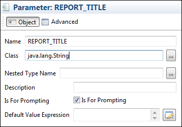
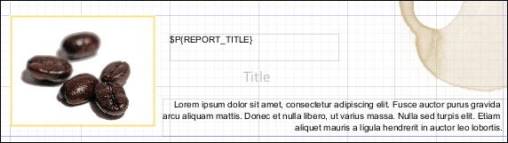

# Using Parameters in Queries

Generally, you can use parameters in a report query whether the language supports them.

JasperReports runs queries, passing the value of each parameter used in the query to the statement.

This approach has a major advantage with respect to concatenating the parameter value to the query string—you do not have to take care of special characters or sanitize your parameter. The database can do it for you. At the same time, this method limits your control of the query structure. For example, you cannot specify a portion of a query with a parameter.

## Using Parameters in a SQL Query

You can use parameters in SQL queries to filter records in a where condition or to add/replace pieces of raw SQL or even to pass the entire SQL string to run.

In the first case, the parameters act as standard SQL parameters. For example:

`SELECT * FROM ORDERS WHERE ORDER_ID = $P{my_order_id}`

In this example, the `my_order_id` parameter contains the ID of the order to be read. This parameter can be passed to the report from the application running it to select only a specific order. Please note that the parameter here is a valid SQL parameter, meaning that the query can be run using a prepared statement like:

`SELECT * FROM ORDERS WHERE ORDER_ID = ?`

and the value of the parameter `my_order_id` is then passed to the statement.

In this query:

`SELECT * FROM ORDERS ORDER BY $P!{my_order_field}`

`my_order_field` cannot be treated as an SQL parameter. JasperReports considers this parameter a placeholder (note the special syntax `$P!) ` is replaced with the text value of the parameter.

Using the same logic, a query can be fully passed using a parameter. The query string would look like:

`$P!{my_query}`

A query can contain any number of parameters. When passing a value using the `$P!` syntax, the value of the parameter is taken as is, the user is responsible of the correctness of the passed value (SQL escaping is not performed by JasperReports in this case). When using a parameter in a query, a default value must be set for the parameter to allow Jaspersoft Studio to run the query to retrieve the available fields.

## Using Parameters with Null Values

The parameter form `$P{parametername}` does not work correctly with null values. In an operation in which your value could be null, use the form `$X{EQUAL,fieldname,parametername}`.

For example:

1.  `$P{param}: "select * where num_column > $P{num_param}"`

    In this case `$P` should be used, because we do not have `$X{GREATER,…}`, and Null has no meaning for the operation “greater than”.

2.  `$X{EQUAL, column_name, param_name}`

Let us compare two expressions:

"`select * where num_column = $P{num_param}"`

and

`"select * where $X{EQUAL, num_column, num_param}" `

Both generate the same output if the parameter value is not Null: `"select * where num_column = 1"`

However, if the parameter has a Null value the output is different:

-   `$P`: `"select * where num_column = null"`

    -   `$X`: `"select * where num_column IS null"`

Databases do not understand the key difference between `"= null"` and `"is null"`. So if you want your query with the condition "=" to work with null values, you need to use `$X{EQUAL/NOTEQUAL, column, parameter}`.

## IN and NOTIN Clauses

JasperReports provides a special syntax to use with a `where` condition: the `IN` and `NOTIN` clauses.

The `IN` clause checks whether a particular value is present in a discrete set of values. Here is an example:

`SELECT * FROM ORDERS WHERE SHIPCOUNTRY IN ('USA','Italy','Germany')`

The set here is defined by the countries USA, Italy, and Germany. Assuming we are passing the set of countries in a list (or better a `java.util.Collection`) or in an array, the syntax to make the previous query dynamic in reference to the set of countries is:

`SELECT * FROM ORDERS WHERE $X{IN, SHIPCOUNTRY, myCountries}`

where `myCountries` is the name of the parameter that contains the set of country names. The `$X` clause recognizes three parameters:

-   Type of function to apply (`IN` or `NOTIN`)

-   Field name to be evaluated `(SHIPCOUNTRY`)

-   Parameter name (`myCountries`)

JasperReports handles special characters in each value. If the parameter is `null` or contains an empty list, meaning no value has been set for the parameter, the entire `$X` clause is evaluated as the always true statement “`0 = 0`”.

## Relative Dates

You can create a report that filters information based on a date range relative to the current system date using a parameter of type `DateRange`. A date range parameter can take either a date or a text expression that specifies a date range relative to the current system date.

!!! note

    A relative date expression is always calculated in the time zone of the logged-in user. However, the start day of the week can be configured independent of locale.

### Relative Date Keywords

The text expression for the relative date must be in the format `<Keyword>+/-<N>` where:

-   `<Keyword>` – Specifies the time span that you want to use. Options include: `DAY`, `WEEK`, `MONTH`, `QUARTER`, `SEMI`, and `YEAR`.
-   `<+/->` – Specifies whether the time span occurs before (-) or after (+) the chosen date.
-   `<N>` – Specifies the number of the above-mentioned time spans you want to include in the filter.

For example, if you want to look at Sales for the prior month, your expression would be `MONTH - 1`.

!!! note

    Relative dates do not currently support keywords like "Week-To-Date" (from the start of the current week to the end of the current day). However, you can set a relative date period in a query in JRXML using `BETWEEN`, which has the syntax:

    `$X{BETWEEN, column, startParam, endParam}`

    For example, to create a week-to-date query, set `startParam` to `WEEK` and `endParam` to `DAY`. You can do this for other time ranges, such as Year-To-Day, Year-To-Week.

### Creating a Date Range Parameter

The `class` attribute of a JasperReports date range parameter must have one of the following values:

-   `net.sf.jasperreports.types.date.DateRange` (Date only) – Accepts text strings with relative date keywords as described above and date strings in YYYY-MM-DD format. For example:

    `<parameter name="myParameter" class="net.sf.jasperreports.types.date.DateRange">`

-   `net.sf.jasperreports.types.date.TimestampRange` (Date and Time) – Accepts text strings with relative date keywords as described above and date strings in YYYY-MM-DD HH:mm:ss format. For example:<br>
    `<parameter name="myParam" class="net.sf.jasperreports.types.date.TimestampRange">`

### Using Date Ranges in Queries

You must use `$X` functions with date ranges, because `$P` does not support the date-range types (`DateRange` and `TimestampRange`).

To use date ranges, create a parameter with type date range and use it as the third argument in the `$X` function. To set the default value expression of a date range parameter, use the `DateRangeBuilder()` class to cast the expression to the correct type:

-   `new net.sf.jasperreports.types.date.DateRangeBuilder("DAY-1").toDateRange()` – casts a keyword text string to a `DateRange`.
-   `new net.sf.jasperreports.types.date.DateRangeBuilder("WEEK").set(Timestamp.class).toDateRange()` – casts a keyword text string to a `TimestampRange`.
-   `new net.sf.jasperreports.types.date.DateRangeBuilder("2012-08-01").toDateRange()`– casts a date in YYYY-MM-DD format to a `DateRange`.
-   `new net.sf.jasperreports.types.date.DateRangeBuilder("2012-08-01 12:34:56").toDateRange()`– casts a date in YYYY-MM-DD HH:mm:ss format to a `TimestampRange`.

The following JRXML example shows data from the previous day:

``` xml
<parameter name="myParameter" class="net.sf.jasperreports.types.date.DateRange">
  <defaultValueExpression>
    <![CDATA[new DateRangeBuilder("DAY-1").toDateRange()]]>
  </defaultValueExpression>
</parameter>
<queryString>
  <![CDATA[Select * from account where $X{EQUAL, OpportunityCloseDate, myParameter}]]>
</queryString>
```

This JRXML example shows results prior to the end of last month:

``` xml
<parameter class="net.sf.jasperreports.types.date.DateRange" name="EndDate">
  <defaultValueExpression>
    <![CDATA[new net.sf.jasperreports.types.date.DateRangeBuilder("MONTH-1").toDateRange().getEnd()]]>
    </defaultValueExpression>
</parameter>
<queryString>
  <![CDATA[SELECT * FROM orders WHERE $X{LESS, order_date, EndDate}]]>
</queryString>
```

The following table shows two additional examples of relative dates.

<table>
<thead>
<tr>
<th><p>Problem</p></th>
<th><p>Solution</p></th>
</tr>
</thead>
<tbody>
<tr>
<td colspan="2">Set up a relative date parameter called <code>StartDate</code> that takes the value: <code>QUARTER</code>. <code>QUARTER</code> evaluates to the first day (the first instant, really) of this quarter.</td>
</tr>
<tr>
<td><p>Find all purchases made previous to this quarter</p></td>
<td><p><code>SQL: select * from orders where $X{LESS, order_date, StartDate}</code></p></td>
</tr>
<tr>
<td><p>Find all purchases made in this quarter</p></td>
<td><p><code>select * from orders where $X{EQUAL, order_date, StartDate}</code></p></td>
</tr>
</tbody>
</table>

### Using Relative Dates in Input Controls

When you create an input control for a `DateRange` or `TimestampRange` parameter, the user can either type a relative date expression or enter a specific date (either by typing or by using the calendar widget).

Use `BETWEEN` to set up input controls that allow the user to specify a range (other than a day) using either a relative date expression or actual dates. To do this:

-   Define two date range parameters, for example, `StartDate` and `EndDate`.

-   Optionally, set default values for one or both parameters using `defaultValueExpression`.

-   Use a `$X` expression with a `BETWEEN` function in your query.

-   Create a date type input control for each parameter, for example, `StartDate` and `EndDate`.

The following JRXML example uses the `BETWEEN` keyword in the `$X()` function to find all data from the previous 20 years:

``` xml
<parameter name="StartDate" class="net.sf.jasperreports.types.date.DateRange">
  <defaultValueExpression>
    <![CDATA[(new net.sf.jasperreports.types.date.DateRangeBuilder("YEAR-20")).toDateRange()]]>
  </defaultValueExpression>
</parameter>
<parameter name="EndDate" class="net.sf.jasperreports.types.date.DateRange">
  <defaultValueExpression>
    <![CDATA[(new net.sf.jasperreports.types.date.DateRangeBuilder("DAY")).toDateRange()]]>
  </defaultValueExpression>
</parameter>
<queryString language="SQL">
  <![CDATA[select HIRE_DATE, MANAGEMENT_ROLE, GENDER, SUPERVISOR_ID,SALARY from employee where
         $X{BETWEEN, HIRE_DATE, StartDate, EndDate} limit 200]]>
</queryString>
```

You can use the `getStart()` and `getEnd()` methods to get the precise beginning and end of a relative date. Both of these methods return a date instead of a date range. The following example shows how to get the precise start date as a default value expression.

``` xml
<parameter name="StartDate" class="java.util.Date" nestedType="java.util.Date">
  <defaultValueExpression><![CDATA[$P{UserPeriod}.getStart()]]></defaultValueExpression>
</parameter>
```

### Publishing Reports with Relative Dates to JasperReports Server

Jaspersoft Studio automatically enables support for date range expressions on connections to JasperReports Server. To verify that date range expressions are enabled:

1.  Right-click on the server connection in the Repository and select **Edit**.
2.  In the **Server Profile Wizard**, display the **Advanced** settings and select **Supports DateRange Expressions**.

When the **Supports DateRange Expressions** option is enabled, input controls for date range parameters work correctly when published to JasperReports Server.

## Passing Parameters from a Program

Jaspersoft Studio passes parameters from a program “caller” to the print generator using a class that extends the `java.util.Map` interface. For example:

``` text
...
    HashMap hm = new HashMap();
        ...
    JasperPrint print = JasperFillManager.fillReport(
        fileName,
        hm,
    new JREmptyDataSource());
...
```

`fillReport` is a key method that allows you to create a report instance by specifying the file name as a parameter, a parameter map, and a data source. (This example uses a dummy data source created with the class `JREmptyDataSource` and an empty parameter map created using a `java.util.HashMap` object.)

Let us see how to pass a simple parameter to a reporting order to specify the title of a report.

The first step is to create a parameter in the report to host the title (that is a String). We can name this parameter `REPORT_TITLE` and the class is `java.lang.String` (Figure 8‑3).

|                                                                |
|----------------------------------------------------------------|
|  |
| *Figure 1: Definition of `REPORT_TITLE`*                       |

All the other properties can be left as they are. Drag the parameter into the Title band to create a text field to display the `REPORT_TITLE` parameter.

|                                                                |
|----------------------------------------------------------------|
|        |
| *Figure 2: Design Panel with `REPORT_TITLE` in the Title Band* |

To set the value of the `REPORT_TITLE` parameter in our application, modify the code of the previous source code example by adding:

``` text
 ...
HashMap hm = new HashMap();
hm.put(“REPORT_TITLE”,”This is the title of the report”);
...
JasperPrint print = JasperFillManager.fillReport(
fileName,
hm,
new JREmptyDataSource());
...
```

We have included a value for the `REPORT_TITLE` parameter in the parameter map. You do not need to pass values for all the parameters. If you do not provide a value for a certain parameter, JasperReports assigns the value of `Default Value Expression` to the parameter with the empty expression evaluated as null.

When printing the report, Jaspersoft Studio includes the String `This is the title of the report `in the Title band. In this case, we just used a simple String. But you can pass much more complex objects as parameters, such as an image (`java.awt.Image`) or a data source instance configured to provide a specified subreport with data. The most important thing to remember is that the object passed in the map as the value for a certain parameter must have the same type (or at least be a super class) of the type of the parameter in the report. Otherwise, Jaspersoft Studio fails to generate the report and returns a `ClassCastException` error.
