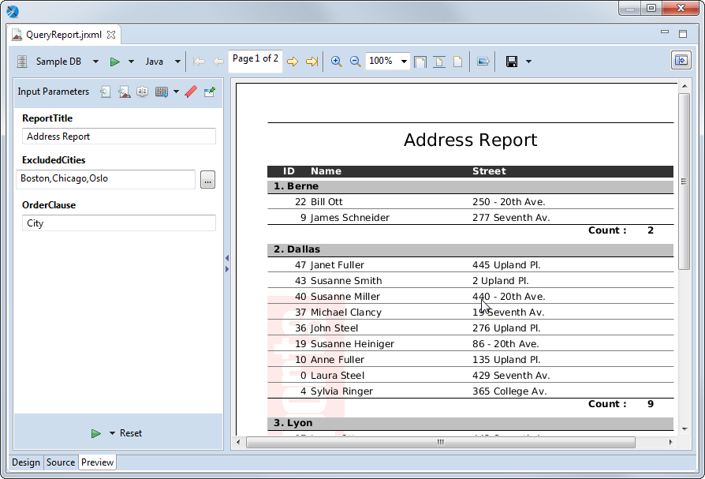
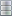
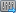

# The Preview Tab

The Preview tab lets you preview the report inside Jaspersoft Studio.

|                                               |
|-----------------------------------------------|
|  |
| Preview Tab of a Report                       |

The Preview tab has the following three areas:

- Main menu. Displays options for viewing, exporting, and creating data snapshots:

  -  – Displays a dropdown menu with options for data snapshots and for restricting the list of data adapters:

    - **Cache Data in Memory**: Creates a data snapshot in RAM.
    - **Save Data to File…**: Saves the data snapshot to a file.
    - **Load Data from File…**: Runs the report using the data in the specified data snapshot.
    - **Filter Data Adapters by Report Language**: Enables you to restrict the list of data adapters to only those adapters that are compatible with a specified language, for example, only those adapters that use SQL.

  - Data adapter dropdown: Lists all available data adapters. Use **Filter Data Adapters by Report Language** on the  menu to restrict the list to adapters that are compatible with a specified language.

  -  Run the report: Runs the report. Use the menu immediately to the right to choose between a normal report and an interactive report. Interactive reports only support the HTML format.

  - Output format menu: Let you select the output format for the report.

  - Pagination tools: Use the arrows to go to page through the report or to go to the first or last page. You can also edit the page text to specify the number you want (for example, Page 7 of 12) and press **Enter**.

  - Display tools: Zoom in or out, specify a percent, or click the icon to zoom to fit page width, zoom to fit page, or zoom to actual size.

  -  Export a sample image: Saves a PNG file of the current page of the report in a location you specify.

  -  Export report: Saves the report to a file in the format that you specify from the dropdown list.

  -  Show parameters: Expands the parameters panel.

- Parameters panel: Automatically displayed for a report that has parameters that have been specified for prompting. Otherwise it is hidden. You can display or hide the parameters pane using the expand/collapse arrows to the right of the panel or show it by clicking  on the Preview menu. Use the following icons to choose what is displayed in this panel:

  -  Input parameters: Shows any input parameters that are set for prompting and lets you manually enter values.
  -  Report parameters: Shows all parameters for the report.
  -  Sort fields: Shows any fields set for sorting.
  -  Export options: Displays any export properties set at the report level. Click the down arrow to open the Properties dialog for Jaspersoft Studio and see the export properties set at the Jaspersoft Studio level.
  -  Bookmarks: Lists the bookmarks set in the report.
  -  Pin Parameters Panel: Click this to have the parameters panel displayed for all reports.

- Report preview.
