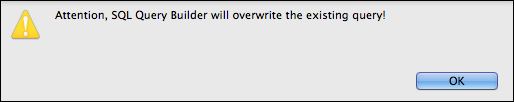
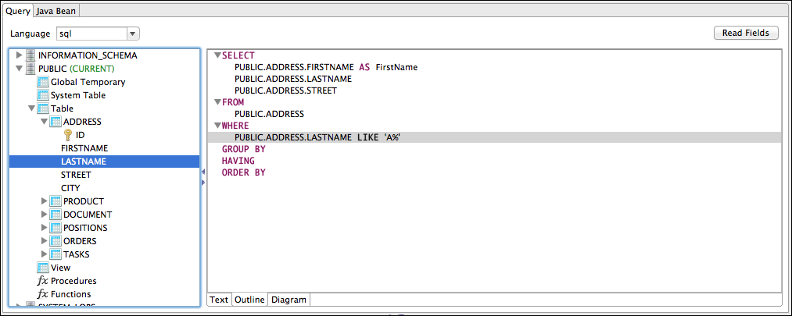
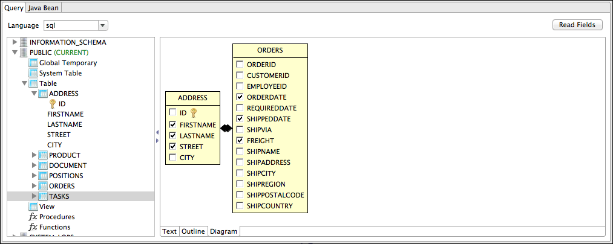
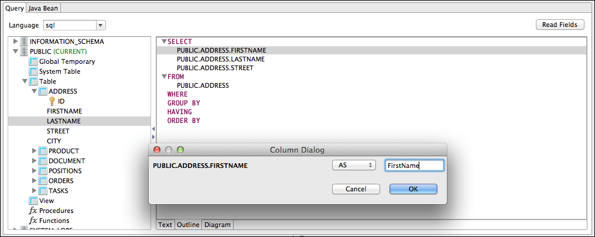
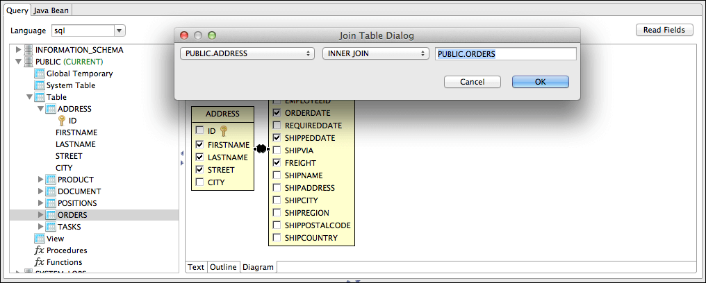
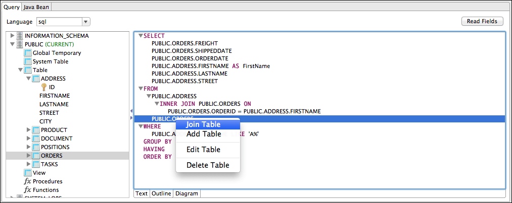
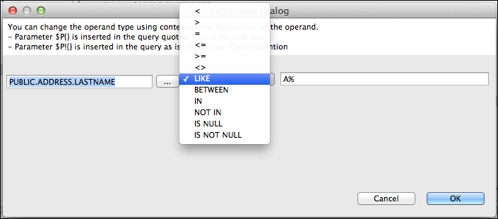
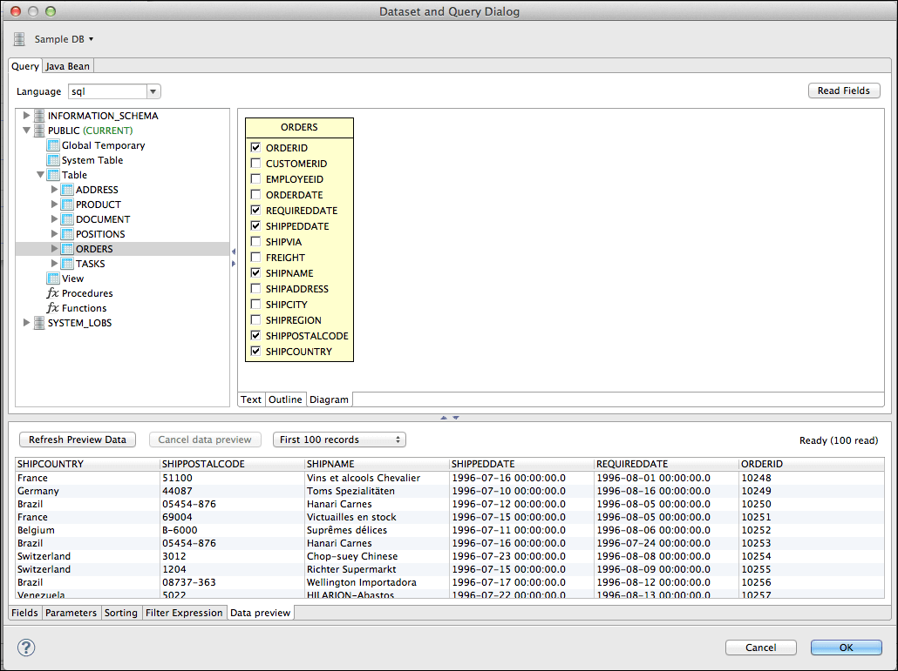

# Working with the Query Builder

When your language is SQL, the Query Builder is called the SQL Builder. The tool requires a JDBC data adapter.

The builder has two parts. On the left a tree-view shows all the available schemas and relative objects like tables, views found by using the JDBC connection provided by the data adapter. On the right, there are three tabs that present the query in different ways.

The first **Text** tab contains a text area for writing a query. You can drag tables and other objects from the metadata view into the text area, so you do not have to write the entire qualified names of those objects. Although the SQL builder does not support arbitrary complex queries (which may use database-specific syntax), this text area can be used for any supported query, including stored procedures if supported by the report query executer.

If a query has already been set for the report, this text area shows it when the query dialog is open.

Use the **Outline** and **Diagram** tabs to build the query visually. The current version of Jaspersoft Studio does not support back-parsing of SQL. For this reason, you should use Outline and Diagram editing mode only to create queries, otherwise the new query replaces any existing query. If you do attempt to overwrite an existing query, Jaspersoft Studio alerts you.

|                                                       |
|-------------------------------------------------------|
|  |
| *Figure 1 Query Overwrite Warning*                    |

## Query Outline View and Diagram View

The purpose of SQL is to select data from the tables of the database. SQL allows you to join tables, so that you can get data from more than one table at a time.

|                                                       |
|-------------------------------------------------------|
|  |
| *Figure 2 Outline View*                               |

The **Outline** view is a good tool for people with a basic understanding of SQL. It works with the **Diagram** view, which represents the simplest way to design a query. In the outline view, the query is split in its main parts introduced by the relative keyword. Those parts include:

`SELECT` introduces the portion of the query where is listed all the columns that form a record of the final result set (which is basically a list of records).

`FROM` contains the list of tables involved in our queries and if specified the rules to join that tables.

`WHERE` is the portion of the query that describes the filters and conditions that the data must satisfy to be part of the final result, conditions can be combined by using the `OR` and `AND` logical operators and can be aggregated by using parentheses.

`GROUP BY` indicates a set of fields used to aggregate data and is used when an aggregation function is present in the `SELECT`. For example, the following query counts the number of orders placed in each country.

<table>
<colgroup>
<col style="width: 100%" />
</colgroup>
<tbody>
<tr>
<td>
<pre class="sourceCode sql"><code class="sourceCode sql">SELECT</code></pre>
</td>
</tr>
<tr>
<td>
<pre><code>   count(*) as number_of_orders,</code></pre>
</td>
</tr>
<tr>
<td>
<pre><code>   Orders.country</code></pre>
</td>
</tr>
<tr>
<td>
<pre><code>FROM</code></pre>
</td>
</tr>
<tr>
<td>
<pre><code>   Orders</code></pre>
</td>
</tr>
<tr>
<td>
<pre><code>GROUP BY</code></pre>
</td>
</tr>
<tr>
<td>
<pre><code>   Orders.country</code></pre>
</td>
</tr>
<tr>
<td></td>
</tr>
</tbody>
</table>

`HAVING` works a bit like a `WHERE`, but it is used with aggregate functions. For example, the following query filters the records by showing only the countries that have at least 40 orders:

`ORDER BY` specifies a set of columns for sorting the result set.

<table>
<colgroup>
<col style="width: 100%" />
</colgroup>
<tbody>
<tr>
<td>
<pre class="sourceCode sql"><code class="sourceCode sql">SELECT</code></pre>
</td>
</tr>
<tr>
<td>
<pre><code>   count(*) as number_of_orders,</code></pre>
</td>
</tr>
<tr>
<td>
<pre><code>   Orders.country</code></pre>
</td>
</tr>
<tr>
<td>
<pre><code>FROM</code></pre>
</td>
</tr>
<tr>
<td>
<pre><code>   Orders</code></pre>
</td>
</tr>
<tr>
<td>
<pre><code>GROUP BY</code></pre>
</td>
</tr>
<tr>
<td>
<pre><code>   Orders.country</code></pre>
</td>
</tr>
<tr>
<td>
<pre><code>HAVING</code></pre>
</td>
</tr>
<tr>
<td>
<pre><code>   count(*) &gt; 40</code></pre>
</td>
</tr>
<tr>
<td></td>
</tr>
</tbody>
</table>

The `Diagram` view shows the tables in the query with the relative join connections and the selected fields. This view is very useful, especially to select the relevant fields and easily edit the table joins by double-clicking the connection arrows.

|                                                       |
|-------------------------------------------------------|
|  |
| *Figure 3 Diagram View*                               |

## Selecting Columns

You can drag columns from the database explorer into the `SELECT` node or other nodes in the outline view. Make sure the columns that you select are from tables present in the `FROM` part of your query.

You can also select fields by their checkboxes in the diagram view.

Finally you can add a column by right-clicking the `SELECT` node in the outline view and selecting **Add Column**. A new dialog prompts you to pick the column from those in the tables mentioned in the `FROM` clause. If a column you want to add is not a table column, but a more complex expression, for instance an aggregation function like` COUNT(*)`, add it by right-clicking the `SELECT` node in the outline view and selecting **Add Expression**.

When a column is added to the query as part of the `SELECT` section, you can set an alias for it by double-clicking it.

|                                                   |
|---------------------------------------------------|
|  |
| *Figure 4 Setting an Alias*                       |

Aliases are useful when you have several fields with the same name coming from two different tables.

## Joining Tables

You can join tables you have added by selecting shared fields. You can create the relationship in the Diagram view by dragging a column of the first table onto the column of the table you are joining to. You can edit this type of join by double-clicking the join arrows. Currently a single join condition is supported.

|                                                   |
|---------------------------------------------------|
|  |
| *Figure 5 Column Dialog*                          |

You can also edit joins in the outline view by right-clicking a table name and selecting **Add or Edit Table Join**.

|                                                               |
|---------------------------------------------------------------|
|  |
| *Figure 6 Join Table*                                         |

## Data Selection Criteria (WHERE Conditions)

Use a `WHERE` clause to specify the criteria to be for each record's part in the query result. Right-click the `WHERE` node in the outline view and select **Add Condition** to add a condition.

If you know in advance which column should be involved in the condition, you can drag this column on the `WHERE` node to create the condition. In both cases, the condition dialog is displayed.

|  |
|----|
|  |
| *Figure 7 Add Condition* |

You can organize conditions by creating condition groups, and then combining them with `or` and operators. At least one condition must be true for an `OR` group. All conditions must be true for the `AND` operator. You can double-click to change the value of either of these group operators.

If the value of a condition is not fixed, you can express it by using a parameter with the expression: `$P{parameter_name}`.

When using collection type parameters, the `$X`expressions allow you to use operators like `IN` and `NOT IN`, which determine whether a value is present in the provided list. The `$X` syntax also allows you to use other operators like `BETWEEN` for numbers, Date Range, and Time Range type of parameters. See [1.1.2, “Expression Operators and Object Methods,” on page 1](expressions/expressions.md) for more information about the `$X` syntax.

## Acquiring Fields

When your query is ready, it is time to map the columns of the result set to the fields of the report. When using SQL, this is a pretty straight forward operation.

Press the Read button to run the query. If the query is valid and no errors occur Jaspersoft Studio adds a field for each column with the proper class type to the fields list.

## Data Preview

Use the **Data Preview** tab to generate a ghost report that maps the fields to the fields tab using your query and selected **Data Adapter**. This tool is independent of the query language and a good way to debug a query or check, which records the dataset returns.

|                                                                   |
|-------------------------------------------------------------------|
|  |
| *Figure 8 Data Preview Tab*                                       |
