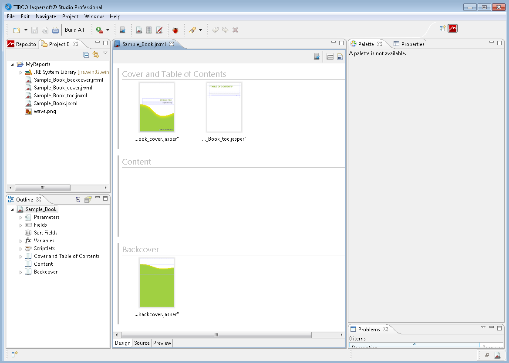

# Creating the Report Book Framework

The first step is to create your report book jrxml. This is the framework in which you organize the book’s parts.

To create the report book framework

1.  In Jaspersoft Studio, click  and select **Other...** to open the **Wizard Selection** window.

2.  Expand the Jaspersoft Studio folder, select **Jasper Report**, and click **Next**.

3.  In the **Categories** panel, select **Report Books**.

4.  Click to select **Wave Book** then click **Next**.

5.  In the Project Explorer, select the **My Reports** folder, change the file name to `Sample_Book.jrxml`, and click **Next**.

6.  In the **Data Source** window, select a data adapter. For our walkthrough, use **Sample DB – Database JDBC Connection**.

7.  In the text panel, enter the following query then click **Next**:

    `select distinct shipcountry from orders order by shipcountry`

8.  In the **Fields** window, move **SHIPCOUNTRY** from the Dataset Fields panel to the Fields panel and click **Next**.

9.  In the Book Sections window, make sure that all three options are selected:

    - **Create Cover Section**
    - **Create Table of Contents**
    - **Create Back Cover Section**

10. Click **Finish**.

Your Report Book project opens in Jaspersoft Studio.

|  |
|----|
|  |
| *Figure 1: Report Book Framework* |

In Jaspersoft Studio, open the Project Explorer and expand the My Reports folder. There, you can see the jrxml files you just created:

- Sample_Book_backcover.jrxml
- Sample_Book_cover.jrxml
- Sample_Book_toc.jrxml
- Sample_Book.jrxml

Sample_Book.jrxml is open in the main Design tab. This is the file in which you organize the report parts. You notice three groups for the book part types:

- **Cover and Table of Contents** contains Sample_Book_cover.jrxml and Sample_Book_toc.jrxml.
- **Content** is empty.
- **Backcover** contains Sample_Book_backcover.jrxml

When you select each these book parts in the design window, you can view and edit their properties in the **Properties** View, as you can with standard reports and subreports.

Next, you create a subreport and add it to your report book.
