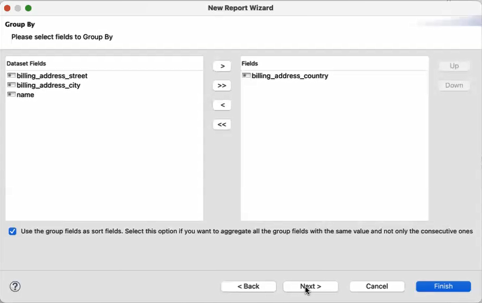
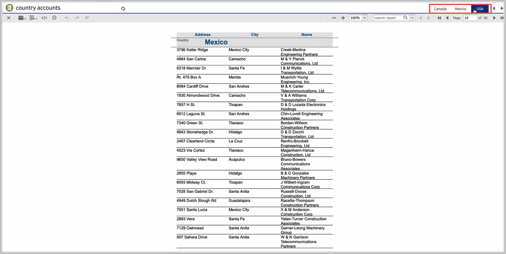

# Report Splitting

With report splitting, you can run a report in a JasperReports Server scheduler and get the output into the individual parts. Each part of the report is saved separately in the repository and sent to different recipients. Report splitting is based on the report parts. You can create report parts using a band-based report or a report book. The following example shows a report splitting procedure using a band-based report.

To split a report using a band-based report

1.  Select a band-based report from the **Report Templates** page and click **Next**.

2.  Navigate to the folder where you want the report to save and name the report.

3.  Click **Next**.

4.  Select **sugarcrm - Database JDBC Connection** and click **Next**.

5.  Enter the query **select \* from accounts** and click **Next**.

6.  Select the following fields and click the right arrow to add them to your report. 
    `billing_address_country` 
    `billing_address_street` 
    `billing_address_city` 
    `name`

7.  Click **Next**.

8.  Group the fields by the element that triggers the report splitting. To do this, select the `billing_address_country` field and click the right arrow.

    |                                                         |
    |---------------------------------------------------------|
    |  |

9.  Select the checkbox to sort the fields and click **Next**.

10. Click **Finish**.

11. Select the **Group Header** from the **Outline** view.

12. In the **Properties** view, under the **Group Band Properties** section, select **Start New Page** and **Reset Page number**. 
    **Start New Page**: Starts each country's data from the new page. 
    **Reset Page Number** - Reset the page number of each part of a report. 

13. To add the properties for an element that triggers the splitting, right-click the `$F{billing_address_country}` element and select **Configure Report Splitting** from the context menu. The **Report Splitting Configuration** dialog appears. Now, configure the following properties: 

-   `net.sf.jasperreports.print.part.name`: `$F{billing_address_country}` 
    Triggers the creation of a new part and provides a name to each part. 
-   `net.sf.jasperreports.print.part.visible`: Provides the visibility of the part as a tab in the final output preview. The default value is true. 
-   `net.sf.jasperreports.print.part.split`: Boolean. Set it to true to create a separate output for each part. This must be added to the same element on which the part name is set up. 
-   `net.sf.jasperreports.print.part.{arbitrary_name}`: You can add this as an additional property.

You can reset these properties using the **Reset** button.

1.  Upload the report to JasperReports Server, you can see three tabs representing individual reports of Canada, Mexico, and the USA in the report viewer.

    |                                                           |
    |-----------------------------------------------------------|
    |  |
    | *Figure 1 Tabs of different countries*                    |

2.  Run the report in the scheduler. To do this, right-click the report and select **Run in Background** from the context menu.

3.  On the **Output Options** tab, set the output options and click **Submit**.

4.  On the **Notifications** tab, enter the email address and subject of the email to be sent to each recipient. Provide dynamic values in the following text fields **To**, **CC**, and **Subject**.

5.  Select the **Include report files as attachments** option and click **Submit**.

A single report is split into three separate reports and sent to the email addresses of different recipients.
