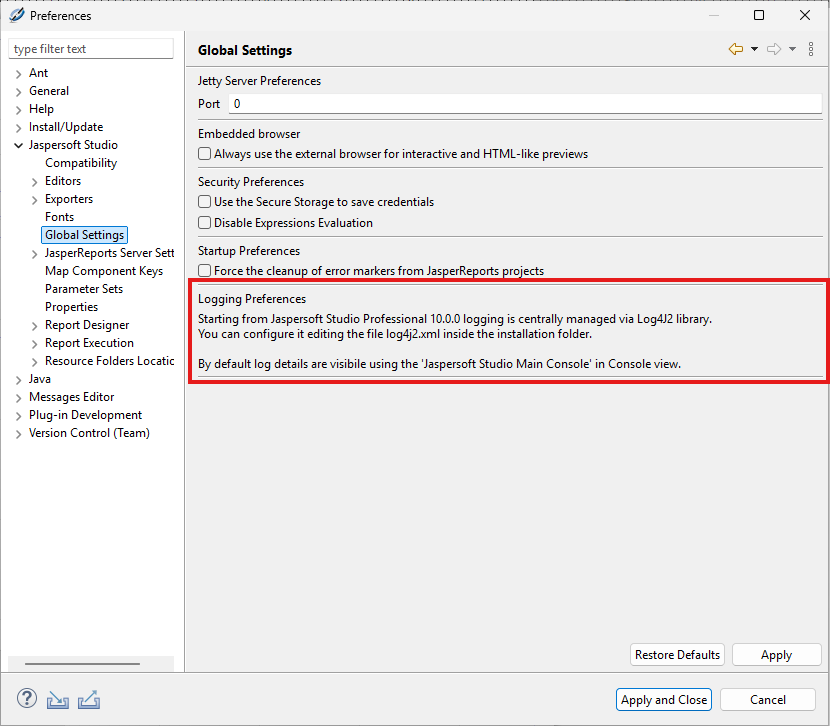
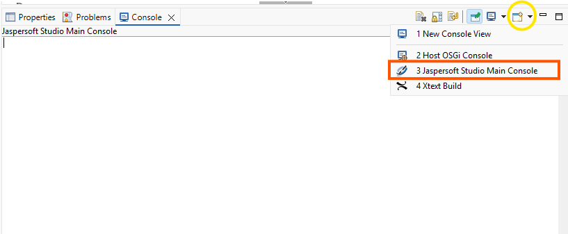
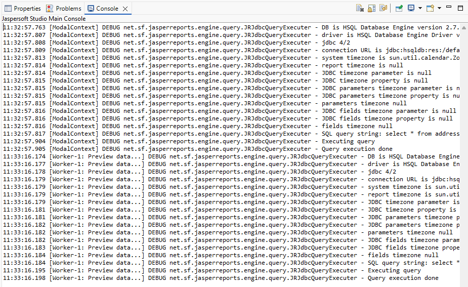

# Revised Logging System

Starting version 10.0.0 , Jaspersoft Studio features a revised logging mechanism. The logging process is restructured, providing a centralized system using Apache Log4j2 to capture all application events. This new architecture consolidates 'everything' happening within Jaspersoft Studio, unifying output from the various underlying Java logging frameworks that are shipped, including:

-   Log4j1.x

-   Log4j2.x

-   SLF4J

-   Apache Commons Logging (1.2x, 1.3x)

-   java.util.logging

All logging behavior is now controlled by a single configuration file, `log4j2.xml`, located in the installation folder. You can easily modify this file for specific logging during debug sessions or normal use.

You can customize the location of this configuration file using the VM argument `-Dlog4j.configurationFile` in the `Jaspersoft Studio Professional.ini` file.

## Eclipse IO Console Appender

The Eclipse IO Console appender in Jaspersoft Studio is refactored to handle concurrent multi-thread invocations and prevent "appender loops" common in OSGi environments, ensuring reliable log output. This ensures that simultaneous logging requests, whether triggered by UI widgets, internal libraries, or background components, are processed reliably without causing performance bottlenecks or application loops. The logging and performance improvements include:

-   A new default setting (`BasicContextSelector`) in the `.ini` file ensures a single `LoggerContext` is used across all bundles, reducing redundant overhead and optimizing memory usage.

-   The `log4j2.xml` file now includes optimized defaults and commented snippets. It is recommended to use the Asynchronous File Appender to prevent logging tasks from slowing down the UI.

-   You can now define a specific storage path for log files by adding the `jss.logging.tmpdir` JVM property to your Jaspersoft Studio `.ini` file.

-   A new property, `jss.logging.redirectSystemStreams`, allows you to hijack `System.out` and `System.err` and route them through your defined `Log4j2` appenders for centralized error tracking.

## Configuration File and Appenders

The standard configuration of the `log4j2.xml` config file is as follows:

``` text
This XML file does not appear to have any style information associated with it. The document tree is shown below.
<Configuration status="WARN">
<Appenders>
<!--
        EclipseIOConsole is a custom appender that writes to a speciale Eclipse console view.
        The following parameters can be customized:
        - queueSize: the size of the internal queue for asynchronous logging (default: 10000)
        - batchSize: the number of log events to process in a batch (default: 64)
          -->
<EclipseIOConsole name="EclipseIOConsole">
<PatternLayout pattern="%d{HH:mm:ss.SSS} [%t] %-5level %logger{36} - %msg%n"/>
</EclipseIOConsole>
<!--
  Rolling File appender with a retention policy to keep logs for 30 days or until they exceed 1 GB in size.
  NOTE: uncomment also the AsyncRollingFile appender and use that in the different Logger sections.
  -->
<!--
        <RollingFile name="RollingFile"
             fileName="${sys:jss.logging.tmpdir}/jaspersoftstudio/logs/jaspersoftstudio_main.log"
             filePattern="${sys:jss.logging.tmpdir}/jaspersoftstudio/logs/jaspersoftstudio_main-%d{yyyy-MM-dd}-%i.log.gz">
            <PatternLayout>
                <Pattern>%d{yyyy-MM-dd HH:mm:ss} %p %c [%t] %m%n</Pattern>
            </PatternLayout>
            <Policies>
                <TimeBasedTriggeringPolicy/>
                <SizeBasedTriggeringPolicy size="25 MB"/>
            </Policies>

            <DefaultRolloverStrategy max="20">

                <Delete basePath="${sys:jss.logging.tmpdir}/jaspersoftstudio/logs/" maxDepth="1">
                    <IfFileName glob="jaspersoftstudio_main-*.log.gz" />

                    <IfAny>
                        <IfLastModified age="30d" />
                        <IfAccumulatedFileSize exceeds="1 GB" />
                    </IfAny>
                </Delete>

            </DefaultRolloverStrategy>
        </RollingFile>
         -->
<!--  Wrap the RollingFile appender in an Async appender to improve performance.  -->
<!--
        <Async name="AsyncRollingFile">
            <AppenderRef ref="RollingFile"/>
        </Async>
          -->
<!--  Standard console appender  -->
<!--
        <Console name="Console" target="SYSTEM_OUT">
            <PatternLayout pattern="%d{HH:mm:ss.SSS} [%t] %-5level %logger{36} - %msg%n"/>
        </Console>
         -->
</Appenders>
<Loggers>
<!--  SAMPLE: Advanced logging for Xtext framework problems debug  -->
<!--
        <Logger name="org.eclipse.xtext" level="trace" additivity="false">
            <AppenderRef ref="EclipseIOConsole"/>
            <AppenderRef ref="AsyncRollingFile"/>
        </Logger>
         -->
<!--  SAMPLE: Debug logging Highcharts Chrome related stuff  -->
<!--
        <Logger name="com.github.kklisura.cdt" level="debug" additivity="false">
            <AppenderRef ref="EclipseIOConsole"/>
            <AppenderRef ref="AsyncRollingFile"/>
        </Logger>
        <Logger name="net.sf.jasperreports.chrome" level="debug" additivity="false">
            <AppenderRef ref="EclipseIOConsole"/>
            <AppenderRef ref="AsyncRollingFile"/>
        </Logger>
         -->
<!--  SAMPLE: Debug logging HTML PRO component stuff  -->
<!--
        <Logger name="com.jaspersoft.jasperreports.htmlcomponent" level="debug" additivity="false">
            <AppenderRef ref="EclipseIOConsole"/>
            <AppenderRef ref="AsyncRollingFile"/>
        </Logger>
         -->
<!--  SAMPLE: Debug logging for JDBC operations  -->
<!--
        <Logger name="net.sf.jasperreports.engine.query" level="debug" additivity="false">
            <AppenderRef ref="EclipseIOConsole"/>
            <AppenderRef ref="AsyncRollingFile"/>
        </Logger>
        <Logger name="net.sf.jasperreports.data.jdbc" level="debug" additivity="false">
            <AppenderRef ref="EclipseIOConsole"/>
            <AppenderRef ref="AsyncRollingFile"/>
        </Logger>
        <Logger name="net.sf.jasperreports.dataadapters" level="debug" additivity="false">
            <AppenderRef ref="EclipseIOConsole"/>
            <AppenderRef ref="AsyncRollingFile"/>
        </Logger>
         -->
<!--
NOTE: Redirect standard output and error streams to the Eclipse console and the rolling file appender.
It makes sense to uncomment when you are forcing the JVM property "jss.logging.redirectSystemStreams=true"
to capture all output from System.out and System.err, including third-party libraries that may not use Log4j for logging.
-->
<!--
        <Logger name="STDOUT" level="info" additivity="false">
            <AppenderRef ref="EclipseIOConsole"/>
            <AppenderRef ref="AsyncRollingFile"/>
        </Logger>
        <Logger name="STDERR" level="error" additivity="false">
            <AppenderRef ref="EclipseIOConsole"/>
            <AppenderRef ref="AsyncRollingFile"/>
        </Logger>
         -->
<!--  Root logger default configuration  -->
<Root level="info">
<AppenderRef ref="EclipseIOConsole"/>
<!-- <AppenderRef ref="AsyncRollingFile"/> -->
</Root>
</Loggers>
</Configuration>
```

The default logging configuration includes the following key features:

-   The `RollingFile` appender is included but disabled by default. To enable file-based logging, you must correctly configure the target destination and other necessary settings.

    If you are missing logs from external libraries, uncomment the stream redirection settings. This allows the Eclipse console and `RollingFile` appender to intercept all `System.out` and `System.err` data, even if the source library doesn't support Log4j.

-   An async appender, `AsyncRollingFile`, is used as a wrapper for the `RollingFile` appender. This configuration offloads the logging workload, preventing file-writing tasks from slowing down your application.

-   The default level is set to INFO to prevent console windows from being cluttered with excessive, low-priority messages.

-   Several commented-out sample sections are provided. You can use these as templates to customize the configuration, such as enabling DEBUG logging for specific operations (for example, JDBC).

!!! note

    Configuring the file location using the `-Dlog4j.configurationFile` argument in the Jaspersoft Studio `.ini` file can be tricky due to operating system differences in path handling.

    -   Depending on the operating system, both relative and absolute paths may behave inconsistently. There is a critical difference between forward slashes ( / ) and backslashes ( \\ ) when specifying paths across operating systems (especially Windows vs. Linux/macOS).

    -   Windows sample:

        -   Set `-Dlog4j.configurationFile=log4j2.xml` to use the configuration file located within the standard installation folder.

        -   Use `-Dlog4j.configurationFile=file:///C:/dev/logging/log4j2.xml` to specify a configuration file located in a specific folder on the C: drive.

## User Interface Changes

The **Preferences** section that previously held logging configurations is replaced with a simple informative message. This message guides users on how to properly configure logging in the newer versions.



You can access the dedicated Jaspersoft Studio console view by opening the standard Console view and selecting it from the available options.



The following example illustrates the logging output when JDBC operations are set to the 'debug' level.


