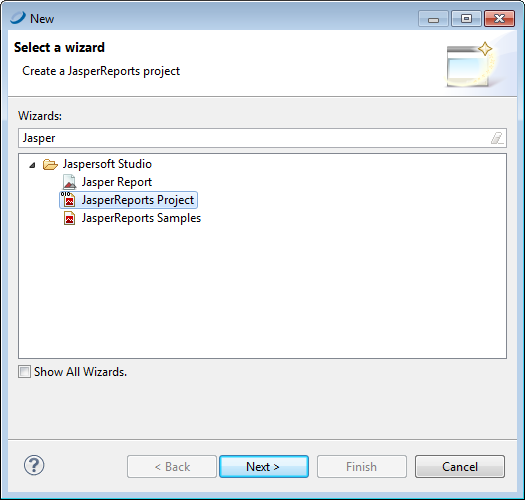
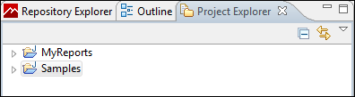

# Creating a Project Folder

Project folders help you organize your reports.

To create a project folder

1.  Choose **File \> New \> Project**. The **Select a wizard** dialog is displayed.

|                                                      |
|------------------------------------------------------|
|  |
| *Figure 1: Select a Wizard*                          |

1.  Enter **Jasper** in the Wizards bar to filter actions to those related to Jaspersoft Studio.
2.  Select **JasperReports Project**. Click **Next**. The **New JasperReports Project** wizard appears.
3.  Enter a name for your project and click **Finish**. The **Project Explorer** displays your project.

|                                                  |
|--------------------------------------------------|
|  |
| *Figure 2: Project Explorer*                     |
