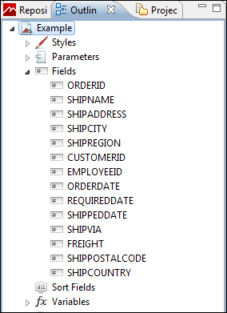

# Adding and Deleting Report Elements

You can add and delete fields and other elements to your report.

## Adding Fields to a Report

To add fields to an already created report

1.  Select the main node of the report from the Outline view.

2.  Select the **Report** tab in the Properties view and click the **Edit query, filter and sort options** button in the Dataset section.

    |  |
    |----|
    |  |
    | *Figure 1 Dataset section in Properties view* |
    | The **Dataset and Query Dialog** opens. |
    | *Figure 2 Dataset and Query Dialog* |

3.  Add more fields by clicking the **Read Fields** button. All the fields discovered are added as new fields in the report.

    !!! note

        You can also change your query in the same dialog. If a new query discovers fewer fields than used in the existing report, the fields not included the new query are removed from your report.

4.  Click **OK** to return to the Design tab.

5.  Expand **Fields** in the Outline view to see all the fields now available for your report.

    |                                                    |
    |----------------------------------------------------|
    |  |
    | *Figure 3 Fields*                                  |

6.  To add a field to your report, click the field and drag it into the **Design**.

When the field object is dragged inside the detail band, Jaspersoft Studio creates a text field element and sets the text field expression for that element.

## Deleting Fields

To delete a field from a report, right-click the field in the **Design** and select **Delete**.

## Adding Other Elements

To add other elements, such as lines, images, or charts, drag the element from the palette into the **Design**. See [1.1.1, “Inserting Elements,” on page 1](../elements/elements-inserting-selecting-postioning.md) for more information.
