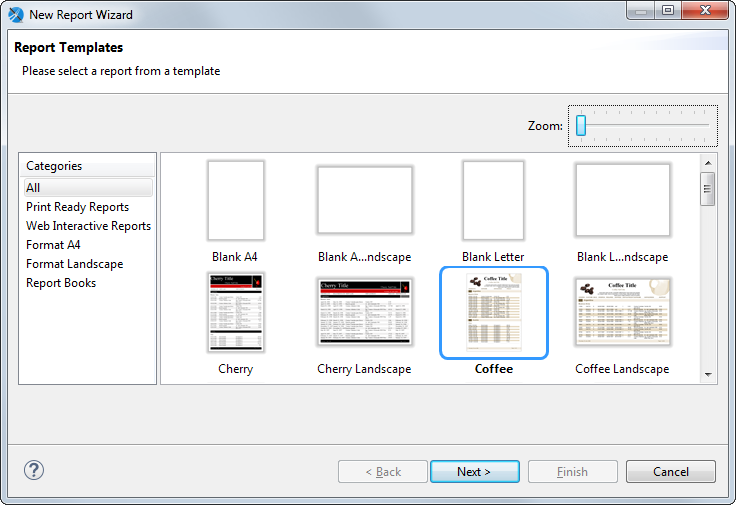
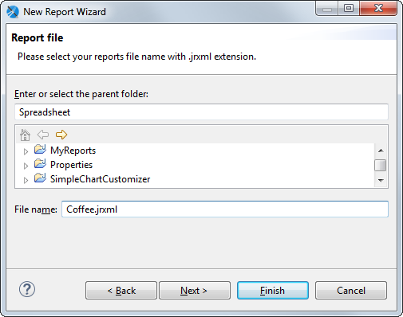
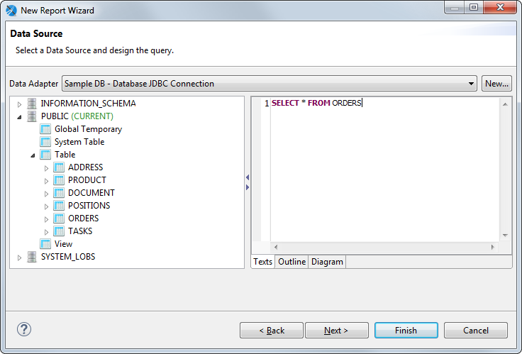
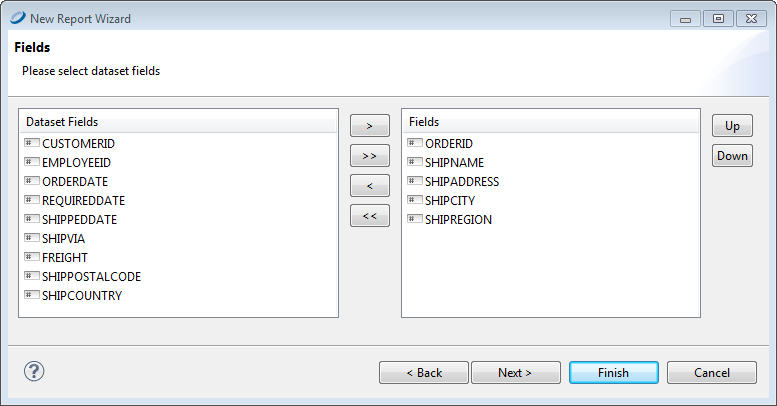
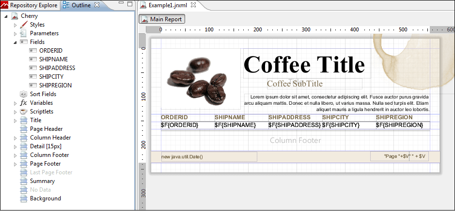

# Creating a New Report

To create a new report

1.  Go to **File &gt; New &gt; Jasper Report** or click  on the main toolbar.

    The **New Report Wizard** window displays the **Report Templates** page. Jaspersoft Studio includes a number of pre-installed templates; you can also create your own. See [Chapter 1, “Report Templates,” on page 1](../templates-intro.md) for more information.

    |  |
    |----|
    |  |
    | *Figure 1 New Report Wizard* |

2.  Select the **Coffee** template and click **Next**. The **New Report Wizard** shows the **Report file** page.

    |  |
    |----|
    |  |
    | *Figure 2 New Report Wizard &gt; Report file* |

3.  Navigate to the folder to which you want the save report and name the report. To create a folder, see [Creating a Project Folder](creating-project-folder.md).

4.  Click **Next**.

The **New Report Wizard** displays the **Data Source** page. This is where you choose the data that fills the report. The dropdown menu shows the pre-installed data adapters as well any data adapters you have added. The following adapters are pre-installed:

-   **One Empty Record - Empty rows**: Data adapter that lets you create a report without data. You might use this option to define the layout of a report and connect it to a data source later.

    -   **Sample DB - Database JDBC Connection**: Data adapter that connects to an SQL database provided with the Jaspersoft Studio installation. If you are getting your data from a JDBC database, you must also supply an SQL query.

        !!! note

            You can create a data adapter separately or click **New...** to create a data adapter directly from this dialog. Adapters can be created globally (embedded in the workspace) or local to a specific project. Using a local adapter makes it easier to deploy the report to JasperReports Server. See [Working with Data Adapters](../data-adapters/data-adapters-creating.md) for more information.

        1.  Choose **Sample DB - Database JDBC Connection**. With a JDBC connection, the **Data Source** dialog shows the database schema on the left and your query on the right.

            |  |
            |----|
            |  |
            | *Figure 3 New Report Wizard &gt; Data Source* |

        2.  Enter the query `SELECT * FROM ORDERS` on the right. Note that you can view your query in three different ways: as text, as an outline, or as a diagram.

        3.  Click **Next**. The **Fields** window is displayed. The Dataset list shows all the discovered fields.

            |                                                            |
            |------------------------------------------------------------|
            |  |
            | *Figure 4 New Report Wizard &gt; Fields*                   |

        4.  Select the following fields and click the right arrow to add them to your report.

    -   **ORDERID**

    -   **SHIPNAME**

    -   **SHIPADDRESS**

    -   **SHIPCITY**

    -   **SHIPREGION**

1.  Click **Next**. The **Grouping** window is displayed. You do not want any grouping for this report.
2.  Click **Next** and **Finish**.

Jaspersoft Studio now builds the report layout with the selected fields included as shown.

|                                                            |
|------------------------------------------------------------|
|  |
| *Figure 5 New Report in the Design Tab*                    |
