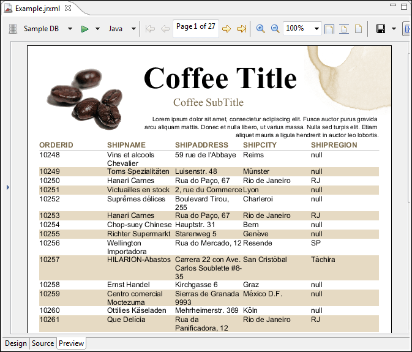

# Previewing a Report

Click the **Preview** tab at the bottom of the report. The preview compiles the report in the background with data retrieved by the query through your JDBC connection. The **Detail** band repeats for every row in the query results, creating a simple table report.

|                                                                    |
|--------------------------------------------------------------------|
|  |
| *Figure 1: Report Preview*                                         |

!!! note

    Each subreport is saved in a separate report file. Reflecting the standard Eclipse design, saving or previewing a report that contains subreports does not update the subreports. When you edit a subreport, you must first build the subreport, and then save the file for the subreport changes to be visible when you preview the report that contains it.

    -   To build a subreport explicitly, use the **Build All** button on the toolbar, or type `Ctrl-B`. Alternatively, select **Project &gt; Build Automatically** to have Jaspersoft Studio do it for you.
    -   To save a subreport, use **File &gt; Save** or **File &gt; Save As**.
