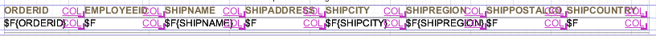
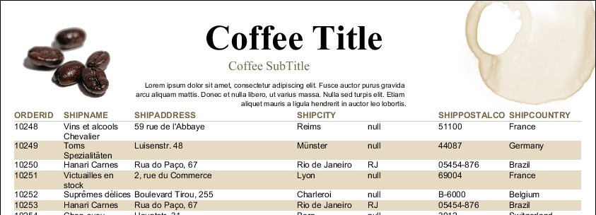

# Working with Spreadsheet Layout

Spreadsheet layout allows you to create a tabular layout without the complexity of lists or tables. You can create columns that span different bands in your report.

When you enable spreadsheet layout, the elements in the detail band are arranged according to horizontal layout. This means that elements are positioned horizontally across the band with no space between them, and if you resize an element horizontally, the elements to the right of it automatically move so there is no overlap. In addition, elements in other bands, such as the header band, are associated with the elements in the detail band. When you resize elements in one band, elements in the associated bands are resized to match.

You can only associate one element per column.

## Example of Using Spreadsheet Layout

Create a report

1.  Go to **File &gt; New &gt; Jasper Report** or click  on the main toolbar.

    The **New Report Wizard** window displays the **Report Templates** page.

2.  Select the Coffee Landscape template and click **Next**.

    The **New Report Wizard** displays the **Report file** page.

3.  Navigate to the folder that you want the report in and name the report, then click **Next**.

    The **New Report Wizard** displays the **Data Source** page.

4.  Choose **Sample DB - Database JDBC Connection**.

5.  Enter the query `SELECT * FROM ORDERS` and click **Next**.

    The **Fields** window is displayed.

6.  Select the following fields and click the right arrow to add them to your report.

-   ORDERID

    -   EMPLOYEEID

    -   SHIPNAME

    -   SHIPADDRESS

    -   SHIPCITY

    -   SHIPREGION

    -   SHIPCOUNTRY

        1.  Click **Finish**.

        Jaspersoft Studio builds the report layout with the selected fields.

        Enable spreadsheet layout

        1.  Right-click on any column heading and select **Arrange in Container &gt; Spreadsheet Layout** from the context menu.

            All elements in the band display a **COL** annotation at the right of the element.

        2.  Right-click on any field and select **Arrange in Container &gt; Spreadsheet Layout** from the context menu again.

        Again, all elements in the band display the **COL** annotation. Spreadsheet layout is now enabled.

        |  |
        |----|
        |  |
        | *Figure 1 Spreadsheet layout in Design view* |

        Remove a Column

        1.  Select the EMPLOYEEID heading and press the Delete key.
        2.  Click **Delete Entire Column** when prompted.

        All elements in the same column are deleted. In this case, the header and the field are deleted. The other elements move to the left as necessary to close the gap.

        !!! note

            There is no option to cancel a delete. However, you can undo the action immediately.

        Resize Columns

        The real advantage to spreadsheet layout is that it lets you quickly resize columns and keep the elements aligned across bands.

        1.  Select the ORDERID header or text field.
        2.  Click the right side and move the handles to the left to reduce the size of the OrderID column. All elements in the column are resized together.
        3.  Select the SHIPADDRESS header or text field. Use the handles on the right to expand the column. Again, the columns are resized together.

        Remove a Header

        1.  Select the Region header and press Delete.
        2.  When prompted, select **Delete Selected**. The item is removed, but the column layout is preserved.

        !!! note

            When you delete an element from the detail band, the associated elements in other bands are no longer part of the column layout. When you delete an element from a band other than the detail band, the column layout is not removed.

        If you preview the report, it should look something like the following image.

        |                                                                         |
        |-------------------------------------------------------------------------|
        |  |
        | *Figure 2 Report output using spreadsheet layout*                       |

        Add an element to a column

        1.  In Outline view, select the Column Footer.
        2.  In the Properties view, set the Height to 16 px and press **Enter.**
        3.  In the Outline view, expand the fields node, then drag ORDERID to the column footer. The TextField Wizard is displayed.
        4.  In the TextField Wizard, select **Count**, then click **Finish**. The ORDERID field is added to the column footer.
        5.  Right-click the $V{ORDERID1} and select **Arrange in Container &gt; Spreadsheet Layout** from the context menu.
        6.  Select the $F{ORDERID} field in the Detail band, and the $V{ORDERID1} element you want to add, then right-click the $V{ORDERID1} field and select **Add to Column**.

        The element you select is added to the column. Now if you resize one of the elements, all three elements resize together.

        Notes on adding column elements:

-   You can add at most one element in a band to each column. However, you can add a frame to a column and then add elements inside the frame.

-   The element in the detail band is the element that drives the column. Select this element to specify the column you want to add another element to.

-   You can only add a variable to a column that contains its related field.

-   If you resize the band, the column elements resize vertically to fit.

Remove an element from a column

1.  Select the element that you want to remove. This element should not be in the detail band.
2.  Select **Remove from column** from the context menu.

The column formatting on the element is removed, but the element remains in the report.
