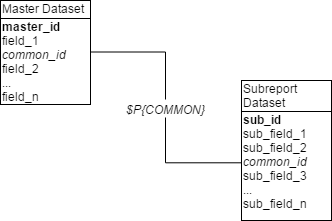
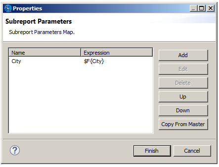

# Understanding Subreports

There are three steps to creating and adding a subreport:

1.  **Create a report**: Create a parent or master report that contains the subreport.
2.  **Create a subreport**: Create and compile a subreport. Optionally create a dynamic connection to filter the records of the subreport based on the parent’s data.
3.  **Add the subreport to the parent report**: Insert a subreport element and specify the following:

- The data adapter or data source for the subreport.
- The location of the subreport's compiled Jasper file.
- An optional parameters map (it can be empty) to set the report parameters used in the dynamic connection.

## Subreports

A subreport is simply a report composed of its own JRXML source and compiled in a Jasper file. Generally speaking, creating a subreport is very similar to creating any other report. The margins of a subreport are usually set to zero for subreports because a subreport is meant to be a portion of a page, not an entire document. The horizontal dimension of the subreport should be as large as the element into which it is placed in the parent report.

## Subreport Elements

You add a subreport to a report by dragging the Subreport element  from the palette. At design time, the element is rendered as a rectangle with the dimensions specified in the subreport.

!!! note

    The Subreport element does not need to be the same size as the subreport. You can think of the Subreport element as a place holder defining the position of the top-left corner to which the subreport is aligned. However, we recommend that you set the dimensions of the Subreport element to the dimensions of the subreport to visualize the layout of the final report.

### Properties of a Subreport Element

When a subreport element is selected in the master report, the following properties are available on the Subreport tab of the **Properties** view:

<table>
<colgroup>
<col style="width: 50%" />
<col style="width: 50%" />
</colgroup>
<thead>
<tr>
<th>Property</th>
<th>Description</th>
</tr>
</thead>
<tbody>
<tr>
<td>
Run To Bottom
</td>
<td>When true, the subreport element consumes the entire vertical space available on the report page.</td>
</tr>
<tr>
<td>
Overflow Type
</td>
<td>When not specified, the subreport stretches to accommodate the content.</td>
</tr>
<tr>
<td>
Expression
</td>
<td>
(Required) Expression that can be used to load the Jasper object to use when filling the subreport portion of the document. Evaluated at run time to retrieve the Jasper object for the subreport.

See 1.1.2.1, “Expression,” on page 1 for more information.
</td>
</tr>
<tr>
<td>
Using Cache
</td>
<td>
Specifies whether the subreport's report object is kept in memory or reloaded each time it is used. It is common for a subreport element to be printed more than once (or once for each record in the main dataset).

The cache works only if the subreport expression type is <code>String</code>, because that string is used as the key for the cache.
</td>
</tr>
<tr>
<td>
Connection Expression

or

Datasource Expression
</td>
<td>
At run time, returns a JDBC connection or a <code>JRDataSource</code> used to fill in the subreport. Only one of these expression types can be used.

If there is no connection or data source expression, no data is passed to the subreport. This option is useful at times. In this case, the subreport should have the document property <code>When No Data Type</code> set to something like <code>All Sections, No Detail</code>, or <code>No Data Section</code>.
</td>
</tr>
<tr>
<td>
Parameters Map Expression
</td>
<td>
Optional expression is used to produce a <code>java.util.Map</code> object at run time. The expression must contain a set of coupled names/objects that are passed to the subreport to set a value for its parameters.
</td>
</tr>
<tr>
<td>
Edit Return Values
</td>
<td>
Allows you to define how to store values in local variables calculated or processed in the subreport (such as totals and record count).
</td>
</tr>
<tr>
<td>
Edit Parameters
</td>
<td>
Allows you to define <code>name/expression</code> pairs used to set a value for the subreport parameters dynamically.
</td>
</tr>
</tbody>
</table>

The following properties must be set to link the subreport to the parent report:

- **Expression**: Retrieves the Jasper object that implements the subreport.
- **Connection Expression** or **Datasource Expression**: Defines how to feed the object with data.
- **Parameters**: Sets the values of the subreport parameters.

## The Expression Property

The subreport expression specifies the location of the Jasper file used to generate the subreport.

If the expression is a string (`java.lang.String`), JasperReports assumes that the subreport must be loaded from a Jasper file and tries to locate the file in the same way that resources are located, as follows:

1.  The string is at first interpreted as a URL.
2.  In the case of failure (a `MalformedURLException`), the string is interpreted as a physical path to a file. This is the most common case.
3.  If the file does not exist, the string is interpreted as a resource in the classpath.

This means that using an expression of type `String` means you are in some way trying to specify a file path. Optionally, you can put your Jasper file in the classpath and refer to it as a resource, using an expression something like `"subreport.jasper"`.

!!! note

    You cannot use a relative path to locate the subreport file; that is, if you have a report in` c:\myreport\main_report.jasper`, you cannot refer to a subreport using an expression like `..\\mysubreports\\mysubreport.jasper`.

    This is because JasperReports does not keep in memory the original location of the Jasper file that it is working with. This makes perfect sense, considering that a Jasper object is not necessarily loaded from a physical file.

To simplify report design when loading a subreport from the file system, do one of the following:

- Place the subreport file in a directory that is in the classpath. This permits you to use very simple subreport expressions, such as a string containing just the name of the subreport file (that is, “`subreport.jasper`”). Jaspersoft Studio always includes the classpath of the directory of the report that is running, so all the subreport Jasper files can be found easily if they are in the same directory.

- Parametrize the Jasper file location and create on-the-fly the real absolute path of the file to load. This can be achieved with a parameter containing the parent directory of the subreport (let us call it `SUBREPORT_DIRECTORY`) and an expression like this:

`$P{SUBREPORT_DIRECTORY} + "subreport.jasper"`

One advantage of this approach is that you can use the Jasper files’ local directory as the default value for the `SUBREPORT_DIRECTORY` parameter. The developer who integrates JasperReports in his applications can set a different value for that location just by passing a different value for the `SUBREPORT_DIRECTORY` parameter.

## Specifying the Data Source

For JasperReports to retrieve data and fill the subreport, you have to set the subreport data source. The following options are available:

- **Use the same connection used to fill the master report**: Select this to use the same JDBC data adapter for the master report and the subreport. The JDBC connection is passed to the subreport to run it.

- **Use another connection**: Select this to specify a different JDBC data adapter for the subreport.

- **Use a JRDataSource expression**: Select this to use a `JRDataSource` object to fill the subreport.

- **Use an empty datasource**: Select this to set the data source expression to `new JREmptyDataSource()`. That creates a special data source that provides a single record with all the field values set to `null`. This is useful when the subreport is used to display static content such as headers, footers, and backgrounds. In this case, in the subreport, set the report property `When no data type` to `All Data No Details` or `No Data Section` to ensure that at least a portion of the document is actually printed.

JDBC connections make using subreports simple enough. A connection expression must identify a `java.sql.Connection` object (ready to be used, so a connection to the database is already opened). Typically, we run the SQL query using the same database connection as the parent report; the connection can be referenced with the `REPORT_CONNECTION` built-in parameter. It must be clear that if we pass a JDBC connection to the subreport, it is because we defined an SQL query in the subreport, a query that is used to fill it.

Using a different data source is sometimes necessary when a connection like JDBC is not being used. It is more complicated but extremely powerful. It requires writing a data source expression that returns a `JRDataSource` instance that you then use to fill the subreport. Depending on what you want to achieve, you can pass the data source that feeds the subreport through a parameter, or you can define the data source dynamically every time it is required. If the parent report is run using a data source, this data source is stored in the `REPORT_DATASOURCE` built-in parameter. On the other hand, the `REPORT_DATASOURCE` should never be used to feed a subreport. A data source is a consumable object that is usable for feeding a report only once. Therefore, the parameter technique is not suitable when every record of the master report has its own subreport (unless there is only one record in the master report). When we discuss data sources this is clearer and you see how this problem is easily solved with custom data sources. You also see how to create subreports using different types of connections and data sources.

## Subreport Parameters

One of the most common uses of subreport parameters is to pass the key of a record printed in the parent report to run a query in the subreport through which you can extract the records referred to (report headers and lines). For example, let us say you have in the master report a set of customers, and you want to show additional information about them, such as their contact info. The subreports use the customer ID to get the contact info. The customer ID should be passed to the subreport as a parameter, and its value changes for each record in the master report.

|  |
|----|
|  |
| *Figure 1: Related datasets in master and subreport* |

To pass parameters from the master report to a subreport, you create a set of parameter `name/object` pairs that feed the parameters map of the subreport. To do this, click the `Edit Parameters` button on the Subreport tab of the `Properties` view to open the `Subreport Parameters` dialog.

!!! note

    When a report is invoked from a program (using one of the `fillReport` methods, for instance), a parameters map is passed to set a value for its parameters. A similar approach is used to set a value for subreport parameters. With subreports you do not have to define a map (even, if possible, specifying a `Parameters Map Expression`). The report engine takes care of that for you.

|                                                                         |
|-------------------------------------------------------------------------|
|  |
| *Figure 2: Subreport Parameters dialog*                                 |

To configure a parameter you want to pass to the subreport, click **Add** in the **Subreport Parameters** dialog to open the **Parameter Configuration** dialog, which lets you set the following:

- **Name**: Name of the parameter. A parameter must have the same name in the master report and the subreport. Parameter names are case-sensitive.

!!! note

    If you make an error in typing the name or the inserted parameter has not been defined, no error is generated. In most cases, the report fails silently.

- **ValueExpression**: JasperReports expression for the parameter. To create or edit an expression, click  to open the expression editor. You can use fields, parameters, and variables. The return type has to be congruent with the parameter type declared in the subreport; otherwise, an exception of `ClassCastException` occurs at run time.

As cited below, you have the option of directly providing a parameter map to be used with the subreport. The `Parameters Map Expression` allows you to define an expression, the result of which must be a `java.util.Map` object. It is possible, for example, to prepare a map designed for the subreport in your application, pass it to the master report using a parameter, then use that parameter as an expression (for example, `$P{myMap}`) to pass the map to the subreport. It is also possible to pass to the subreport the same parameters map that was provided to the parent by using the built-in parameter `REPORT_PARAMETERS_MAP`. In this case the expression looks like this:

`$P{REPORT_PARAMETERS_MAP}`

Since the subreport parameters can be used with this map, you could even use it to pass common parameters, such as the username of the user running the report.
