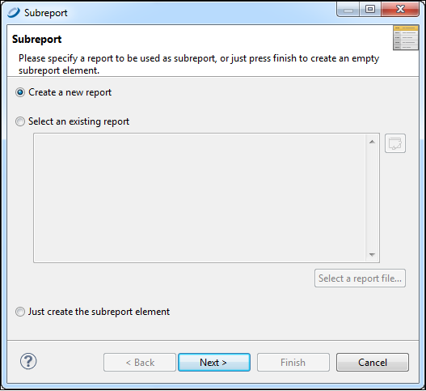
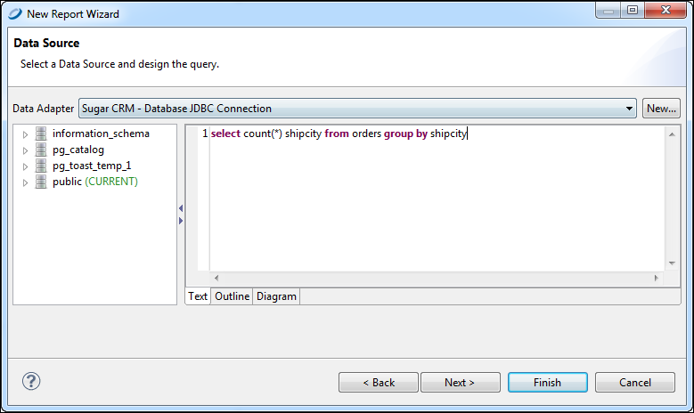
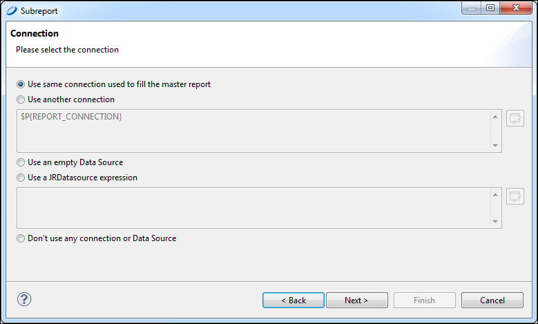
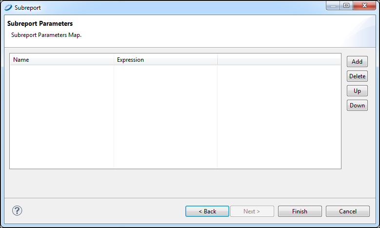

# Creating a New Report via the Subreport Wizard

To simplify inserting a subreport, a wizard for creating subreports starts automatically when a Subreport element is added to a report.

You can use the Subreport Wizard to create a brand new report that is referenced as a subreport or to refer to an existing report. In the latter case, if the report you choose contains one or more parameters, the wizard provides an easy way to define values for them.

To create a subreport using the wizard

1.  Drag the **Subreport** element from the **Palette** to the area of your report where you want to use it.

The **Subreport** wizard provides three options:

- **Create a report**: Use this option when you need to use data or a query not available in an existing report.

<!-- -->

- **Select an existing report**: Use this option when you want to choose a report from the repository.
- **Just create the subreport element**: Use this option to create a placeholder to be used later.

|                                                         |
|---------------------------------------------------------|
|  |
| *Figure 1: Subreport Wizard*                            |

1.  Select **Create a new report** and click **Next**. The **New Report Wizard \> Report Templates** window is displayed.
2.  Select a template for your subreport. For this example, select one of the blank templates. Click **Next**. The **New Report Wizard \> Report file** window opens.
3.  Select a location for your subreport, and name it. Click **Next**. The **Data Source** window opens.

|                                                                 |
|-----------------------------------------------------------------|
|  |
| *Figure 2: Data Source and Query*                               |

1.  Choose to use the same data adapter as the main report, or a different data adapter.

For this example, choose the same adapter (Sample DB). Enter the following SQL query:

`select count (*), shipcity from orders group by shipcity`

1.  Click **Next**.
2.  Add all the fields to the list on the right. Click **Next**.
3.  Click **Next** to skip the **Group By** step. The **Subreport \> Connection** window opens.

|                                                                 |
|-----------------------------------------------------------------|
|  |
| *Figure 3: Subreport \> Connection window*                      |

1.  Choose to connect either to the same database as the main report or to a different database. For this example, click **Use same connection used to fill the master report**.
2.  Click **Next**. The **Subreport Parameters** window opens.

|                                                                 |
|-----------------------------------------------------------------|
|  |
| *Figure 4: Subreport parameters window*                         |

1.  For this example, skip this window and click **Finish**. A new report opens containing all bands.
2.  Delete all bands but the Title or Summary band to eliminate extra white space in your report.

You now have a location into which to place your table, chart, or other element attached to the new subreport.
