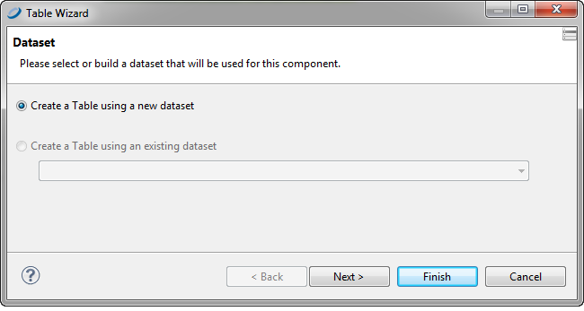
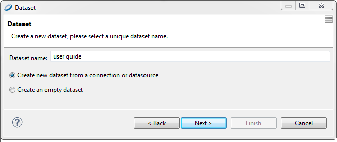
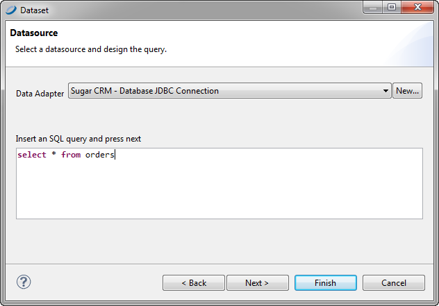
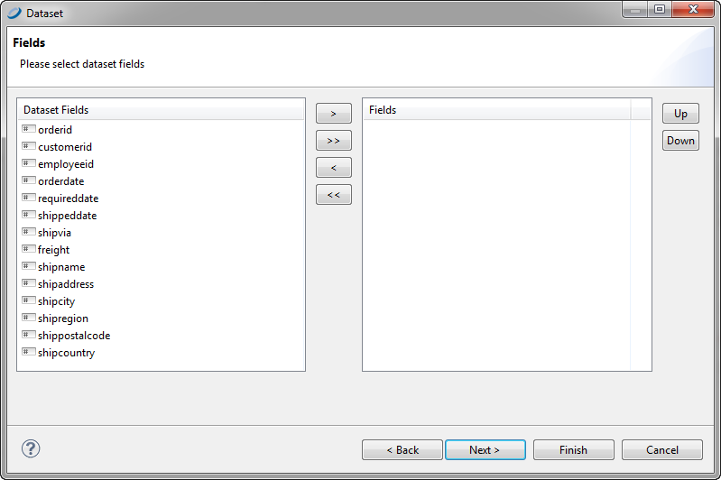
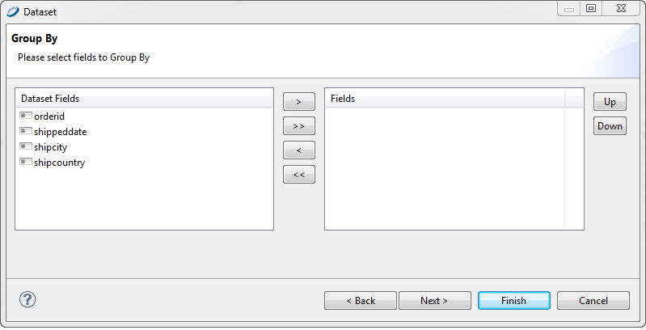
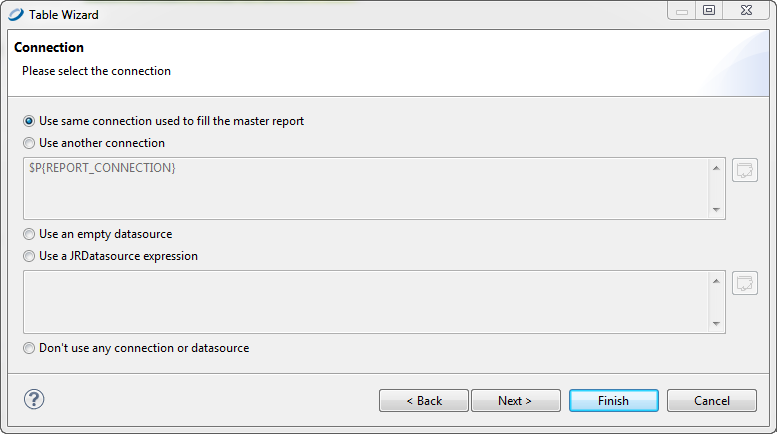
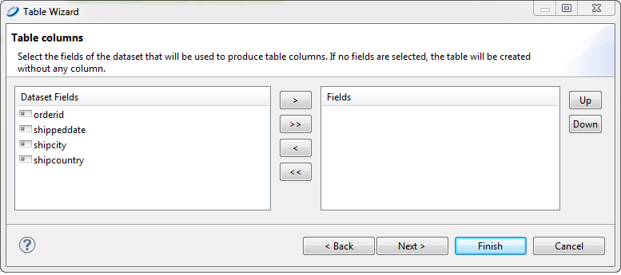
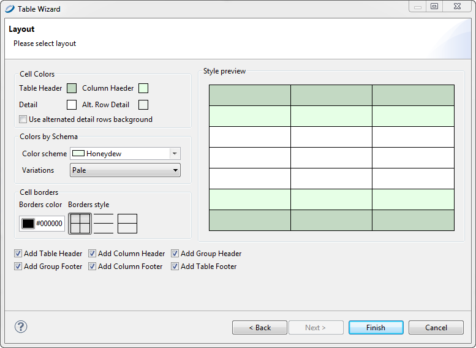
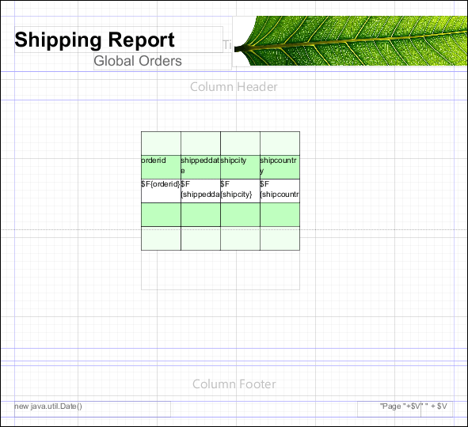
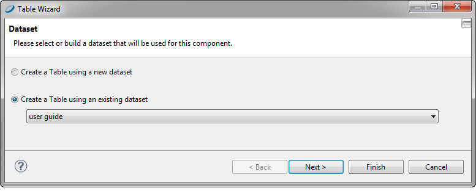

# Creating a Table

To create a table

- To autosize your table, drag the Table element  from the Elements palette into any band of the report.

- To set the size of the table manually when you insert it, click the Table element , but do not drag. The cursor changes  to show that an element is selected. Click and drag in the report editing area to size and place the element. When you size the table when you first insert it, the columns fill the whole table.

Once you have placed your table in your report, use the **Table Wizard** to choose a new or existing dataset for your table.

|                                                         |
|---------------------------------------------------------|
|  |
| *Figure 1: Table Wizard - New Table*                    |

To create a new dataset for your table

1.  Select **Create a Table from a new dataset** and click **Next**. The **Dataset** window is displayed.

    |                                                                 |
    |-----------------------------------------------------------------|
    |  |
    | *Figure 2: Table Wizard - Dataset*                              |

2.  Name your dataset and select your option: **Create new dataset from a connection or data source** or **Create an empty dataset**. For this example, choose the first option and click **Next**. You are prompted to select a data source and design query.

    |  |
    |----|
    |  |
    | *Figure 3: Table Wizard - Dataset Datasource* |

3.  Select a data source and enter an SQL query such as: `select * from orders` and click **Next**. You are prompted to select dataset fields.

    |  |
    |----|
    |  |
    | *Figure 4: Table Wizard - Dataset Fields* |

4.  Select the fields that you want in your table and add them to the **Fields** list on the right. Then click **Next**. You are prompted to select the fields to group by from among your chosen fields.

    |  |
    |----|
    |  |
    | *Figure 5: Table Wizard - Dataset \> Group By* |

5.  Select one or more fields to group by and move them to the **Fields** list on the right. Click **Next**. You are prompted to select a connection.

    |                                                                       |
    |-----------------------------------------------------------------------|
    |  |
    | *Figure 6: Table Wizard - Connection*                                 |

6.  Select a data connection option. Your options are:

    - Use the same connection used to fill the master report (the option used in this example)
    - Use another connection (you provide a connection)
    - Use an empty data source
    - Use a JRDatasource expression (you enter a JRDatasource expression)
    - Do not use any data source or connection

7.  Click **Next**. You are prompted to choose the fields for produce table columns.

    |  |
    |----|
    |  |
    | *Figure 7: Table Wizard - Table Columns* |

8.  Select one or more fields to for table columns and move them to the Fields list on the right. Click **Next**. You are prompted to select a layout.

    |                                                               |
    |---------------------------------------------------------------|
    |  |
    | *Figure 8: Table Wizard - Layout*                             |

9.  Select the layout for your table, and click **Finish**. The table appears where you dragged the table element in your report.

|                                                       |
|-------------------------------------------------------|
|  |
| *Figure 9: Report Containing a Table*                 |

To use an existing dataset when creating a table

Creating a table using an existing dataset is largely the same as creating a table using a new dataset.

1.  In the **Dataset** window of the **Table Wizard**, select **Create a Table using an existing dataset**.

2.  Select a dataset from the drop-down.

    |  |
    |----|
    |  |
    | *Figure 10: Table Wizard - Dataset* |

3.  Click **Next**. You are prompted to select the connection.

From this point, the steps are the same as creating a table using a new dataset.
